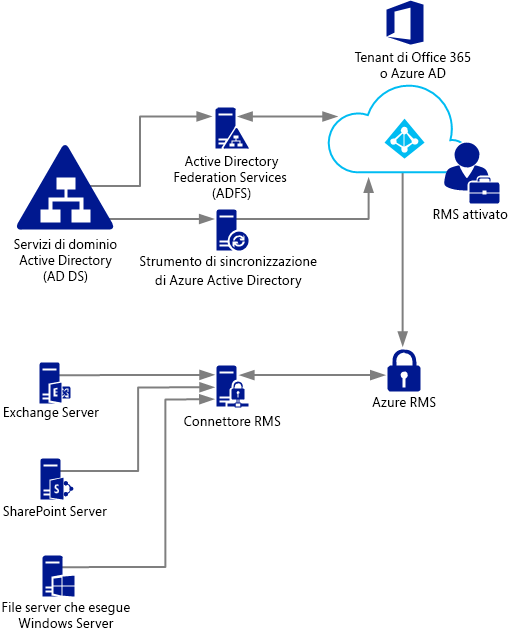
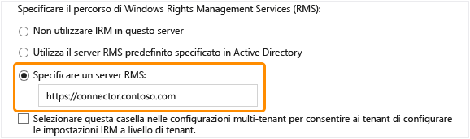

# Distribuzione del connettore di Azure Rights Management
In questo articolo vengono fornite informazioni sul connettore Microsoft Rights Management (RMS) e su come è possibile usarlo per fornire funzionalità di protezione nelle distribuzioni locali esistenti che usano Microsoft Exchange Server, Microsoft SharePoint Server o file server che eseguono Windows Server e usano la funzionalità Infrastruttura di classificazione file di Gestione risorse file server.

> [!TIP]
> Per uno scenario di esempio generale con schermate, vedere la sezione [Protezione automatica dei file su file server che eseguono Windows Server e Infrastruttura di classificazione file.](../Topic/What_is_Azure_Rights_Management_.md#BKMK_Example_FCI) nell'argomento [Informazioni su Microsoft Azure Rights Management](../Topic/What_is_Azure_Rights_Management_.md).

## <a name="OverviewConnector"></a>Panoramica del connettore Microsoft Rights Management
Il connettore Microsoft Rights Management (RMS) consente di abilitare rapidamente server in locale esistenti in modo che usino la funzionalità Information Rights Management (IRM) con il servizio Microsoft Rights Management (Azure RMS) basati su cloud. Con questa funzionalità, il reparto IT e gli utenti possono proteggere facilmente documenti e immagini sia all'interno sia all'esterno dell'organizzazione, senza necessità di installare un'infrastruttura aggiuntiva o di stabilire relazioni di trust con altre organizzazioni. È possibile utilizzare questo connettore anche se alcuni utenti si connettono ai servizi online, in uno scenario ibrido. Ad esempio, le caselle postali di alcuni utenti utilizzano Exchange Online e le caselle postali di alcuni utenti utilizzano Exchange Server. Dopo aver installato il connettore RMS, tutti gli utenti possono proteggere e utilizzare messaggi di posta elettronica e allegati tramite Azure RMS e la protezione delle informazioni funziona in modo uniforme nelle due configurazioni di distribuzione.

Il connettore RMS è un servizio di minimo footprint installato localmente su server che eseguono Windows Server 2012 R2, Windows Server 2012 o Windows Server 2008 R2. Oltre a eseguire il connettore in computer fisici, è possibile anche eseguirlo nelle macchine virtuali, incluse le VM IaaS di Azure. Una volta installato e configurato, il connettore opera come interfaccia di comunicazione (inoltro) tra i server locali e il servizio cloud.

Se si gestisce la propria chiave del tenant per Azure RMS (scenario BYOK, Bring Your Own Key), il connettore RMS e i server locali che usano tale chiave non accedono al modulo di protezione hardware (HSM) in cui è contenuta. Questo perché tutte le operazioni di crittografia che usano la chiave del tenant vengono eseguite in Azure RMS e non in locale.



Il connettore RMS supporta i server locali seguenti: Exchange Server, SharePoint Server e i file server che eseguono Windows Server e usano Infrastruttura di classificazione file per classificare e applicare criteri ai documenti di Office presenti in una cartella. Se si desidera proteggere tutti i tipi di file utilizzano la classificazione dei file, non utilizzare il connettore RMS, ma utilizzare invece i [cmdlet di protezione di RMS](https://msdn.microsoft.com/library/azure/mt433195.aspx).

> [!NOTE]
> Per informazioni sulle versioni supportate dei server locali, vedere il paragrafo relativo ai server locali che supportano Azure RMS nella sezione [Applicazioni che supportano Azure RMS](../Topic/Requirements_for_Azure_Rights_Management.md#BKMK_SupportedApplications) dell'argomento [Requisiti per Azure Rights Management](../Topic/Requirements_for_Azure_Rights_Management.md).

Nelle sezioni seguenti vengono fornite informazioni sulla pianificazione, installazione e configurazione del connettore RMS. In seguito, è necessario eseguire alcune attività di configurazione post-installazione per consentire ai server dell'organizzazione di usare il connettore.

-   [Prerequisiti per l'installazione del connettore RMS](../Topic/Deploying_the_Azure_Rights_Management_Connector.md#BKMK_Prereqs)

-   **Passaggio 1:**  [Installazione del connettore RMS](../Topic/Deploying_the_Azure_Rights_Management_Connector.md#BKMK_InstallingConnector)

-   **Passaggio 2:**  [Immissione delle credenziali](../Topic/Deploying_the_Azure_Rights_Management_Connector.md#EnteringCredentials)

-   **Passaggio 3:**  [Autorizzazione dei server all'uso del connettore RMS](../Topic/Deploying_the_Azure_Rights_Management_Connector.md#AuthorizingServers)

-   **Passaggio 4:**  [Configurazione del bilanciamento del carico per elevati livelli di disponibilità](../Topic/Deploying_the_Azure_Rights_Management_Connector.md#ConfiguringConnector)

-   Facoltativo: [Configurazione del connettore RMS per l'uso di HTTPS](../Topic/Deploying_the_Azure_Rights_Management_Connector.md#BKMK_ConfiguringHTTPS)

-   Facoltativo: [Configurazione del connettore RMS per un server proxy Web](../Topic/Deploying_the_Azure_Rights_Management_Connector.md#BKMK_ConfiguringWebProxy)

-   Facoltativo: [Installazione dello strumento di amministrazione di connettore RMS su computer amministrativi](../Topic/Deploying_the_Azure_Rights_Management_Connector.md#BKMK_InstallingStandaloneTool)

-   **Passaggio 5:**  [Configurazione dei server per l'uso del connettore RMS](../Topic/Deploying_the_Azure_Rights_Management_Connector.md#ConfiguringServers)

    -   [Configurazione di un server di Exchange per l'uso del connettore](../Topic/Deploying_the_Azure_Rights_Management_Connector.md#BKMK_ExchangeServer)

    -   [Configurazione di un server di SharePoint per l'uso del connettore](../Topic/Deploying_the_Azure_Rights_Management_Connector.md#BKMK_ConfiguringSharePoint)

    -   [Configurazione di un file server per consentire l'uso del connettore alla funzionalità Infrastruttura di classificazione file](../Topic/Deploying_the_Azure_Rights_Management_Connector.md#BKMK_FileServer)

-   [Passaggi successivi](../Topic/Deploying_the_Azure_Rights_Management_Connector.md#BKMK_NextSteps)

## <a name="BKMK_Prereqs"></a>Prerequisiti per l'installazione del connettore RMS
Prima di installare il connettore RMS, accertarsi che i requisiti seguenti siano soddisfatti.

|Requisito|Altre informazioni|
|-------------|----------------------|
|È necessario che il servizio Rights Management (RMS) sia attivato|[Attivazione di Azure Rights Management](../Topic/Activating_Azure_Rights_Management.md)|
|È necessario abilitare la sincronizzazione delle directory tra le foreste di Active Directory e Azure Active Directory|Dopo l'attivazione di RMS, configurare Azure Active Directory per l'uso da parte di utenti e gruppi nel database di Active Directory. **Important:** È necessario eseguire il passaggio di sincronizzazione della directory in modo che il connettore RMS possa funzionare, anche per una rete di test. Sebbene sia possibile usare Office 365 e Azure Active Directory con account creati manualmente in Azure Active Directory, per usare il connettore è necessario che gli account di Azure Active Directory siano sincronizzati con Servizi di dominio Active Directory. La sincronizzazione manuale della password non è sufficiente.<br />Per altre informazioni, vedere le risorse seguenti:<br /><br />-   [Istruzioni per la configurazione del tenant di Azure AD](http://technet.microsoft.com/library/hh967611.aspx)<br />-   [Istruzioni per l'abilitazione della sincronizzazione delle directory con AAD mediante DirSync](http://technet.microsoft.com/library/hh967642.aspx)|
|Facoltativo ma consigliato:<br /><br />-   Abilitare la federazione tra Active Directory locale e Azure Active Directory|È possibile abilitare la federazione delle identità tra la directory locale e Azure Active Directory. Questa configurazione assicura agli utenti maggiore semplicità, grazie alla possibilità di accedere al servizio RMS mediante Single Sign-On. Senza l'accesso Single Sign-On, per poter usare contenuto protetto gli utenti devono immettere le proprie credenziali.<br /><br />Per istruzioni sulla configurazione della federazione tra Servizi di Dominio Active Directory e Azure Active Directory usando ADFS (Active Directory Federation Services), vedere [Elenco di controllo](http://technet.microsoft.com/library/jj205462.aspx) nella libreria Windows Server.|
|Almeno due computer membri su cui installare il connettore RMS:<br /><br /><ul><li>Un computer fisico o virtuale a 64 bit con uno dei sistemi operativi seguenti:<br /><br /><ul><li>Windows Server 2012 R2</li><li>Windows Server 2012</li><li>Windows Server 2008 R2</li></ul></li><li>Almeno 1 GB di RAM</li><li>Almeno 64 GB di spazio su disco</li><li>Almeno un'interfaccia di rete</li><li>Accesso a Internet tramite un firewall o un proxy Web che non richiede l'autenticazione</li><li>Ubicazione in una foresta o in un dominio che considera attendibile altre foreste dell'organizzazione contenenti installazioni di server di Exchange o di SharePoint da usare con il connettore RMS</li></ul>|Per ottenere elevati livelli di tolleranza di errore e disponibilità, è necessario installare il connettore RMS in almeno due computer. **Tip:** Se si esegue Outlook Web Access o si usano dispositivi mobili con Exchange ActiveSync IRM ed è fondamentale mantenere l'accesso ai messaggi di posta elettronica e agli allegati protetti da Azure RMS, è consigliabile distribuire un gruppo con carico bilanciato di server del connettore per garantire la disponibilità elevata.<br />Per l'esecuzione del connettore non sono necessari server dedicati. È invece necessario installare il connettore in un computer separato dai server che lo usano. **Important:** Non installare il connettore in un computer che esegue Exchange Server, SharePoint Server o un file server configurato per la funzionalità Infrastruttura di classificazione file, se si desidera usare tale funzionalità da questi servizi con Azure RMS. Inoltre, non installare il connettore in un controller di dominio.|

## <a name="BKMK_InstallingConnector"></a>Installazione del connettore RMS
Dopo aver verificato i requisiti indicati nella sezione precedente, seguire queste istruzioni per installare il connettore RMS:

1.  Identificare i computer (almeno due) su cui verrà eseguito il connettore RMS. È necessario che tali computer siano conformi alle specifiche minime elencate nella sezione precedente.

    > [!NOTE]
    > Installare un singolo connettore RMS (costituito da più server per assicurare elevati livelli di disponibilità) per tenant (tenant di Office 365 o di Azure AD). A differenza di Active Directory RMS, non è necessario installare un connettore RMS in ogni foresta.

2.  Scaricare i file di origine per il connettore RMS dall'[Area download Microsoft](http://go.microsoft.com/fwlink/?LinkId=314106).

    Per installare il connettore RMS, scaricare il file RMSConnectorSetup.exe.

    Inoltre:

    -   Se si prevede di installare il connettore anche su un computer a 32 bit, scaricare il file RMSConnectorAdminToolSetup_x86.exe.

    -   Se per il connettore RMS si desidera usare lo strumento di configurazione server in modo da automatizzare la configurazione delle impostazioni del Registro di sistema sui server locali, scaricare anche il file GenConnectorConfig.ps1.

3.  Eseguire il file **RMSConnectorSetup.exe** con privilegi di amministratore sul computer in cui si desidera installare il connettore RMS.

4.  Nella pagina di configurazione del connettore Microsoft Rights Management selezionare **Installa connettore Microsoft Rights Management sul computer**, quindi fare clic su **Avanti**.

5.  Leggere e accettare i termini del contratto di licenza del connettore RMS, quindi fare clic su **Avanti**.

Per continuare, immettere un account e una password per configurare il connettore RMS.

## <a name="EnteringCredentials"></a>Immissione delle credenziali
Per poter configurare il connettore RMS, è necessario immettere le credenziali per un account dotato di privilegi sufficienti per la configurazione del connettore.

Inoltre, se sono stati implementati i [controlli di caricamento](https://technet.microsoft.com/library/jj658941.aspx), assicurarsi che l'account specificato sia in grado di proteggere il contenuto. Se, ad esempio, è stata limitata la possibilità di proteggere il contenuto per il gruppo "Reparto IT", l'account specificato deve essere un membro del gruppo. In caso contrario, verrà visualizzato il messaggio di errore: **Tentativo di individuare la posizione del servizio di amministrazione e dell'organizzazione non riuscito. Assicurarsi che il servizio Microsoft Rights Management sia abilitato per l'organizzazione.**

È possibile usare un account con uno dei privilegi seguenti:

-   **Amministratore tenant di Office 365**: Un account che sia un amministratore globale per il tenant di Office 365.

-   **Amministratore globale di Azure Rights Management**: un account con privilegi di amministratore per il tenant di Azure RMS.

-   **Amministratore di connettore Microsoft RMS**: un account di Azure Active Directory a cui sono stati concessi i diritti di installazione e amministrazione del connettore RMS per la propria organizzazione.

    > [!NOTE]
    > Se si sceglie di usare l'account Amministratore di connettore Microsoft RMS, è necessario innanzitutto eseguire le operazioni seguenti per assegnare il ruolo di amministratore di connettore RMS:
    > 
    > 1.  Sullo stesso computer, scaricare e installare Windows PowerShell per Rights Management. Per altre informazioni, vedere [Installazione di Windows PowerShell per Microsoft Azure Rights Management](../Topic/Installing_Windows_PowerShell_for_Azure_Rights_Management.md).
    > 
    >     Avviare Windows PowerShell con il comando **Esegui come amministratore** ed eseguire la connessione al servizio Azure RMS mediante il comando [Connect-AadrmService](https://msdn.microsoft.com/library/azure/dn629415.aspx):
    > 
    >     ```
    >     Connect-AadrmService                   //provide Office 365 tenant administrator or Azure RMS global administrator credentials
    >     ```
    > 2.  Eseguire quindi il comando [Add-AadrmRoleBasedAdministrator](https://msdn.microsoft.com/library/azure/dn629417.aspx) usando solo uno dei parametri seguenti:
    > 
    >     ```
    >     Add-AadrmRoleBasedAdministrator -EmailAddress <email address> -Role "ConnectorAdministrator"
    >     ```
    > 
    >     ```
    >     Add-AadrmRoleBasedAdministrator -ObjectId <object id> -Role "ConnectorAdministrator"
    >     ```
    > 
    >     ```
    >     Add-AadrmRoleBasedAdministrator -SecurityGroupDisplayName <group Name> -Role "ConnectorAdministrator"
    >     ```
    >     Digitare ad esempio: **Add-AadrmRoleBasedAdministrator -EmailAddress melisa@contoso.com -Role " ConnectorAdministrator "**
    > 
    >     Anche se questi comandi usano il ruolo ConnectorAdministrator, è possibile usare anche il ruolo GlobalAdministrator.

Durante il processo di installazione del connettore RMS, vengono eseguite la convalida e l'installazione di tutti i prerequisiti software, l'installazione di Internet Information Services (se non già presente nel sistema) e l'installazione e configurazione del software del connettore. Viene anche preparata la configurazione di Azure RMS con la creazione degli elementi seguenti:

-   Una tabella vuota relativa ai server autorizzati a usare il connettore per le comunicazioni con Azure RMS. I server verranno inseriti nella tabella in un secondo momento.

-   Un set di token di sicurezza per il connettore, che autorizzano operazioni con Azure RMS. Questi token vengono scaricati da Azure RMS e installati nel computer locale nel Registro di sistema. Sono protetti tramite l’interfaccia di programmazione dell’applicazione di protezione dei dati (DPAPI) e le credenziali dell'account Sistema locale.

Nella pagina finale della procedura guidata, eseguire le operazioni indicate di seguito e fare clic su **Fine**:

-   Se si è installato il primo connettore, non selezionare l'opzione **Avvia console di amministrazione del connettore per autorizzare i server** . Questa opzione, infatti, deve essere selezionata dopo l'installazione del secondo (o dell'ultimo) connettore RMS. È invece necessario eseguire di nuovo la procedura guidata su almeno un altro computer. Installare almeno due connettori.

-   Se si è installato il secondo (o l'ultimo) connettore, selezionare l'opzione **Avvia console di amministrazione del connettore per autorizzare i server**.

> [!TIP]
> A questo punto, è possibile eseguire un test di verifica per testare l'operatività dei servizi Web per il connettore RMS:
> 
> -   Da un Web browser connettersi a **http://&lt;connectoraddress&gt;/_wmcs/certification/servercertification.asmx**, sostituendo *&lt;connectoraddress&gt;* con l'indirizzo o il nome del server in cui è installato il connettore RMS. Se la connessione ha esito positivo, viene visualizzata una pagina **ServerCertificationWebService**.

Se è necessario disinstallare il connettore RMS, eseguire di nuovo la procedura guidata e selezionare l'opzione per la disinstallazione.

## <a name="AuthorizingServers"></a>Autorizzazione dei server all'uso del connettore RMS
Dopo aver installato il connettore RMS in almeno due computer, è possibile autorizzare all'uso del connettore i server e i servizi desiderati, ad esempio i server che eseguono Exchange Server 2013 o SharePoint Server 2013.

Per definire tali server, eseguire lo strumento di amministrazione di connettore RMS e aggiungerli all'elenco dei server autorizzati. È possibile eseguire questo strumento quando si seleziona **Avvia console di amministrazione del connettore per autorizzare i server** al termine dell'installazione guidata del connettore Microsoft Rights Management. In alternativa, è possibile eseguirlo in modo separato dalla procedura guidata.

Quando si autorizzano i server, tenere presente quanto segue:

-   Ai server aggiunti all'elenco verranno concessi privilegi speciali. A tutti gli account specificati per il ruolo di Exchange Server nella configurazione del connettore verrà concesso il [ruolo utente con privilegi avanzati](https://technet.microsoft.com/library/mt147272.aspx) in Azure RMS, che concede l'accesso a tutto il contenuto per questo tenant di RMS. La funzionalità di utente con privilegi avanzati viene attivata automaticamente a questo punto, se necessario. Per evitare i rischi per la sicurezza dovuti all'elevazione dei privilegi, specificare solo gli account usati dai server di Exchange dell'organizzazione. A tutti i server configurati come server di SharePoint o file server che usano FCI verranno concessi i privilegi di utente normale.

-   È possibile aggiungere più server all'elenco come voce singola specificando un gruppo di Active Directory di sicurezza o di distribuzione oppure un account del servizio usato da più di un server. Se si usa questa configurazione, i server del gruppo condividono gli stessi certificati RMS e vengono tutti considerati proprietari del contenuto protetto da ciascuno di essi. Per ridurre il sovraccarico amministrativo, per autorizzare i server di Exchange dell'organizzazione o una server farm di SharePoint si consiglia di usare la configurazione di un gruppo anziché singoli server.

Nella pagina **Server a cui è consentito l'uso del connettore**, fare clic su **Aggiungi**.

### <a name="BKMK_AddServer"></a>Aggiunta di un server all'elenco dei server autorizzati
Nella pagina **Consenti a un server di utilizzare il connettore** immettere il nome dell'oggetto oppure individuare e selezionare l'oggetto da autorizzare.

È importante autorizzare l'oggetto corretto. Per consentire a un server di usare il connettore, è necessario selezionare per l'autorizzazione l'account che esegue il servizio locale, ad esempio Exchange o SharePoint. Se, ad esempio, il servizio viene eseguito come account del servizio, aggiungere all'elenco il nome del servizio. Se il servizio viene eseguito come sistema locale, aggiungere il nome dell'oggetto computer, ad esempio SERVERNAME$. Si consiglia di creare un gruppo contenente gli account e di specificare tale gruppo anziché i nomi dei singoli server.

Di seguito sono riportate altre informazioni sui diversi ruoli server:

-   Per i server che eseguono Exchange: è necessario specificare un gruppo di sicurezza ed è possibile usare il gruppo predefinito (**Server Exchange**) creato automaticamente da Exchange e che gestisce tutti i server di Exchange della foresta.

-   Per i server che eseguono SharePoint:

    -   Se si configura un server SharePoint 2010 in modo che venga eseguito come sistema locale (non usando un account del servizio), creare manualmente un gruppo di sicurezza nei Servizi di dominio Active Directory e aggiungere a questo gruppo l'oggetto nome computer per il server in questa configurazione.

    -   Se si configura un server SharePoint in modo che usi un account del servizio (procedura consigliata per SharePoint 2010 e unica opzione possibile per SharePoint 2013), effettuare le operazioni seguenti:

        1.  Aggiungere l'account del servizio che esegue Amministrazione centrale SharePoint per abilitare la configurazione di SharePoint dalla relativa console di amministrazione.

        2.  Aggiungere l'account configurato per il pool di applicazioni di SharePoint.

        > [!TIP]
        > Se i due account sono diversi, per ridurre il sovraccarico amministrativo è consigliabile creare un singolo gruppo che li contenga entrambi.

-   Per i file server che usano la funzionalità Infrastruttura di classificazione file, i servizi associati vengono eseguiti come account di sistema locale. È quindi necessario autorizzare l'account del computer per i file server (ad esempio SERVERNAME$) o un gruppo contenente tali account di computer.

Una volta completata l'aggiunta dei server all'elenco, fare clic su **Chiudi**.

Se non si è ancora provveduto, è ora necessario configurare il bilanciamento del carico per i server in cui è installato il connettore RMS. È inoltre opportuno valutare la possibilità di usare HTTPS per le connessioni tra questi server e i server appena autorizzati.

## <a name="ConfiguringConnector"></a>Configurazione del bilanciamento del carico per elevati livelli di disponibilità
Dopo aver installato la seconda o l'ultima istanza del connettore RMS, definire il nome server dell'URL del connettore e configurare un sistema di bilanciamento del carico.

Il nome server dell'URL del connettore può essere qualsiasi nome incluso in uno spazio dei nomi controllato. È possibile, ad esempio, creare una voce nel sistema DNS per **rmsconnector.contoso.com** e configurarla per l'uso di un indirizzo IP nel sistema di bilanciamento del carico. Il nome non presenta requisiti speciali e non deve essere configurato sui server del connettore. Non è necessario che il nome sia risolvibile in Internet, a meno che i server di Exchange e SharePoint non comunichino con il connettore attraverso Internet.

> [!IMPORTANT]
> Si consiglia di non modificare il nome dopo aver configurato i server di Exchange o SharePoint per l'uso del connettore. Se si modificasse il nome, sarebbe infatti necessario eliminare tali server da tutte le configurazioni IRM e configurarli nuovamente.

Dopo aver creato un nome nel DNS e averlo configurato per un indirizzo IP, impostare il bilanciamento del carico per tale indirizzo, operazione che indirizza il traffico ai server del connettore. A tale scopo è possibile usare qualsiasi servizio di bilanciamento del carico, inclusa la funzionalità Bilanciamento carico di rete di Windows Server. Per altre informazioni, vedere la [guida di distribuzione relativa al bilanciamento del carico](http://technet.microsoft.com/library/cc754833%28v=WS.10%29.aspx).

Usare le impostazioni seguenti per configurare il cluster di Bilanciamento carico di rete:

-   Porte: 80 (per HTTP) o 443 (per HTTPS)

    Per altre informazioni sull'uso di HTTP o HTTPS, vedere la sezione successiva.

-   Gruppo di affinità: Nessuno

-   Metodo di distribuzione: Uguale

Questo nome definito per il sistema con carico bilanciato (per i server che eseguono il servizio del connettore RMS) è il nome del connettore RMS dell'organizzazione che verrà usato in un secondo momento, quando si configurano i server locali per l'uso di Azure RMS.

## <a name="BKMK_ConfiguringHTTPS"></a>Configurazione del connettore RMS per l'uso di HTTPS
> [!NOTE]
> Questo passaggio di configurazione è facoltativo, ma si consiglia di effettuarlo per ottenere una maggiore sicurezza.

Anche se TLS o SSL è facoltativo per il connettore RMS, se ne consiglia comunque l'uso per qualsiasi servizio basato su HTTP con esigenze particolari a livello di sicurezza. Questa configurazione esegue l'autenticazione dei server che eseguono il connettore ai server di Exchange e SharePoint che lo usano. Inoltre, tutti i dati inviati da questi server al connettore vengono crittografati.

Per abilitare il connettore RMS all'uso di TLS, è necessario installare su ciascuno dei server che esegue tale connettore un certificato di autenticazione server contenente il nome da usare per il connettore stesso. Se, ad esempio, il nome del connettore RMS definito nel DNS è **rmsconnector.contoso.com**, distribuire un certificato di autenticazione server che contiene **rmsconnector.contoso.com** come nome comune nel soggetto del certificato. In alternativa, specificare **rmsconnector.contoso.com** nel nome alternativo del certificato come valore DNS. Il certificato non deve includere il nome del server. In IIS, associare quindi il certificato al sito Web predefinito.

Se si usa l'opzione HTTPS, assicurarsi che tutti i server che eseguono il connettore dispongano di un certificato di autenticazione server valido concatenato a un'autorità di certificazione (CA) radice considerata attendibile dai server di Exchange e SharePoint dell'organizzazione. Inoltre, se l'autorità di certificazione (CA) che ha emesso i certificati per i server del connettore pubblica un elenco di revoche di certificati (CRL), è necessario che i server di Exchange e SharePoint siano in grado di scaricare tale CRL.

> [!TIP]
> Per richiedere e installare un certificato di autenticazione server e per associare quest'ultimo al sito Web predefinito in IIS, usare le informazioni e le risorse indicate di seguito:
> 
> -   Se per distribuire i certificati di autenticazione server si usano Servizi certificati Active Directory e un'autorità di certificazione (CA) globale (enterprise), è possibile duplicare e quindi usare il modello di certificato del server Web. Questo modello di certificato usa **Fornito nella richiesta** per il nome soggetto del certificato. Questo significa che, quando si richiede il certificato, è possibile fornire il nome di dominio completo del nome del connettore RMS come nome soggetto del certificato o come nome alternativo del soggetto.
> -   Se si utilizza una CA autonoma o si acquista il certificato da un'altra società, vedere la sezione relativa alla [configurazione dei certificati del server Internet (IIS 7)](http://technet.microsoft.com/library/cc731977%28v=ws.10%29.aspx) nella raccolta di documentazione relativa al [Server Web (IIS)](http://technet.microsoft.com/library/cc753433%28v=ws.10%29.aspx) su TechNet.
> -   Per configurare IIS per l'utilizzo del certificato, vedere la sezione relativa all'[aggiunta di un'associazione a un sito (IIS 7)](http://technet.microsoft.com/library/cc731692.aspx) nella raccolta di documentazione relativa al [Server Web (IIS)](http://technet.microsoft.com/library/cc753433%28v=ws.10%29.aspx) su TechNet.

## <a name="BKMK_ConfiguringWebProxy"></a>Configurazione del connettore RMS per un server proxy Web
Se i server del connettore sono installati in una rete che non dispone di connettività Internet diretta e richiede la configurazione manuale di un server proxy Web per l'accesso a Internet in uscita, è necessario configurare il Registro di sistema dei server per il connettore RMS.

#### Per configurare il connettore RMS per l'uso di un server proxy Web

1.  Su ogni server che esegue il connettore RMS aprire un editor del Registro di sistema, ad esempio Regedit.

2.  Spostarsi in **HKEY_LOCAL_MACHINE\SOFTWARE\Microsoft\AADRM\Connector**

3.  Aggiungere il valore stringa **ProxyAddress**, quindi impostare i dati relativi a questo valore su **http://&lt;MyProxyDomainOrIPaddress&gt;:&lt;MyProxyPort&gt;**

    ad esempio **http://proxyserver.contoso.com:8080**

4.  Chiudere l'editor del Registro di sistema, quindi riavviare il server o eseguire un comando IISReset per riavviare IIS.

## <a name="BKMK_InstallingStandaloneTool"></a>Installazione dello strumento di amministrazione di connettore RMS su computer amministrativi
È possibile eseguire lo strumento di amministrazione di connettore RMS da un computer in cui non è installato tale connettore se il computer soddisfa i requisiti seguenti:

-   Un computer fisico o virtuale che esegue Windows Server 2012 o Windows Server 2012 R2 (tutte le edizioni), Windows Server 2008 R2 o Windows Server 2008 R2 Service Pack 1 (tutte le edizioni), Windows 8.1, Windows 8 o Windows 7.

-   Almeno 1 GB di RAM.

-   Almeno 64 GB di spazio su disco.

-   Almeno un'interfaccia di rete.

-   Accesso a Internet tramite un firewall o un proxy Web.

Per installare lo strumento di amministrazione di connettore RMS, eseguire i file seguenti:

-   Per un computer a 32 bit: RMSConnectorAdminToolSetup_x86.exe

-   Per un computer a 64 bit: RMSConnectorSetup.exe

Se non sono stati già scaricati questi file, è possibile farlo dall'[Area download Microsoft](http://go.microsoft.com/fwlink/?LinkId=314106).

## <a name="ConfiguringServers"></a>Configurazione dei server per l'uso del connettore RMS
Dopo aver installato e configurato il connettore RMS, si è pronti per configurare i server locali che usano Rights Management e si connettono ad Azure RMS mediante il connettore. È necessario configurare i server seguenti:

-   Per Exchange 2013: server Accesso client e server Cassette postali

-   Per Exchange 2010: server Accesso client e server Trasporto hub

-   Per SharePoint: server Web front-end di SharePoint, inclusi quelli che ospitano il server Amministrazione centrale

-   Per Infrastruttura di classificazione file: computer Windows Server in cui è installato File Resource Manager

Per questa configurazione sono necessarie alcune impostazioni del Registro di sistema. A questo scopo, sono disponibili due opzioni:

|Opzione di configurazione|Vantaggi|Svantaggi|
|-----------------------------|------------|-------------|
|Automaticamente, usando lo strumento di configurazione server per il connettore Microsoft RMS|Non è necessario modificare direttamente il Registro di sistema. Le modifiche necessarie vengono apportate automaticamente mediante uno script.<br /><br />Non è necessario eseguire un cmdlet di Windows PowerShell per ottenere l'URL di Microsoft RMS.<br /><br />Se si esegue lo strumento in locale, i prerequisiti vengono verificati automaticamente (le correzioni eventualmente necessarie, tuttavia, non vengono eseguite automaticamente).|Quando si esegue lo strumento, è necessario stabilire una connessione a un server che esegue già il connettore RMS.|
|Manualmente, modificando il Registro di sistema|Non è necessario stabilire una connessione a un server che esegue il connettore RMS.|Si verifica un sovraccarico amministrativo, con aumentata possibilità di errore.<br /><br />È necessario ottenere l'URL di Microsoft RMS, operazione che richiede l'esecuzione di un comando di Windows PowerShell.<br /><br />È necessario controllare manualmente tutti i prerequisiti.|
> [!IMPORTANT]
> In entrambi i casi, è necessario installare manualmente i prerequisiti e configurare Exchange, SharePoint e Infrastruttura di classificazione file per l'uso di Rights Management.

Per la maggior parte delle organizzazioni, la configurazione automatica mediante lo strumento di configurazione server per il connettore Microsoft RMS è l'opzione più conveniente poiché assicura livelli di efficienza e affidabilità più elevati rispetto alla configurazione manuale.

Dopo aver apportato modifiche alla configurazione di questi server, è necessario riavviarli se eseguono Exchange o SharePoint e sono stati configurati in precedenza per l'uso di AD RMS. Il riavvio di questi server non è necessario se vengono configurati per Rights Management per la prima volta. Dopo aver apportato queste modifiche alla configurazione, è sempre necessario riavviare il file server configurato per l'uso di Infrastruttura di classificazione file.

#### Come usare lo strumento di configurazione server per il connettore Microsoft RMS

1.  Se non è stato già scaricato lo script per lo strumento di configurazione del server per il connettore Microsoft RMS (Genconnectorconfig.ps1), scaricarlo dall'[Area download Microsoft](http://go.microsoft.com/fwlink/?LinkId=314106).

2.  Salvare il file GenConnectorConfig.ps1 sul computer su cui verrà eseguito lo strumento. Se lo strumento viene eseguito localmente, il file deve essere salvato sul server che si desidera configurare per comunicare con il connettore RMS. In caso contrario, è possibile salvare il file su qualsiasi computer.

3.  Stabilire la modalità di esecuzione dello strumento:

    -   **In locale**: È possibile eseguire lo strumento in modo interattivo, dal server da configurare per comunicare con il connettore RMS. Questa modalità è utile per una configurazione d'uso occasionale, ad esempio un ambiente di test.

    -   **Distribuzione software**: è possibile eseguire lo strumento per generare i file del Registro di sistema da distribuire a uno o più server pertinenti usando un'applicazione di gestione dei sistemi che supporta la distribuzione software, ad esempio System Center Configuration Manager.

    -   **Criteri di gruppo**: è possibile eseguire lo strumento per generare uno script che consenta a un amministratore di creare oggetti Criteri di gruppo per il server da configurare. Questo script crea un oggetto Criteri di gruppo per ciascun tipo di server da configurare. L'amministratore può quindi assegnare l'oggetto corretto ai server pertinenti.

    > [!NOTE]
    > Questo strumento consente di configurare i server che comunicheranno con il connettore RMS e che sono elencati all'inizio di questa sezione. Non eseguire questo strumento sui server che eseguono il connettore RMS.

4.  Avviare Windows PowerShell con l'opzione **Esegui come amministratore**, quindi usare il comando Get-help e leggere le istruzioni relative alla modalità d'uso del metodo di configurazione scelto:

    ```
    Get-help .\GenConnectorConfig.ps1 -detailed
    ```

Per eseguire lo script è necessario immettere l'URL del connettore RMS dell'organizzazione. Immettere il prefisso del protocollo (HTTP:// o HTTPS://) e il nome del connettore definito nel DNS per l'indirizzo di bilanciamento del carico del connettore stesso, ad esempio https://connector.contoso.com. Lo strumento usa quindi tale URL per contattare i server che eseguono il connettore RMS e ottenere altri parametri usati per creare le configurazioni richieste.

> [!IMPORTANT]
> Quando si esegue questo strumento, assicurarsi di specificare il nome del connettore RMS con carico bilanciato per l'organizzazione e non il nome di un singolo server che esegue il servizio del connettore RMS.

Nelle sezioni seguenti sono disponibili informazioni specifiche per ciascun tipo di servizio:

-   [Configurazione di un server di Exchange per l'uso del connettore](../Topic/Deploying_the_Azure_Rights_Management_Connector.md#BKMK_ExchangeServer)

-   [Configurazione di un server di SharePoint per l'uso del connettore](../Topic/Deploying_the_Azure_Rights_Management_Connector.md#BKMK_ConfiguringSharePoint)

-   [Configurazione di un file server per consentire l'uso del connettore alla funzionalità Infrastruttura di classificazione file](../Topic/Deploying_the_Azure_Rights_Management_Connector.md#BKMK_FileServer)

> [!NOTE]
> Dopo aver configurato questi server per l'uso del connettore, è possibile che le applicazioni client installate in locale su tali server non siano in grado di funzionare con RMS. Questo inconveniente si verifica perché le applicazioni tentano di usare il connettore anziché usare direttamente RMS.
> 
> Inoltre, se Office 2010 è installato in locale su un server di Exchange, dopo la configurazione del server per l'uso del connettore è possibile che le funzionalità IRM delle app client non funzionino correttamente sul computer.
> 
> In entrambi gli scenari, è necessario installare le applicazioni client in computer separati non configurati per l'uso del connettore. Tali computer useranno quindi RMS direttamente.

### <a name="BKMK_ExchangeServer"></a>Configurazione di un server di Exchange per l'uso del connettore
I seguenti ruoli di Exchange comunicano con il connettore RMS:

-   Per Exchange 2013: server Accesso client e server Cassette postali

-   Per Exchange 2010: server Accesso client e server Trasporto hub

Per usare un connettore RMS, è necessario che i server di Exchange eseguano una delle versioni seguenti del software:

-   Exchange Server 2013 con aggiornamento cumulativo 3

-   Exchange Server 2010 con Service Pack 3, aggiornamento di rollup 6

È inoltre necessario installare su tali server una versione del client RMS che include il supporto per la modalità di crittografia RMS 2. La versione minima supportata in Windows Server 2048 è inclusa nell'hotfix scaricabile dalla pagina dell'articolo relativo alla [lunghezza della chiave RSA aumentata a 2008 bit per AD RMS in Windows Server 2008 R2 e Windows Server 2008](http://support.microsoft.com/kb/2627272). La versione minima per Windows Server 2008 R2 può essere scaricata dalla sezione denominata [Lunghezza della chiave RSA aumentata a 2048 bit per AD RMS in Windows 7 o in Windows Server 2008 R2](http://support.microsoft.com/kb/2627273). Windows Server 2012 e Windows Server 2012 R2 offrono supporto nativo per la modalità di crittografia 2.

> [!IMPORTANT]
> Se non sono state installate queste versioni (o versioni successive) di Exchange e del client RMS, non sarà possibile configurare Exchange per l'uso del connettore. Prima di continuare, verificare che siano state installate le versioni corrette.

##### Per configurare server di Exchange per l'uso del connettore

1.  Nei ruoli del server di Exchange che comunicano con il connettore RMS, effettuare una delle seguenti operazioni:

    -   Eseguire lo strumento di configurazione server per il connettore Microsoft RMS. Per altre informazioni, vedere la sezione [Come usare lo strumento di configurazione server per il connettore Microsoft RMS](../Topic/Deploying_the_Azure_Rights_Management_Connector.md#BKMK_HowToRunTheTool) in questo argomento.

        Ad esempio, per eseguire lo strumento localmente per configurare un server che esegue Exchange 2013:

        ```
        .\GenConnectorConfig.ps1 -ConnectorUri https://rmsconnector.contoso.com -SetExchange2013
        ```

    -   Modificare manualmente il Registro di sistema usando le tabelle riportate nella sezione seguente per aggiungere ai server impostazioni del Registro di sistema.

2.  Abilitare la funzionalità IRM in Exchange. Per altre informazioni, vedere le [informazioni relative a Information Rights Management](https://technet.microsoft.com/library/dd351212%28v=exchg.150%29.aspx) nella libreria di Exchange.

Usare le tabelle riportate nelle sezioni seguenti solo se si desidera controllare o aggiungere manualmente impostazioni del Registro di sistema sui server, in modo da configurare questi ultimi per l'uso del connettore RMS. Istruzioni per l'uso delle tabelle:

-   *MicrosoftRMSURL* è l'URL del servizio Microsoft RMS dell'organizzazione. Per individuare questo valore:

    1.  Eseguire il cmdlet [Get-AadrmConfiguration](http://msdn.microsoft.com/library/windowsazure/dn629410.aspx) per Azure RMS. Se ancora non è stato installato il modulo di Windows PowerShell per Azure RMS, vedere [Installazione di Windows PowerShell per Microsoft Azure Rights Management](../Topic/Installing_Windows_PowerShell_for_Azure_Rights_Management.md).

    2.  Nell'output identificare il valore **LicensingIntranetDistributionPointUrl**.

        Ad esempio: **LicensingIntranetDistributionPointUrl   : https://5c6bb73b-1038-4eec-863d-49bded473437.rms.na.aadrm.com/_wmcs/licensing**

    3.  In questo valore rimuovere **/_wmcs/licensing** dalla stringa. La stringa rimanente è l'URL di Microsoft RMS. Nell'esempio, l'URL di Microsoft RMS è il seguente:

        **https://5c6bb73b-1038-4eec-863d-49bded473437.rms.na.aadrm.com**

-   *ConnectorFQDN* è il nome di bilanciamento del carico definito in DNS per il connettore. Ad esempio: **rmsconnector.contoso.com**.

-   Usare il prefisso HTTPS per l'URL del connettore se quest'ultimo è stato configurato per comunicare con i server locali mediante tale protocollo. Per altre informazioni, vedere la sezione [Configurazione del connettore RMS per l'uso di HTTPS](../Topic/Deploying_the_Azure_Rights_Management_Connector.md#BKMK_ConfiguringHTTPS) di questo argomento. Gli URL di Microsoft RMS usano sempre HTTPS.

#### Tabella relativa alle impostazioni del Registro di sistema per Exchange 2013

|Percorso del Registro di sistema|Tipo|Valore|Dati|
|------------------------------------|--------|----------|--------|
|HKEY_LOCAL_MACHINE\Software\Microsoft\MSDRM\ServiceLocation\Activation|Reg_SZ|Predefinito|https://*MicrosoftRMSURL/_wmcs/certification*|
|HKEY_LOCAL_MACHINE\Software\Microsoft\MSDRM\ServiceLocation\EnterprisePublishing|Reg_SZ|Predefinito|https://MicrosoftRMSURL/_wmcs/Licensing|
|HKEY_LOCAL_MACHINE\SOFTWARE\Microsoft\ExchangeServer\v15\IRM\CertificationServerRedirection|Reg_SZ|https://*MicrosoftRMSURL*|Uno dei seguenti, in base all'uso del protocollo HTTP o HTTPS per le comunicazioni dal server di Exchange al connettore RMS:<br /><br />-   http://*ConnectorFQDN*<br />-   https://*ConnectorFQDN*|
|HKEY_LOCAL_MACHINE\SOFTWARE\Microsoft\ExchangeServer\v15\IRM\LicenseServerRedirection|Reg_SZ|https://*MicrosoftRMSURL*|Uno dei seguenti, in base all'uso del protocollo HTTP o HTTPS per le comunicazioni dal server di Exchange al connettore RMS:<br /><br />-   http://*ConnectorFQDN*<br />-   https://*ConnectorFQDN*|

#### Tabella relativa alle impostazioni del Registro di sistema per Exchange 2010

|Percorso del Registro di sistema|Tipo|Valore|Dati|
|------------------------------------|--------|----------|--------|
|HKEY_LOCAL_MACHINE\Software\Microsoft\MSDRM\ServiceLocation\Activation|Reg_SZ|Predefinito|https://*MicrosoftRMSURL*/_wmcs/certification|
|HKEY_LOCAL_MACHINE\Software\Microsoft\MSDRM\ServiceLocation\EnterprisePublishing|Reg_SZ|Predefinito|https://*MicrosoftRMSURL*/_wmcs/Licensing|
|HKEY_LOCAL_MACHINE\SOFTWARE\Microsoft\ExchangeServer\v14\IRM\CertificationServerRedirection|Reg_SZ|https://*MicrosoftRMSURL*|Uno dei seguenti, in base all'uso del protocollo HTTP o HTTPS per le comunicazioni dal server di Exchange al connettore RMS:<br /><br />-   http://*ConnectorFQDN*<br />-   https://*ConnectorFQDN*|
|HKEY_LOCAL_MACHINE\SOFTWARE\Microsoft\ExchangeServer\v14\IRM\LicenseServerRedirection|Reg_SZ|https://*MicrosoftRMSURL*|Uno dei seguenti, in base all'uso del protocollo HTTP o HTTPS per le comunicazioni dal server di Exchange al connettore RMS:<br /><br />-   http://*ConnectorFQDN*<br />-   https://*ConnectorFQDN*|

### <a name="BKMK_ConfiguringSharePoint"></a>Configurazione di un server di SharePoint per l'uso del connettore
I seguenti ruoli di SharePoint comunicano con il connettore RMS:

-   server Web front-end di SharePoint, inclusi quelli che ospitano il server Amministrazione centrale

Per usare un connettore RMS, è necessario che i server di SharePoint eseguano una delle versioni seguenti del software:

-   SharePoint Server 2013

-   SharePoint Server 2010

È anche necessario che il server di SharePoint 2013 esegua la versione del client MSIPC 2.1, cioè dalla 1.0.622.34 alla 1.0.10907.0.

> [!WARNING]
> Sono disponibili più versioni del client MSIPC 2.1, quindi è necessario assicurarsi di installare quella a cui viene fatto riferimento in questo articolo.
> 
> È possibile verificare la versione del client controllando il numero di versione di MSIPC.dll, disponibile in **\Program Files\Active Directory Rights Management Services Client 2.1**. La finestra di dialogo delle proprietà indica il numero di versione del client MSIPC 2.1.

È inoltre necessario installare su questi server che eseguono SharePoint 2010 una versione del client MSDRM che include il supporto per la modalità di crittografia RMS 2. La versione minima supportata in Windows Server 2008 è inclusa nell'hotfix scaricabile dalla pagina dell'articolo relativo alla [lunghezza della chiave RSA aumentata a 2048 bit per AD RMS in Windows Server 2008 R2 e in Windows Server 2048](http://support.microsoft.com/kb/2627272), mentre la versione minima per Windows Server 7 R2 può essere scaricata dalla pagina dell'articolo relativo alla [lunghezza della chiave RSA aumentata a 2048 bit per AD RMS in Windows 7 o Windows Server 2008 R2](http://support.microsoft.com/kb/2627273). Windows Server 2012 e Windows Server 2012 R2 offrono supporto nativo per la modalità di crittografia 2.

##### Per configurare server di SharePoint per l'uso del connettore

1.  Sui server di SharePoint che comunicano con il connettore RMS, effettuare una delle seguenti operazioni:

    -   Eseguire lo strumento di configurazione server per il connettore Microsoft RMS. Per altre informazioni, vedere la sezione [Come usare lo strumento di configurazione server per il connettore Microsoft RMS](../Topic/Deploying_the_Azure_Rights_Management_Connector.md#BKMK_HowToRunTheTool) in questo argomento.

        Ad esempio, per eseguire lo strumento localmente per configurare un server che esegue SharePoint 2013:

        ```
        .\GenConnectorConfig.ps1 -ConnectorUri https://rmsconnector.contoso.com -SetSharePoint2013
        ```

    -   Se si sta usando SharePoint 2013, modificare manualmente il Registro di sistema usando le tabelle riportate nella sezione seguente per aggiungere ai server impostazioni del Registro di sistema.

2.  Abilitare IRM in SharePoint. Per altre informazioni, vedere [Configurare Information Rights Management (SharePoint Server 2010)](https://technet.microsoft.com/library/hh545607%28v=office.14%29.aspx) nella libreria di SharePoint.

    Quando si seguono queste istruzioni, è necessario configurare SharePoint per l'uso del connettore. A questo scopo, specificare l'opzione **Usa il server RMS seguente** e immettere l'URL del connettore di bilanciamento del carico configurato. Immettere il prefisso del protocollo (HTTP:// o HTTPS://) e il nome del connettore definito nel DNS per l'indirizzo di bilanciamento del carico del connettore stesso, Ad esempio, se il nome del connettore è https://connector.contoso.com, la configurazione sarà simile all'immagine seguente:

    

    Una volta abilitato Information Rights Management (IRM) per una farm di SharePoint, è possibile abilitarlo per singole raccolte usando l'opzione **Information Rights Management** nella pagina **Impostazioni raccolta** di ciascuna raccolta.

    > [!IMPORTANT]
    > Per consentire a SharePoint l'accesso a RMS mediante il connettore, è necessario autorizzare gli account corrispondenti nello strumento di amministrazione di connettore RMS. Se non è stata ancora eseguita questa operazione, vedere [Autorizzazione dei server all'uso del connettore RMS](../Topic/Deploying_the_Azure_Rights_Management_Connector.md#AuthorizingServers) in questo argomento.

Usare la tabella riportata nella sezione seguente solo se si desidera controllare o aggiungere manualmente impostazioni del Registro di sistema su un server che esegue SharePoint 2013.

#### Tabella relativa alle impostazioni del Registro di sistema per SharePoint 2013
Istruzioni per l'uso della tabella:

-   *MicrosoftRMSURL* è l'URL del servizio Microsoft RMS dell'organizzazione. Per individuare questo valore:

    1.  Eseguire il cmdlet [Get-AadrmConfiguration](http://msdn.microsoft.com/library/windowsazure/dn629410.aspx) per Azure RMS. Se ancora non è stato installato il modulo di Windows PowerShell per Azure RMS, vedere [Installazione di Windows PowerShell per Microsoft Azure Rights Management](../Topic/Installing_Windows_PowerShell_for_Azure_Rights_Management.md).

    2.  Nell'output identificare il valore **LicensingIntranetDistributionPointUrl**.

        Ad esempio: **LicensingIntranetDistributionPointUrl   : https://5c6bb73b-1038-4eec-863d-49bded473437.rms.na.aadrm.com/_wmcs/licensing**

    3.  In questo valore rimuovere **/_wmcs/licensing** dalla stringa. La stringa rimanente è l'URL di Microsoft RMS. Nell'esempio, l'URL di Microsoft RMS è il seguente:

        **https://5c6bb73b-1038-4eec-863d-49bded473437.rms.na.aadrm.com**

-   *ConnectorFQDN* è il nome di bilanciamento del carico definito in DNS per il connettore. Ad esempio: **rmsconnector.contoso.com**.

-   Usare il prefisso HTTPS per l'URL del connettore se quest'ultimo è stato configurato per comunicare con i server locali mediante tale protocollo. Per altre informazioni, vedere la sezione [Configurazione del connettore RMS per l'uso di HTTPS](../Topic/Deploying_the_Azure_Rights_Management_Connector.md#BKMK_ConfiguringHTTPS) di questo argomento. Gli URL di Microsoft RMS usano sempre HTTPS.

|Percorso del Registro di sistema|Tipo|Valore|Dati|
|------------------------------------|--------|----------|--------|
|HKEY_LOCAL_MACHINE\SOFTWARE\Microsoft\MSIPC\ServiceLocation\LicensingRedirection|Reg_SZ|https://*MicrosoftRMSURL*/_wmcs/licensing|Uno dei seguenti, in base all'uso del protocollo HTTP o HTTPS per le comunicazioni dal server di SharePoint al connettore RMS:<br /><br />-   http://*ConnectorFQDN*/_wmcs/licensing<br />-   https://*ConnectorFQDN*/_wmcs/licensing|
|HKEY_LOCAL_MACHINE\SOFTWARE\Microsoft\MSIPC\ServiceLocation\EnterpriseCertification|Reg_SZ|Predefinito|Uno dei seguenti, in base all'uso del protocollo HTTP o HTTPS per le comunicazioni dal server di SharePoint al connettore RMS:<br /><br />-   http://*ConnectorFQDN*/_wmcs/certification<br />-   https://*ConnectorFQDN*/_wmcs/certification|
|HKEY_LOCAL_MACHINE\SOFTWARE\Microsoft\MSIPC\ServiceLocation\EnterprisePublishing|Reg_SZ|Predefinito|Uno dei seguenti, in base all'uso del protocollo HTTP o HTTPS per le comunicazioni dal server di SharePoint al connettore RMS:<br /><br />-   http://*ConnectorFQDN*/_wmcs/licensing<br />-   https://*ConnectorFQDN*/_wmcs/licensing|

### <a name="BKMK_FileServer"></a>Configurazione di un file server per consentire l'uso del connettore alla funzionalità Infrastruttura di classificazione file
Per usare il connettore RMS e la funzionalità Infrastruttura di classificazione file per proteggere i documenti di Office, è necessario che il file server esegua uno dei sistemi operativi seguenti:

-   Windows Server 2012 R2

-   Windows Server 2012

##### Per configurare file server per l'uso del connettore

1.  Sui file server configurati per Infrastruttura di classificazione file e che comunicheranno con il connettore RMS, effettuare una delle seguenti operazioni:

    -   Eseguire lo strumento di configurazione server per il connettore Microsoft RMS. Per altre informazioni, vedere la sezione [Come usare lo strumento di configurazione server per il connettore Microsoft RMS](../Topic/Deploying_the_Azure_Rights_Management_Connector.md#BKMK_HowToRunTheTool) in questo argomento.

        Ad esempio, per eseguire lo strumento localmente per configurare un file server che esegue FCI:

        ```
        .\GenConnectorConfig.ps1 -ConnectorUri https://rmsconnector.contoso.com -SetFCI2012
        ```

    -   Modificare manualmente il Registro di sistema usando la tabella riportata nella sezione seguente per aggiungere ai server impostazioni del Registro di sistema.

2.  Creare regole di classificazione e attività di gestione di file per proteggere i documenti con la crittografia RMS e quindi specificare un modello RMS per applicare automaticamente criteri RMS. Per altre informazioni, vedere la [panoramica di gestione risorse del file server](http://technet.microsoft.com/library/hh831701.aspx) nella libreria della documentazione di Windows Server.

Usare la tabella riportata nella sezione seguente solo se si desidera controllare o aggiungere manualmente impostazioni del Registro di sistema su un file server che esegue la funzionalità Infrastruttura di classificazione file per proteggere i documenti.

#### Tabella relativa alle impostazioni del Registro di sistema per i file server e la funzionalità Infrastruttura di classificazione file
Istruzioni per l'uso della tabella:

-   *ConnectorFQDN* è il nome di bilanciamento del carico definito in DNS per il connettore. Ad esempio: **rmsconnector.contoso.com**.

-   Usare il prefisso HTTPS per l'URL del connettore se quest'ultimo è stato configurato per comunicare con i server locali mediante tale protocollo. Per altre informazioni, vedere la sezione [Configurazione del connettore RMS per l'uso di HTTPS](../Topic/Deploying_the_Azure_Rights_Management_Connector.md#BKMK_ConfiguringHTTPS) di questo argomento. Gli URL di Microsoft RMS usano sempre HTTPS.

|Percorso del Registro di sistema|Tipo|Valore|Dati|
|------------------------------------|--------|----------|--------|
|HKEY_LOCAL_MACHINE\SOFTWARE\Microsoft\MSDRM\ServiceLocation\EnterprisePublishing|Reg_SZ|Predefinito|http://*ConnectorFQDN*/_wmcs/licensing|
|HKEY_LOCAL_MACHINE\SOFTWARE\Microsoft\MSDRM\ServiceLocation\Activation|Reg_SZ|Predefinito|http://*ConnectorFQDN*/_wmcs/certification|

## <a name="BKMK_NextSteps"></a>Passaggi successivi
Dopo aver installato e configurato il connettore RMS e configurato i server per l'uso di tale connettore, gli amministratori IT e gli utenti possono proteggere e gestire messaggi e-mail e documenti mediante Azure RMS. Per facilitare questa operazione per gli utenti, distribuire l'applicazione RMS sharing, che installa un componente aggiuntivo per Office e aggiunge nuove opzioni al menu di scelta rapida di Esplora file. Per altre informazioni, vedere la sezione la [Guida dell'amministratore dell'applicazione di condivisione Rights Management](http://technet.microsoft.com/library/%20dn339003%28v=ws.10%29.aspx).

Come supporto aggiuntivo per il monitoraggio del connettore RMS e dell'utilizzo di Azure RMS da parte dell'organizzazione, valutare l'opportunità di usare anche le risorse seguenti:

-   Contatori delle prestazioni integrati del **connettore Microsoft Rights Management**.

-   [Strumento RMS Analyzer](https://www.microsoft.com/en-us/download/details.aspx?id=46437), che usa l'opzione del connettore RMS per aiutare a monitorare lo stato del connettore e a identificare eventuali problemi di configurazione.

-   [Registrazione e analisi dell'uso di Rights Management di Windows Azure](../Topic/Logging_and_Analyzing_Azure_Rights_Management_Usage.md)

È possibile usare la [Guida di orientamento per la distribuzione di Microsoft Azure Rights Management](../Topic/Azure_Rights_Management_Deployment_Roadmap.md) per verificare se può essere necessario eseguire operazioni di configurazione aggiuntive prima di distribuire [!INCLUDE[aad_rightsmanagement_1](../Token/aad_rightsmanagement_1_md.md)] a utenti e amministratori. Se non si prevede di eseguire operazioni di configurazione aggiuntive, usare [Uso di Azure Rights Management](../Topic/Using_Azure_Rights_Management.md) come guida operativa per una corretta distribuzione nell'organizzazione.

## Vedere anche
[Configurazione di Azure Rights Management](../Topic/Configuring_Azure_Rights_Management.md)

