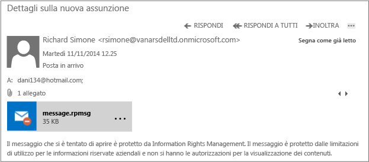

# Immagine a schermo intero: Un messaggio di posta elettronica esterno protetto da DLP e Azure RMS

Torna a [Azure RMS in azione: Protezione automatica della posta elettronica con Exchange Online e criteri di prevenzione della perdita di dati](http://technet.microsoft.com/library/jj585026.aspx)

