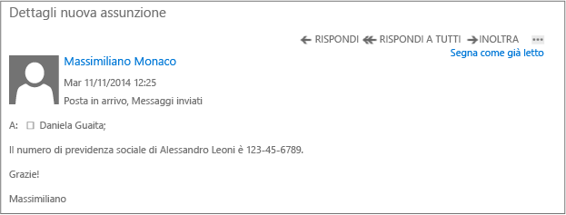

# Immagine a schermo intero: Messaggio di posta elettronica (interno) non protetto

Torna a [Azure RMS in azione: Protezione automatica della posta elettronica con Exchange Online e criteri di prevenzione della perdita di dati](http://technet.microsoft.com/library/jj585026.aspx)

