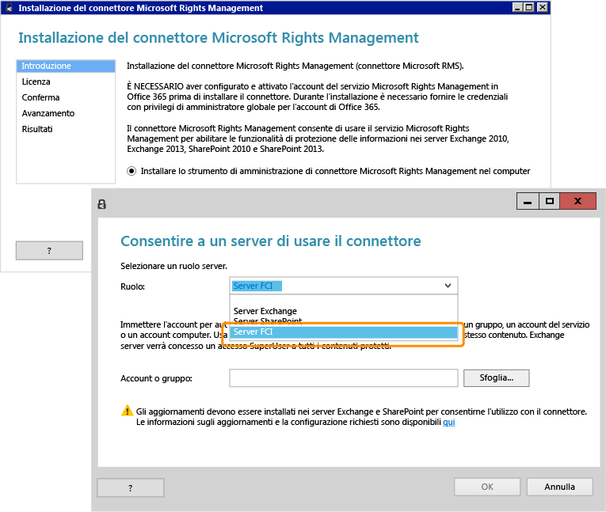

# Immagine a schermo intero: Installazione e configurazione del connettore RMS per FCI

Torna a [Azure RMS in azione: Protezione automatica dei file su file server che eseguono Windows Server e Infrastruttura di classificazione file.](http://technet.microsoft.com/library/jj585026.aspx).

