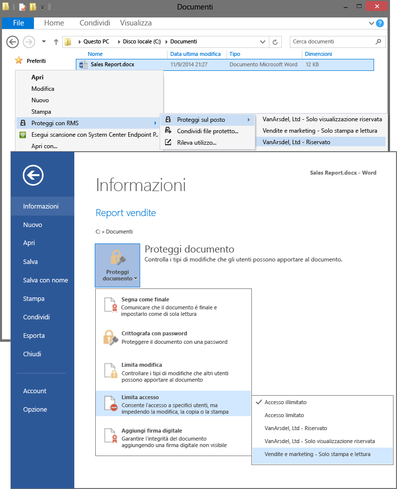

# Immagine a schermo intero: Selezionare i modelli RMS nelle applicazioni, ad esempio Esplora file e Word

Torna a [Azure RMS in azione: Attivazione e configurazione di Rights Management](http://technet.microsoft.com/library/jj585026.aspx)

