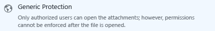

# Come condividere in modo sicuro un documento tramite posta elettronica

## &lt;Istruzioni per gli amministratori: - cancellare questa sezione prima di darla agli utenti &gt;
Utilizzare questo documento come punto di partenza per le proprie istruzioni per l'utente finale per consentire agli utenti di condividere in modo sicuro i documenti tramite posta elettronica.Apportare tutte le modifica desiderate alle istruzioni nella sezione successiva, quindi eliminare la prima sezione e dare il documento agli utenti.

Le istruzioni di seguito sono per una società fittizia, **VanArsdel Ltd**.Prima di fornire queste istruzioni agli utenti, sostituire le schermate e le istruzioni in modo che mostrino il proprio nome aziendale, o modificare le istruzioni per informare gli utenti del fatto che ogni volta che le istruzioni fanno riferimento a VanArsdel Ltd, essi visualizzeranno il proprio nome aziendale.Altre personalizzazioni che si desiderano apportare:

-   Nel passaggio 2, sono consigliabili solo due delle opzioni disponibili se viene inviato a utenti esterni all'azienda.È possibile modificare questi suggerimenti.

-   Nel passaggio 2, si suggeriscono delle descrizioni per consentire agli utenti di identificare quale modello selezionare.È possibile modificare queste descrizioni per renderle più specifiche o significative per l'azienda e per gli utenti.

-   Nel passaggio 3, è consigliabile l’opzione **Consenti immediatamente la revoca dell'accesso ai documenti** per l’opzione **Visualizzatore-solo visualizzazione**, ad esempio per quando si potrebbe desiderare di includere questa opzione di configurazione per gli utenti.Tuttavia, si potrebbe decidere che gli utenti devono selezionare sempre questa opzione, ogni volta che inviano il documento a utenti esterni all'azienda, o non selezionare mai questa opzione.

-   Nel passaggio 4, è consigliabile l'opzione **Invia un messaggio di posta elettronica quando qualcuno tenta di aprire il documento**.Se gli utenti tracciano i documenti utilizzando il portale di rilevamento dei documenti, è possibile decidere che la notifica tramite posta elettronica non è necessaria ed eliminare questo passaggio.

> [!NOTE]
> Per ulteriori informazioni su ciascuna delle opzioni selezionabili dagli utenti, vedere [Opzioni della finestra di dialogo per l'applicazione di condivisione di Rights Management](https://technet.microsoft.com/library/dn574738.aspx)

Affinché le istruzioni per l'utente per questo scenario funzionino, devono verificarsi le seguenti condizioni:

|Check|Requisito|Se sono necessarie ulteriori informazioni|
|---------|-------------|---------------------------------------------|
||Sono stati preparati account e gruppi per Azure Active Directory|[Preparazione per Azure Rights Management](https://technet.microsoft.com/library/jj585029.aspx)|
||Azure Rights Management non è attivato|[Attivazione di Azure Rights Management](https://technet.microsoft.com/library/jj658941.aspx)|
||L’applicazione di condivisione Rights Management è distribuita nei computer degli utenti che eseguono Windows|[Distribuzione automatica dell'applicazione di condivisione Microsoft Rights Management](https://technet.microsoft.com/library/dn339003%28v=ws.10%29.aspx)|
||Se si utilizza Exchange Server invece di Exchange Online:  -   Viene distribuito il connettore RMS e i ruoli dell’Exchange Server sono configurati per utilizzarlo|[Distribuzione del connettore di Azure Rights Management](https://technet.microsoft.com/library/dn375964.aspx)|
||Gli utenti utilizzano Outlook da Office 2010.|Se gli utenti dispongono di Office 2013, sostituire le schermate con le versioni equivalenti in modo che corrispondano con ciò che viene visualizzato agli utenti.|
||Sono stati configurati dei modelli personalizzati, come descritto di seguito|[Configurazione di modelli personalizzati per Azure Rights Management](https://technet.microsoft.com/library/dn642472.aspx)|

#### Per configurare dei modelli personalizzati:

1.  Archiviare i 2 modelli predefiniti.

2.  Creare 3 nuovi modelli copiando i modelli predefiniti e apportando le seguenti modifiche:

    |Modello da copiare|Nuovo nome|Nuova descrizione|Concedere questi diritti personalizzati|Altre impostazioni|
    |----------------------|--------------|---------------------|-------------------------------------------|----------------------|
    |**&lt;nome organizzazione&gt; - Solo visualizzazione riservata**|**Strettamente riservato - &lt; nome organizzazione &gt;**|Tutti gli utenti di &lt; nome organizzazione &gt; visualizzano e modificano i diritti.Nessun accesso offline|**Visualizza contenuto**  **Salva file**  **Modifica contenuto**|Aggiornare il nome e la descrizione per le lingue utilizzate dagli utenti.  Per la **scadenza contenuto**: Mantenere il valore predefinito di**Nessuna scadenza contenuto**  Per **l'accesso offline**: Selezionare **Il contenuto è disponibile solo con una connessione a Internet**|
    |**&lt;nome organizzazione&gt; - Solo visualizzazione riservata**|**Riservato - &lt;nome organizzazione&gt;**|Tutti gli utenti di &lt; nome organizzazione &gt; visualizzano e modificano i diritti.|**Visualizza contenuto**  **Salva file**  **Modifica contenuto**|Aggiornare il nome e la descrizione per le lingue utilizzate dagli utenti.  Per la **scadenza contenuto**: Mantenere il valore predefinito di**Nessuna scadenza contenuto**  Per **l'accesso offline**: Selezionare il **Numero di giorni per cui il contenuto è disponibile senza una connessione a Internet**  e digitare **1**|
    |**&lt;nome organizzazione&gt; - Riservato**|**Interno - &lt; nome organizzazione &gt;**|Tutti gli utenti di &lt; nome organizzazione &gt; dispongono dei diritti completi, ma non possono rimuovere la protezione del contenuto.|**Visualizza contenuto**  **Salva file**  **Modifica contenuto**  **Copia ed estrai contenuto**  **Stampa**|Aggiornare il nome e la descrizione per le lingue utilizzate dagli utenti.  Per la **scadenza contenuto**: Mantenere il valore predefinito di**Nessuna scadenza contenuto**  Per **l'accesso offline**: Mantenere il valore predefinito di**Numero di giorni per cui il contenuto è disponibile senza una connessione a Internet**e mantenere il valore predefinito di**7**|

3.  Pubblicare i 3 nuovi modelli.

## &lt;Istruzioni per l'utente inizia da qui, eliminare questo titolo&gt;
D'ora in avanti, ogni volta che si invia un documento importante a qualcuno tramite posta elettronica, è possibile utilizzare queste istruzioni per evitare che il documento venga letto da persone che non devono visualizzarlo.

1.  Creare il messaggio di posta elettronica specificando l'indirizzo o gli indirizzi di posta elettronica, digitare il messaggio e allegare il file che si desidera condividere in modo sicuro.Quindi, nella scheda **Messaggio**, nel gruppo **RMS**, fare clic su **Condividi file protetto** e quindi fare nuovamente clic su **Condividi file protetto**:

    

2.  Nella finestra di dialogo **Condividi file protetto**, specificare le seguenti:

    Quando si invia un documento ad almeno una persona che lavora per un'altra azienda:

    |Se...|effettuare la seguente operazione:|
    |---------|--------------------------------------|
    |**Protezione generica**→ viene selezionato automaticamente|Mantenere questa selezione:  |
    |Le informazioni nel documento non devono essere modificate    →|Selezionare **Visualizzatore -solo visualizzazione**:  |
    |Le informazioni nel documento possono essere modificate    →|Selezionare **Co-autore - Visualizzare, modificare, copiare e stampare**:  |
    Quando si invia un documento a persone all'interno della propria azienda:

    |Se...|effettuare la seguente operazione:|
    |---------|--------------------------------------|
    |**Protezione generica**→ viene selezionato automaticamente|Mantenere questa selezione:  |
    |Le informazioni contenute nel documento sono molto sensibili e causerebbe un danno estremamente elevato all'azienda o ai propri dipendenti se venissero rese pubbliche    →|Selezionare**Strettamente riservato - VanArsdel, Ltd** :  |
    |Le informazioni contenute nel documento sono sensibili e causerebbe un danno estremamente elevato all'azienda o ai propri dipendenti se venissero rese pubbliche    →|Selezionare**riservato - VanArsdel, Ltd** :  |
    |Le informazioni contenute nel documento non devono essere condivise con utenti esterni all'azienda, ma non contengano informazioni riservate riguardanti l’azienda o i suoi dipendenti    →|Selezionare**Interno – VanArsdel, Ltd**:  |

3.  Se si seleziona **Visualizzatore-solo visualizzazione**: Selezionare l’opzione **Consenti la revoca immediata dell'accesso a specifici documenti**:

    

4.  Selezionare **Inviami un messaggio di posta elettronica quando qualcuno tenta di aprire questi documenti**:

    

5.  Fare clic su **Invia subito**:

    

Quando un utente a cui è stato inviato un documento protetto riceve il messaggio di posta elettronica, viene visualizzato un messaggio che fornisce le istruzioni su come leggerlo.Essi possono leggere il documento su diversi dispositivi, tra cui iPad, iPhone, tablet e telefoni Android, computer Mac e computer Windows.

Per monitorare se le persone a cui sono stati inviati i documenti hanno avuto accesso ai protetti, utilizzare il [sito di rilevamento del documento](https://track.azurerms.com/).

**Serve assistenza?**

-   Per informazioni aggiuntive:

    -   [Proteggere un file che si condivide tramite posta elettronica](https://technet.microsoft.com/library/dn574735%28v=ws.10%29.aspx)

    -   [Tenere traccia e revocare i documenti](https://technet.microsoft.com/library/dn986611.aspx)

-   Contattare il supporto tecnico:

    -   &lt; dettagli di contatto &gt;

