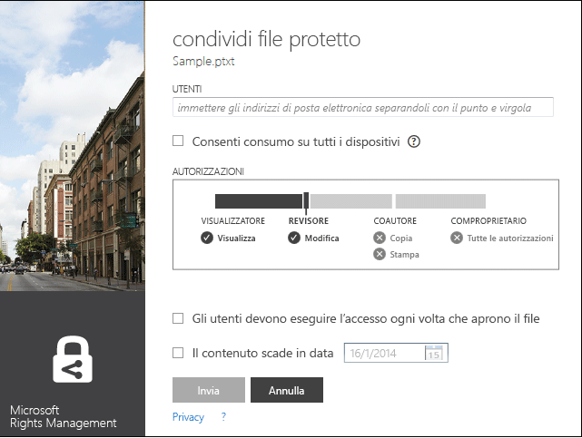
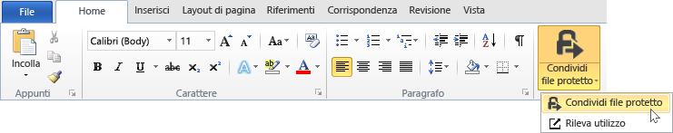

# Manuale dell&#39;utente dell&#39;applicazione di condivisione Microsoft Rights Management - pubblicazione originale
Questo manuale dell'utente per l'applicazione di condivisione Microsoft Rights Management per Windows include le sezioni seguenti:

-   [Valutazione e installazione dell'applicazione di condivisione Microsoft Rights Management](../Topic/Microsoft_Rights_Management_sharing_application_user_guide_-_original_publication.md#BKMK_Eval)

-   [Uso dell'applicazione di condivisione Microsoft Rights Management](../Topic/Microsoft_Rights_Management_sharing_application_user_guide_-_original_publication.md#BKMK_UsingMSRMSApp)

-   [Uso di autorizzazioni create dall'utente e condivisione di contenuto protetto](../Topic/Microsoft_Rights_Management_sharing_application_user_guide_-_original_publication.md#BKMK_Custom)

-   [Uso del componente aggiuntivo della barra degli strumenti di Office](../Topic/Microsoft_Rights_Management_sharing_application_user_guide_-_original_publication.md#BKMK_OfficeToolbar)

-   [Materiale sussidiario dell'amministratore per l'applicazione di condivisione Microsoft Rights Management](../Topic/Microsoft_Rights_Management_sharing_application_user_guide_-_original_publication.md#BKMK_AdminGuide)

Per informazioni sulla risoluzione dei problemi e sulle domande frequenti, vedere [Domande frequenti per l'applicazione di condivisione Microsoft Rights Management per Windows](http://go.microsoft.com/fwlink/?LinkId=303971).

## <a name="BKMK_Eval"></a>Valutazione e installazione dell'applicazione di condivisione Microsoft Rights Management
In questa sezione viene spiegato cos'è l'applicazione di condivisione Microsoft Rights Management e la modalità di installazione:

-   [Cos'è l'applicazione di condivisione Microsoft Rights Management?](../Topic/Microsoft_Rights_Management_sharing_application_user_guide_-_original_publication.md#BKMK_WhatIs)

-   [Requisiti dell'applicazione di condivisione Microsoft Rights Management](../Topic/Microsoft_Rights_Management_sharing_application_user_guide_-_original_publication.md#BKMK_Reqs)

-   [Installazione dell'applicazione di condivisione Microsoft Rights Management](../Topic/Microsoft_Rights_Management_sharing_application_user_guide_-_original_publication.md#BKMK_Install)

### <a name="BKMK_WhatIs"></a>Cos’è l'applicazione di condivisione Microsoft Rights Management?
L’applicazione di condivisione Microsoft Rights Management è un'applicazione facoltativa scaricabile per Microsoft Windows che fornisce le funzionalità seguenti:

-   Migliora Esplora file (noto anche come Esplora risorse in Windows 7 e versioni precedenti) per consentire di proteggere un singolo file o più file in blocco, nonché tutti i file all'interno di una cartella selezionata.

-   Aggiunge il supporto per la protezione di qualsiasi tipo di file e un visualizzatore integrato per i tipi di file di testo e immagine d’uso comune.

-   Aggiunge nuovi pulsanti alla barra degli strumenti di Microsoft Office per Word, PowerPoint ed Excel.

### <a name="BKMK_Reqs"></a>Requisiti per l'applicazione di condivisione Microsoft Rights Management
Per utilizzare l'applicazione di condivisione Microsoft Rights Management, nel computer deve essere in esecuzione Windows 8.1, Windows 8 o Windows 7.

L'applicazione di condivisione Microsoft Rights Management richiede il client AD RMS 2.1, che viene installato come parte del pacchetto di installazione.L'applicazione di condivisione Microsoft Rights Management funziona solo con questa versione del client AD RMS.

### <a name="BKMK_Install"></a>Installazione dell'applicazione di condivisione Microsoft Rights Management
Per installare l'applicazione di condivisione Microsoft Rights Management, procedere come segue:

1.  Visitare la pagina [Microsoft Rights Management](http://go.microsoft.com/fwlink/?LinkId=303970) nel sito Web Microsoft.

2.  Nella sezione **Computer**, fare clic sull'icona per l’**app RMS per Windows** e salvare il pacchetto di installazione dell’applicazione di condivisione Microsoft Rights Management nel computer.

3.  Fare doppio clic sul file compresso che è stato scaricato e quindi su **setup.exe**.Se viene richiesto di continuare, fare clic su **Sì**.

4.  Nella pagina **Installazione di Microsoft RMS** fare clic su **Avanti** e attendere la fine dell'installazione.

5.  Al termine dell'installazione, fare clic su **Riavvia** per riavviare il computer e completare l'installazione.In alternativa, fare clic su **Chiudi** e riavviare il computer in un secondo momento per completare l'installazione.

## <a name="BKMK_UsingMSRMSApp"></a>Uso dell'applicazione di condivisione Microsoft Rights Management
In questa sezione vengono illustrati diversi modi per utilizzare l'applicazione di condivisione Microsoft Rights Management:

-   [Creazione di un file di testo protetto (con estensione ptxt)](../Topic/Microsoft_Rights_Management_sharing_application_user_guide_-_original_publication.md#BKMK_CreatePTXT)

-   [Visualizzazione di un file di testo protetto (con estensione ptxt) o di un file di immagine protetto](../Topic/Microsoft_Rights_Management_sharing_application_user_guide_-_original_publication.md#BKMK_ViewPTXT)

-   [Creazione di un file con protezione generica (con estensione pfile)](../Topic/Microsoft_Rights_Management_sharing_application_user_guide_-_original_publication.md#BKMK_CreatePFILE)

-   [Visualizzazione di un file con protezione generica (con estensione pfile)](../Topic/Microsoft_Rights_Management_sharing_application_user_guide_-_original_publication.md#BKMK_ViewPFILE)

-   [Rimozione della protezione da un file](../Topic/Microsoft_Rights_Management_sharing_application_user_guide_-_original_publication.md#BKMK_Unprotect)

### <a name="BKMK_CreatePTXT"></a>Creazione di un file di testo protetto (.ptxt)
L’applicazione di condivisione Microsoft Rights Management può essere utilizzata per convertire un file di testo normale (.txt) in un file protetto (.ptxt).

##### Per creare un file di testo protetto (.ptxt)

1.  In Esplora file, fare clic con il pulsante destro del mouse in una cartella, scegliere **Nuovo**, quindi fare clic su **Documento di testo**.

2.  Rinominare il file (ad esempio, Sample.txt).

3.  Fare doppio clic sul file per aprirlo in Blocco note.

4.  In Blocco note, aggiungere al file alcune righe di testo, ad esempio come indicato di seguito, e quindi salvare il file:

    ```
    This is a sample text file.
    This is a sample text file.
    This is a sample text file.
    This is a sample text file. 
    This is a sample text file.
    This is a sample text file.
    ```

5.  Fare clic con il pulsante destro del mouse sul file, scegliere **Proteggi sul posto** e selezionare un modello dall'elenco.Se questa è la prima volta che si utilizza lo strumento, è necessario selezionare **Protezione aziendale** per avviare il download dei modelli per l'organizzazione.

6.  Nella schermata **Applicazione di condivisione Microsoft Rights Management**, verificare i criteri da applicare, fare clic su **Applica** e, una volta protetto il file, fare clic su **Chiudi**.

### <a name="BKMK_ViewPTXT"></a>Visualizzazione di un file di immagine protetto o un file di testo protetto (.ptxt)
Per visualizzare un file di testo protetto (.ptxt), in Esplora file, fare doppio clic sul file (ad esempio, Sample.ptxt).È possibile che venga richiesto di autorizzare l'applicazione a ottenere i diritti.I criteri di protezione vengono visualizzati nella parte superiore del file.

Le immagini protette possono essere aperte e visualizzate in modo analogo.

### <a name="BKMK_CreatePFILE"></a>Creazione di un file generico protetto (.pfile)
Il formato di file di protezione generica (.pfile) può essere utilizzato per offrire un livello di protezione generico per i tipi di file che non sono supportati direttamente dall'applicazione di condivisione Microsoft Rights Management o da altre applicazioni che forniscono protezione incorporata di tipo RMS.

Ad esempio, il formato di file di protezione generico può proteggere i file con estensione vsd mediante Microsoft Visio (che non supporta attualmente la protezione integrata).

> [!NOTE]
> I file che utilizzano la protezione generale sono protetti solo per l'autenticazione.Un utente autorizzato a utilizzare il file protetto (.pfile) verrà autenticato e i diritti e le autorizzazioni dell'utente vengono visualizzati, ma non possono essere applicati una volta aperto il file nel formato originale (ad esempio, una volta che in Visio viene aperto il file con estensione vsd).Un utente che non è autorizzato o non può essere autenticato non sarà in grado di aprire il file protetto.

##### Per creare un file generico protetto (.pfile) da un file di disegno di Visio (.vsd)

1.  In Esplora file, fare clic con il pulsante destro del mouse in una cartella, scegliere **Nuovo**, quindi fare clic su **Nuovo documento di Visio**.

2.  Rinominare il file (ad esempio, Sample.vsd).

3.  Fare doppio clic sul file per aprirlo in Visio.

4.  In Visio, aggiungere elementi al disegno, quindi salvare e chiudere il file.

5.  Fare clic con il pulsante destro del mouse sul file, scegliere **Proteggi sul posto** e selezionare un modello di criteri dall'elenco.Se questa è la prima volta che si utilizza lo strumento, è necessario selezionare **Protezione aziendale** per avviare il download dei modelli per l'organizzazione.

6.  Nella schermata **Applicazione di condivisione Microsoft Rights Management**, selezionare i criteri da applicare, quindi fare clic su **Applica**.

7.  Un messaggio indica che il file protetto è stato salvato come Sample.vsd.pfile (il file originale viene eliminato).

### <a name="BKMK_ViewPFILE"></a>Visualizzazione di un file generico protetto (.pfile)
Per visualizzare un file generico protetto (.pfile), in Esplora file, fare doppio clic sul file generico protetto (.pfile) (ad esempio, Sample.vsd.pfile) e fare clic su **Apri**.

### <a name="BKMK_Unprotect"></a>Rimozione della protezione da un file
L’applicazione di condivisione Microsoft Rights Management offre l'opzione per rimuovere la protezione da un file protetto in precedenza.

Per rimuovere la protezione (ossia annullare la protezione) di un file protetto in precedenza, si applica l’opzione **Rimuovi protezione**, come indicato di seguito:

1.  Fare doppio clic su **Sample.ptxt**, scegliere **Proteggi sul posto** e fare clic su **Rimuovi protezione**.È possibile che venga richiesto di autorizzare l'applicazione a ottenere i diritti.

2.  Sample.ptxt viene eliminato e sostituito con Sample.txt.

## <a name="BKMK_Custom"></a>Utilizzo delle autorizzazioni create dall'utente e condivisione del contenuto protetto
In questa sezione viene illustrato come proteggere e utilizzare un file utilizzando le autorizzazioni create dall'utente, come condividere il contenuto protetto e come proteggere più file:

-   [Protezione di un file con autorizzazioni create dall'utente](../Topic/Microsoft_Rights_Management_sharing_application_user_guide_-_original_publication.md#BKMK_ProtectCustom)

-   [Utilizzo di file con protezione creata dall'utente](../Topic/Microsoft_Rights_Management_sharing_application_user_guide_-_original_publication.md#BKMK_UserDefined)

-   [Condivisione di contenuto protetto](../Topic/Microsoft_Rights_Management_sharing_application_user_guide_-_original_publication.md#BKMK_ShareProtected)

-   [Uso dei tasti di scelta rapida](../Topic/Microsoft_Rights_Management_sharing_application_user_guide_-_original_publication.md#BKMK_AccessKeys)

-   [Applicazione della protezione a più file e cartelle](../Topic/Microsoft_Rights_Management_sharing_application_user_guide_-_original_publication.md#BKMK_Multiple)

### <a name="BKMK_ProtectCustom"></a>Protezione di un file con le autorizzazioni create dall'utente
La protezione creata dall'utente può essere utilizzata per i seguenti scopi:

-   Per limitare l'accesso ai file solo per un elenco specifico di singoli utenti identificati dai rispettivi indirizzi di posta elettronica.

-   Per limitare l'utilizzo dei file solo per specifici diritti, ad esempio i diritti di sola lettura di un documento.

Per proteggere un file con le autorizzazioni create dall'utente, fare clic con il pulsante destro del mouse sul file, fare clic su **Proteggi sul posto** e quindi su **Autorizzazioni personalizzate**.Viene visualizzata la schermata seguente:


Digitare gli indirizzi e-mail dell'elenco di utenti, utilizzare il dispositivo di scorrimento per selezionare le autorizzazioni per il file e fare clic su **Applica**.

### <a name="BKMK_UserDefined"></a>Utilizzo di file che hanno la protezione creata dall'utente
La maggior parte dei file protetti che vengono gestiti dall'applicazione di condivisione Microsoft Rights Management, sono protetti applicando livelli di protezione basati sul modello.È possibile, tuttavia, che l’applicazione di condivisione Microsoft Rights Management supporti anche i file a cui è stato assegnato un livello di protezione creato dall'utente .

La protezione creata dall'utente può essere utilizzata per ottenere i seguenti tipi di protezione per un file:

-   Per limitare l'accesso solo ai file di un elenco specifico di singoli utenti identificati dai rispettivi indirizzi di posta elettronica.

-   Per limitare l'utilizzo del file solo per un singolo specifico diritto, ad esempio i diritti di sola lettura del documento.

Per formati di file di testo e immagine, questo livello di protezione richiede che tutte le applicazioni che vengono utilizzate per modificare, salvare o limitare i file di testo o immagine siano state progettate per supportare la protezione RMS e implementare le API di protezione fornite in AD RMS SDK.

Quando si visualizza un file di testo protetto a cui è stata applicata la protezione utente, si noterà una leggera differenza nelle autorizzazioni visualizzate per il file, come illustrato nell'esempio riportato di seguito.

Per i file protetti utilizzando il formato di file di protezione generico (.pfile), nella schermata di conferma anziché il nome del modello utilizzato per proteggere il file vengono visualizzati i diritti o le autorizzazioni specifiche dell'utente, come illustrato nella figura seguente.


### <a name="BKMK_ShareProtected"></a>Condivisione di contenuto protetto
Per proteggere e condividere il contenuto, fare clic con il pulsante destro del mouse sul file e scegliere **Condividi file protetto**.Viene visualizzata la schermata seguente:



Digitare gli indirizzi e-mail dell'elenco di utenti, utilizzare il dispositivo di scorrimento per selezionare le autorizzazioni per il file e fare clic su **Invia**.L'applicazione avvia Outlook con un messaggio e-mail prestabilito con allegato il file protetto.Il file originale non sarà protetto.

Per consentire agli utenti di visualizzare i file protetti sui dispositivi non Windows, fare clic su **Consenti consumo su tutti i dispositivi**.Gli utenti dovranno [scaricare l'applicazione di condivisione Microsoft Rights Management](http://go.microsoft.com/fwlink/?LinkId=303970) per il dispositivo in uso.

### <a name="BKMK_AccessKeys"></a>Uso dei tasti di scelta rapida
Premere il tasto **ALT** per visualizzare le chiavi di accesso disponibili.Premere **ALT** + tasto di scelta per selezionare un'opzione.Ad esempio, nella finestra di dialogo **Condividi file protetto**, premere **ALT** per visualizzare i tasti di scelta e premere **ALT + u** per selezionare **Gli utenti devono eseguire l’accesso ogni volta che aprono il file**.


### <a name="BKMK_Multiple"></a>Applicazione della protezione per più file e cartelle
L’applicazione di condivisione Microsoft Rights Management consente inoltre di applicare la protezione a più file, ad esempio selezionando più file o una cartella contenente i file non protetti in Esplora file.

##### Per proteggere molti o tutti i file di una cartella selezionata

1.  In Esplora file, selezionare più file o una cartella contenente più file da proteggere.

2.  Fare clic con il pulsante destro del mouse sulla cartella o sui file selezionati, scegliere **Proteggi sul posto** e selezionare un modello dall'elenco.Se questa è la prima volta che si utilizza lo strumento, è necessario selezionare **Protezione aziendale** per avviare il download dei modelli per l'organizzazione.

3.  Nella schermata dell’**applicazione di condivisione Microsoft Rights Management**, verificare che i file siano stati protetti.

Se sono presenti errori, fare riferimento alle [Domande frequenti per l’applicazione di condivisione Microsoft Rights Management per Windows](http://go.microsoft.com/fwlink/?LinkId=303971).

## <a name="BKMK_OfficeToolbar"></a>Uso del componente aggiuntivo della barra degli strumenti di Office
È possibile proteggere e condividere file di Word, PowerPoint ed Excel direttamente da Microsoft Office utilizzando il componente aggiuntivo della barra multifunzione di Office per l'applicazione di condivisione Microsoft Rights Management.Fare clic su **Condividi file protetto** sulla barra multifunzione per avviare l'applicazione di condivisione Microsoft Rights Management.



## <a name="BKMK_AdminGuide"></a>Linee guida per l’amministratore dell'applicazione di condivisione Microsoft Rights Management
Questa Guida dell’amministratore per l'applicazione di condivisione Microsoft Rights Management include le sezioni seguenti:

-   [Panoramica tecnica dell'applicazione di condivisione Microsoft Rights Management](../Topic/Microsoft_Rights_Management_sharing_application_user_guide_-_original_publication.md#BKMK_AdminOverview)

-   [Tipi di file supportati](../Topic/Microsoft_Rights_Management_sharing_application_user_guide_-_original_publication.md#BKMK_SupportFileTypes)

-   [Distribuzione automatica dell'applicazione di condivisione Microsoft Rights Management](../Topic/Microsoft_Rights_Management_sharing_application_user_guide_-_original_publication.md#BKMK_ScriptedInstall)

### <a name="BKMK_AdminOverview"></a>Informazioni tecniche sull'applicazione di condivisione Microsoft Rights Management
L’applicazione di condivisione Microsoft Rights Management è un'applicazione facoltativa scaricabile per Microsoft Windows e altre piattaforme che fornisce le funzionalità seguenti:

-   Protezione di un singolo un singolo file o più file in blocco oppure di tutti i file contenuti in una cartella selezionata.

-   Supporto completo per la protezione di qualsiasi tipo di file e un visualizzatore integrato per i tipi di file di testo e immagine d’uso comune.

-   Protezione generica per i file che non supportano la protezione RMS.

-   Interoperabilità completa con i file protetti tramite Office Information Rights Management (IRM)

-   Interoperabilità completa con i file PDF protetti con SharePoint, FCI e gli strumenti di creazione PDF supportati

L’applicazione di condivisione Microsoft Rights Management utilizza il nuovo [runtime client AD RMS 2.1](http://www.microsoft.com/download/details.aspx?id=38396).Offre agli utenti la possibilità di proteggere il contenuto mediante modelli predefiniti o definiti dall'utente che è possibile personalizzare e distribuire per l'organizzazione.Utilizzando la funzionalità di AD RMS 2.1, l'applicazione di condivisione Microsoft Rights Management consente agli utenti finali un'esperienza semplice di protezione e utilizzo.

Con la versione di ottobre 2013 di Windows Azure AD RMS, è possibile proteggere in modo nativo i documenti utilizzando Office 2010 e inviarli a utenti in un'altra società i quali possono quindi utilizzarli con Windows Azure AD RMS.Inoltre, con questa versione, se si usa AD RMS in modalità di crittografia 2, è possibile utilizzare RMS per utenti singoli e utilizzare il contenuto di persone in un'altra società che utilizza Windows Azure AD RMS.Per ulteriori informazioni sulla modalità di crittografia 2, vedere [Modalità di crittografia di AD RMS](http://technet.microsoft.com/library/hh867439%28v=ws.10%29.aspx).

Per scaricare l'applicazione di condivisione Microsoft Rights Management, procedere come segue:

1.  Accedere a [Microsoft Connect](http://connect.microsoft.com/) con l'account Microsoft (precedentemente noto come Live ID).

2.  Nella pagina **Home**, cercare **Rights Management Services** e partecipare al gruppo.

3.  Fare clic su **Download**, quindi su **Applicazione di condivisione Microsoft Rights Management**.

4.  Nella pagina **Dettagli download** selezionare **Applicazione di condivisione Microsoft Rights Management.zip** e fare clic su **Download**.

5.  Se necessario, installare Microsoft File Transfer Manager e completare i passaggi per scaricare l'applicazione di condivisione Microsoft Rights Management.

#### Livelli di protezione supportati dall'applicazione di condivisione Microsoft Rights Management
L’applicazione di condivisione Microsoft Rights Management supporta due livelli diversi di protezione, come descritto nella tabella seguente.

||||
|-|-|-|
|Tipo di protezione|Nativo|Generico|
|Descrizione|Per file di testo, immagine, Microsoft Office (Word, Excel e PowerPoint), file .pdf e altri tipi di file di applicazione che supportano AD RMS, la protezione nativa fornisce un potente livello di protezione che include crittografia e applicazione di diritti (autorizzazioni).|Per tutte le altre applicazioni e tipi di file, la protezione generica fornisce un livello di protezione che include l’incapsulamento dei file usando il tipo di file .pfile e l’autenticazione dei file per verificare se un utente è autorizzato ad aprire il file.|
|Protezione|I file sono completamente crittografati e la protezione viene applicata nei modi seguenti:<br /><br />-   Prima di eseguire il rendering del contenuto protetto, è necessario eseguire l'autenticazione per gli utenti che ricevono il file tramite e-mail o a cui viene concesso l'accesso al file tramite le autorizzazioni di condivisione o del file.<br />-   Inoltre, i criteri e i diritti di utilizzo impostati dal proprietario del contenuto quando i file vengono protetti sono applicati quando viene eseguito il rendering del contenuto nel Visualizzatore IP (per file di testo e immagine protetti) o nell'applicazione associata (per tutti gli altri tipi di file supportati).|La protezione dei file viene applicata nei modi seguenti:<br /><br />-   Prima di eseguire il rendering del contenuto protetto, è necessario eseguire con esito positivo l'autenticazione per coloro che sono autorizzati ad aprire il file e a cui viene concesso l’accesso.Se l'autorizzazione ha esito negativo, il file non viene aperto.<br />-   I criteri e i diritti di utilizzo impostati dal proprietario del contenuto vengono visualizzati per informare gli utenti autorizzati circa i criteri di utilizzo previsti.<br />-   Viene eseguita la registrazione degli utenti autorizzati che aprono e accedono ai file, tuttavia i diritti di utilizzo non vengono applicati tramite le applicazioni che non prevedono il supporto.|
|Impostazione predefinita per i tipi di file|Questo è il livello di protezione predefinito per i tipi di file seguenti:<br /><br />-   File di testo e immagine<br />-   File di Microsoft Office (Word, Excel, PowerPoint)<br />-   Portable Document Format (.pdf)<br /><br />Per ulteriori informazioni, vedere Tipi di file supportati.|Questa è la protezione predefinita per tutti gli altri tipi di file (ad esempio .vsdx, .rtf e così via) non supportati tramite la protezione completa.|

### <a name="BKMK_SupportFileTypes"></a>Tipi di file supportati
Nella tabella seguente sono elencati i tipi di file supportati dall’applicazione di condivisione Microsoft Rights Management.

|Estensione di file|Descrizione|Estensione di file originale|
|----------------------|---------------|--------------------------------|
|.ptxt|File di testo protetto|.txt|
|.pxml|File XML protetto|.xml|
|.pjpg|File di immagine JPG protetto|.jpg|
|.pjpeg|File di immagine JPEG protetto|.jpeg|
|.ppng|File di immagine PNG protetto|.png|
|.ptiff|File di immagine TIFF protetto|.tiff|
|.pbmp|File bitmap di Windows protetto|.bmp|
|.pgif|File di immagine GIF protetto|.gif|
|.pgiff|File di immagine GIFF protetto|.giff|
|.pjpe|File di immagine JPE protetto|.jpe|
|.pjfif|File di immagine JFIF protetto|.jfif|
|.pjif|File di immagine JIF protetto|.jif|
Nella tabella seguente sono elencati i tipi di file supportati da Microsoft Office 2013, Office 2010 e Office 2007.Sono disponibili due tipi di protezione: MsoIrmProtector e OpcIrmProtector.Per ulteriori informazioni su questi tipi di protezione, vedere [Protezioni del formato di file di Microsoft Office](http://archive.msdn.microsoft.com/OfficeProtectors).

|||
|-|-|
|MsoIrmProtector supporta i seguenti tipi di file:<br /><br />-   doc<br />-   dot<br />-   xla<br />-   xls<br />-   xlt<br />-   pps<br />-   ppt|OpcIrmProtector supporta i seguenti tipi di file:<br /><br />-   docm<br />-   docx<br />-   dotm<br />-   dotx<br />-   xlam<br />-   xlsb<br />-   xlsm<br />-   xlsx<br />-   xltm<br />-   xltx<br />-   xps<br />-   potm<br />-   potx<br />-   ppsx<br />-   ppsm<br />-   pptm<br />-   pptx<br />-   thmx|

### <a name="BKMK_ScriptedInstall"></a>Distribuzione automatica dell'applicazione di condivisione Microsoft Rights Management
La versione di Windows dell'applicazione di condivisione RMS supporta un'installazione tramite script che può essere utilizzata anche per le distribuzioni aziendali.

##### Per scaricare l'applicazione di condivisione RMS per la distribuzione automatica

1.  Visitare la pagina [Applicazione di condivisione Microsoft Rights Management per Windows](http://www.microsoft.com/download/details.aspx?id=40857) nell’Area download Microsoft e fare clic su **Download**.

2.  Selezionare e scaricare i file necessari.Sono disponibili due pacchetti di installazione client: uno per Windows a 64 bit (applicazione di condivisione Microsoft Rights Management x64.zip) e l'altro per Windows a 32 bit (applicazione di condivisione Microsoft Rights Management x86.zip).

3.  Estrarre i file dai pacchetti di installazione compressi, ad esempio facendo doppio clic sui nomi.Quindi copiare i file estratti in un percorso di rete a cui possono accedere ai computer client.

I pacchetti di installazione per l'applicazione di condivisione RMS supportano diversi scenari di distribuzione tra cui i seguenti:

|Descrizione|Scenario di distribuzione|
|---------------|-----------------------------|
|Assistente per l'accesso ai Microsoft Online Services|Richiesto per:<br /><br />-   Office 2010 e Windows Azure RMS|
|Aggiornamento rapido per Office (KB 2596501)|Richiesto per:<br /><br />-   Office 2010 e Windows Azure RMS|
|Aggiornamento rapido per la modalità di crittografia 2 (KB 2627273)|Richiesto per:<br /><br />-   Office 2010 e Windows Azure RMS|
|Client AD RMS e applicazione di condivisione RMS|Richiesto per:<br /><br />-   Office 2013 e Windows Azure RMS<br />-   Office 2010 e Windows Azure RMS<br />-   Office 2013 e Active Directory RMS<br />-   Office 2010 e Active Directory RMS<br />-   Aggiornamento dell’applicazione di condivisione RMS|
|Componente aggiuntivo di Office per la barra multifunzione|Richiesto per:<br /><br />-   Office 2013 e Windows Azure RMS<br />-   Office 2013 e Active Directory RMS<br />-   Office 2010 e Active Directory RMS<br />-   Aggiornamento dell’applicazione di condivisione RMS|
|Utilità preparazione di Windows Azure Active Directory Rights Management|Richiesto per:<br /><br />-   Office 2010 e Windows Azure RMS|
> [!NOTE]
> Per lo scenario **Office 2010 e Windows Azure RMS**, è possibile utilizzare Windows Azure RMS o Active Directory RMS ma si desidera inviare in modo sicuro i documenti a persone di un'altra società che utilizzano Windows Azure RMS.
> 
> Quando si installa e si esegue l'utilità preparazione di Windows Azure Active Directory Rights Management per il supporto di Office 2010, vengono eseguite due operazioni:
> 
> -   Modifica il Registro di sistema per supportare l'applicazione di condivisione RMS.
> -   Esegue il “bootstrap” dell'utente, ossia il computer contatta il server AD RMS o Windows Azure RMS e ottiene i certificati necessari al computer e all’utente per utilizzare RMS.

Usare le procedure seguenti per identificare i comandi necessari per distribuire l'applicazione di condivisione RMS per questi scenari di distribuzione:

-   Office 2013 e Windows Azure RMS

-   Office 2010 e Windows Azure RMS

-   Office 2013 o Office 2010 e Active Directory RMS

-   Aggiornamento dell’applicazione di condivisione RMS

Negli esempi dei comandi si presuppone che i file scaricati ed estratti sono stati copiati in una condivisione di rete a cui i computer client accedono utilizzando **\\server5\apps\rms** e che i computer client dispongono già di una cartella denominata **C:\Log files** dove è possibile archiviare i file di log dell’installazione dell’applicazione.Per ogni installazione, è possibile scegliere il nome del file di log di installazione, ma l’estensione di file deve essere .log.

> [!IMPORTANT]
> Prima di distribuire l'applicazione di condivisione RMS, è necessario creare un pacchetto dei comandi necessari in queste procedure, in modo da poterli installare nel contesto del computer di tutti gli utenti e con i privilegi di amministratore locale.È quindi possibile distribuire il pacchetto ai computer tramite il meccanismo standard di distribuzione dell’applicazione, ad esempio criteri di gruppo o System Center Configuration Manager.
> 
> L’utilità preparazione di Windows Azure Active Directory Rights Management fa eccezione: Deve essere eseguita una sola volta per ogni utente del computer e con i privilegi elevati per modificare correttamente il Registro di sistema.Esistono diversi modi per eseguire questa operazione, tra cui chiedere agli utenti di eseguire il comando (ad esempio, un collegamento in un messaggio e-mail o un collegamento del portale Help Desk) oppure aggiungerlo agli script di accesso.Se non è possibile utilizzare il comando runas perché gli utenti non dispongono di un account amministratore locale, sono disponibili strumenti di distribuzione che possono elevare automaticamente un comando, in base alle regole specificate.

##### Per distribuire l'applicazione di condivisione RMS per Office 2013 e Windows Azure RMS

1.  Installare il client AD RMS e l'applicazione di condivisione RMS utilizzando i comandi seguenti:

    -   For Windows a 64 bit: x64\setup_ipviewer.exe /norestart /quiet /msicl "MSIRESTARTMANAGERCONTROL=Disable" /log "&lt;percorso e nome file log&gt;"

        ```
        x64\setup_ipviewer.exe /norestart /quiet /msicl "MSIRESTARTMANAGERCONTROL=Disable" /log "<log file path and name>"
        ```

    -   Per Windows a 32 bit:

        ```
        X86\setup_ipviewer.exe /norestart /quiet /msicl "MSIRESTARTMANAGERCONTROL=Disable" /log "<log file path and name>"
        ```

    Ad esempio: `\\server5\apps\rms\x64\setup_ipviewer.exe /norestart /quiet /msicl "MSIRESTARTMANAGERCONTROL=Disable" /log "C:\Log files\ipviewerinstall.log"`

2.  Installare il componente aggiuntivo di Office utilizzando i comandi seguenti:

    -   Per la versione di Office a 64 bit:

        ```
        msiexec.exe /norestart /quiet MSIRESTARTMANAGERCONTROL=Disable /i "x64\Setup64.msi" /L*v "<log file path and name>"
        ```

    -   Per la versione di Office a 32 bit:

        ```
        msiexec.exe /norestart /quiet MSIRESTARTMANAGERCONTROL=Disable /i "x86\Setup.msi" /L*v "<log file path and name>"
        ```

    > [!NOTE]
    > Per completare l'installazione è necessario riavviare il computer.È possibile avviare un'operazione di riavvio automatico tramite un comando, ad esempio shutdown /i.

    Ad esempio: `\\server5\apps\rms\msiexec.exe /norestart /quiet MSIRESTARTMANAGERCONTROL=Disable /i "x64\Setup64.msi" /L*v "C:\Log files\rmsoffice.log"`

##### Per distribuire l'applicazione di condivisione RMS per Office 2010 e Windows Azure RMS

1.  Installare l’Assistente per l'accesso ai Microsoft Online Services utilizzando i comandi seguenti:

    -   Per Windows a 64 bit:

        ```
        msiexec.exe /norestart /quiet MSIRESTARTMANAGERCONTROL=Disable /i "x64\msoidcli_64bit.msi" /L*v "<log file path and name >"
        ```

    -   Per Windows a 32 bit:

        ```
        msiexec.exe /norestart /quiet MSIRESTARTMANAGERCONTROL=Disable /i "x64\msoidcli_64bit.msi" /L*v "<log file path and name>"
        ```

    Ad esempio: `\\server5\apps\rms\msiexec.exe /norestart /quiet MSIRESTARTMANAGERCONTROL=Disable /i "x64\msoidcli_64bit.msi" /L*v "C:\Log files\assistant.log"`

2.  Installare l’aggiornamento rapido di Office utilizzando i comandi seguenti:

    -   Per la versione di Office a 64 bit:

        ```
        x64\office2010-kb2596501-fullfile-x64-glb.exe /norestart /quiet /log:"<log file path and name >"
        ```

    -   Per la versione di Office a 32 bit:

        ```
        x86\office2010-kb2596501-fullfile-x86-glb.exe /norestart /quiet /log:"<log file path and name>"
        ```

    Ad esempio: `\\server5\apps\rms\x64\office2010-kb2596501-fullfile-x64-glb.exe /norestart /quiet /log:"C:\Log files\kb2596501install.log"`

3.  Installare l’aggiornamento rapido della modalità di crittografia 2 utilizzando i comandi seguenti:

    -   Per Windows a 64 bit:

        ```
        wusa.exe /norestart /quiet "x64\Windows6.1-KB2627273-v4-x64.msu" /log:"<log file path and name >"
        ```

    -   Per Windows a 32 bit:

        ```
        wusa.exe /norestart /quiet "x86\Windows6.1-KB2627273-v4-x86.msu" /log:"<log file path and name>"
        ```

    Ad esempio: `\\server5\apps\rms\wusa.exe /norestart /quiet "x64\Windows6.1-KB2627273-v4-x64.msu" /log:"C:\Log files\kb267273.log"`

4.  Installare il client AD RMS e l'applicazione di condivisione RMS utilizzando il comando seguente:

    -   Per Windows a 64 bit:

        ```
        x64\setup_ipviewer.exe /norestart /quiet /msicl "MSIRESTARTMANAGERCONTROL=Disable" /log "<log file path and name >"
        ```

    -   Per Windows a 32 bit:

        ```
        X86\setup_ipviewer.exe /norestart /quiet /msicl "MSIRESTARTMANAGERCONTROL=Disable" /log "<log file path and name>"
        ```

    Ad esempio: `\\server5\apps\rms\x64\setup_ipviewer.exe /norestart /quiet /msicl "MSIRESTARTMANAGERCONTROL=Disable" /log "C:\Log files\ipviewerinstall.log"`

5.  Installare il componente aggiuntivo di Office utilizzando i comandi seguenti:

    -   Per la versione di Office a 64 bit:

        ```
        msiexec.exe /norestart /quiet MSIRESTARTMANAGERCONTROL=Disable /i "x64\Setup64.msi" /L*v "<log file path and name>"
        ```

    -   Per la versione di Office a 32 bit:

        ```
        msiexec.exe /norestart /quiet MSIRESTARTMANAGERCONTROL=Disable /i "x86\Setup.msi" /L*v "<log file path and name>"
        ```

    > [!NOTE]
    > Per completare l'installazione è necessario riavviare il computer.È possibile avviare un'operazione di riavvio automatico tramite un comando, ad esempio shutdown /i.

    Ad esempio: `\\server5\apps\rms\msiexec.exe /norestart /quiet MSIRESTARTMANAGERCONTROL=Disable /i "x64\Setup64.msi" /L*v "C:\Log files\rmsoffice.log"`

6.  Installare l’utilità preparazione di Windows Azure Active Directory Rights Management aggiungendo il seguente comando agli script di accesso:

    > [!IMPORTANT]
    > Per eseguire correttamente questo comando, gli utenti devono disporre di privilegi di amministratore locale.

    -   Per Windows 8, a 64 bit:

        ```
        x64\aadrmprep.exe /initiateMe /logfile "<log file path and name>"
        ```

    -   Per Windows 8, a 32 bit:

        ```
        X86\aadrmprep.exe /initiateMe /logfile "<log file path and name>"
        ```

    -   Per Windows 7, a 64 bit:

        ```
        x64\win7\aadrmprep.exe /initiateMe /logfile "<log file path and name>"
        ```

    -   Per Windows 7, a 32 bit:

        ```
        X86\win7\aadrmprep.exe /initiateMe /logfile "<log file path and name>"
        ```

    > [!NOTE]
    > Questo comando potrebbe richiedere all'utente di immettere le credenziali di Windows Azure.Se il computer non da parte di un dominio, verrà visualizzata la richiesta per l'utente.Se il computer fa parte di un dominio, l’utilità potrebbe essere in grado di utilizzare le credenziali memorizzate nella cache.

    Ad esempio: `\\server5\apps\rms\x64\aadrmprep.exe /initiateMe /logfile "C:\Log files\aadrmprepinstall.log"`

##### Per distribuire l'applicazione di condivisione RMS per Office 2013 o Office 2010 e Active Directory RMS

1.  Installare il client AD RMS e l'applicazione di condivisione RMS utilizzando i comandi seguenti:

    -   Per Windows a 64 bit:

        ```
        x64\setup_ipviewer.exe /norestart /quiet /msicl "MSIRESTARTMANAGERCONTROL=Disable" /log "<log file path and name>"
        ```

    -   Per Windows a 32 bit:

        ```
        X86\setup_ipviewer.exe /norestart /quiet /msicl "MSIRESTARTMANAGERCONTROL=Disable" /log "<log file path and name>"
        ```

    Ad esempio: `\\server5\apps\rms\x64\setup_ipviewer.exe /norestart /quiet /msicl "MSIRESTARTMANAGERCONTROL=Disable" /log "C:\Log files\ipviewerinstall.log"`

2.  Installare il componente aggiuntivo di Office utilizzando i comandi seguenti:

    -   Per la versione di Office a 64 bit:

        ```
        msiexec.exe /norestart /quiet MSIRESTARTMANAGERCONTROL=Disable /i "x64\Setup64.msi" /L*v "<log file path and name>"
        ```

    -   Per la versione di Office a 32 bit:

        ```
        msiexec.exe /norestart /quiet MSIRESTARTMANAGERCONTROL=Disable /i "x86\Setup.msi" /L*v "<log file path and name>"
        ```

    > [!NOTE]
    > Per completare l'installazione è necessario riavviare il computer.È possibile avviare un'operazione di riavvio automatico tramite un comando, ad esempio shutdown /i.

    Ad esempio: `\\server5\apps\rms\msiexec.exe /norestart /quiet MSIRESTARTMANAGERCONTROL=Disable /i "x64\Setup64.msi" /L*v "C:\Log files\rmsofficeinstall.log"`

##### Per aggiornare l’applicazione di condivisione RMS

1.  Installare il client AD RMS e l'applicazione di condivisione RMS utilizzando il comando seguente:

    -   Per Windows a 64 bit:

        ```
        x64\setup_ipviewer.exe /norestart /quiet /msicl "MSIRESTARTMANAGERCONTROL=Disable" /log "<log file path and name>"
        ```

    -   Per Windows a 32 bit:

        ```
        X86\setup_ipviewer.exe /norestart /quiet /msicl "MSIRESTARTMANAGERCONTROL=Disable" /log "<log file path and name>"
        ```

    Ad esempio: `\\server5\apps\rms\x64\setup_ipviewer.exe /norestart /quiet /msicl "MSIRESTARTMANAGERCONTROL=Disable" /log "C:\Log files\ipviewerinstall.log"`

2.  Installare il componente aggiuntivo di Office utilizzando i comandi seguenti:

    -   Per la versione di Office a 64 bit:

        ```
        msiexec.exe /norestart /quiet MSIRESTARTMANAGERCONTROL=Disable /i "x64\Setup64.msi" /L*v "<log file path and name>"
        ```

    -   Per la versione di Office a 32 bit:

        ```
        msiexec.exe /norestart /quiet MSIRESTARTMANAGERCONTROL=Disable /i "x86\Setup.msi" /L*v "<log file path and name>"
        ```

    > [!NOTE]
    > Per completare l'installazione è necessario riavviare il computer.È possibile avviare un'operazione di riavvio automatico tramite un comando, ad esempio shutdown /i.

    Ad esempio: `\\server5\apps\rms\msiexec.exe /norestart /quiet MSIRESTARTMANAGERCONTROL=Disable /i "x64\Setup64.msi" /L*v "C:\Log files\rmsofficeinstall.log"`

#### <a name="BKMK_verifyscripted"></a>Verifica dell'esito positivo dell'installazione
È possibile utilizzare i file di log dell’installazione per verificare l’esito positivo dell’installazione.

###### Per verificare l'esito positivo dell'installazione per l’Assistente per l'accesso ai Microsoft Online Services

-   Per verificare l'esito positivo, cercare il testo seguente nel file di log dell’installazione: **Installazione riuscita o stato di errore: 0**

    Righe di esempio di un'installazione riuscita:

    **MSI (s) (9C:88) [18:49:04:007]: Prodotto: Componenti aggiuntivi di Office per Microsoft RMS - Installazione completata.**

    **MSI (s) (9C:88) [18:49:04:007]: Windows Installer: installazione del prodotto completata.Nome prodotto: Componenti aggiuntivi di Office per Microsoft RMS.Versione prodotto: 1.0.7.Lingua prodotto: 1033.Produttore: Microsoft.Installazione riuscita o stato di errore: 0.**

###### Per verificare l'esito positivo dell'installazione per l'aggiornamento rapido per Office

-   Per verificare l'esito positivo, cercare le seguenti stringhe nel file di log dell’installazione:

    -   Per la versione di Office a 64 bit:

        -   **Chiusura di office2010-kb2596501-fullfile-x64-glb.exe con stato COMPLETATO**

        -   **Chiusura di office2010-kb2596501-fullfile-x64-glb.exe con stato NONAPPLICABILE**

    -   Per la versione di Office a 32 bit:

        -   **Chiusura di office2010-kb2596501-fullfile-x86-glb.exe con stato COMPLETATO**

        -   **Chiusura di office2010-kb2596501-fullfile-x86-glb.exe con stato NONAPPLICABILE**

###### Per verificare l'esito positivo dell'installazione per l'aggiornamento rapido per la modalità di crittografia 2

-   Per verificare l'esito positivo, cercare le seguenti stringhe nel file di log dell’installazione:

    -   Per Windows a 64 bit:

        -   **Chiusura di Windows6.1-KB2627273-v4-x64.msu con stato COMPLETATO**

        -   **Chiusura di Windows6.1-KB2627273-v4-x64.msu con stato NONAPPLICABILE**

    -   Per Windows a 32 bit:

        -   **Chiusura di Windows6.1-KB2627273-v4-x86.msu con stato COMPLETATO**

        -   **Chiusura di Windows6.1-KB2627273-v4-x86.msu con stato NONAPPLICABILE**

###### Per verificare l'esito positivo dell'installazione per il client AD RMS e l’applicazione di condivisione RMS

-   Per verificare l'esito positivo, cercare il testo seguente nel file di log dell’installazione: **Installazione riuscita o stato di errore: 0**

    Righe di esempio di un'installazione riuscita:

    **MSI (s) (F0:B8) [14:19:57:854]: Prodotto: Active Directory Rights Management Services Client 2.1 - Installazione completata.**

    **MSI (s) (F0:B8) [14:19:57:854]: Windows Installer: installazione del prodotto completata.Nome prodotto: Active Directory Rights Management Services Client 2.1.Versione prodotto: 1.0.1179.1.Lingua prodotto: 1033.Produttore: Microsoft Corporation.Installazione riuscita o stato di errore: 0.**

###### Per verificare l'esito positivo dell'installazione per il componente aggiuntivo di Office

-   Per verificare l'esito positivo, cercare il testo seguente nel file di log dell’installazione: **Installazione riuscita o stato di errore: 0**

    Righe di esempio di un'installazione riuscita:

    **MSI (s) (9C:88) [18:49:04:007]: Prodotto: Componenti aggiuntivi di Office per Microsoft RMS - Installazione completata.**

    **MSI (s) (9C:88) [18:49:04:007]: Windows Installer: installazione del prodotto completata.Nome prodotto: Componenti aggiuntivi di Office per Microsoft RMS.Versione prodotto: 1.0.7.Lingua prodotto: 1033.Produttore: Microsoft.Installazione riuscita o stato di errore: 0.**

###### Per verificare l'esito positivo dell'installazione per l’utilità preparazione di Windows Azure Active Directory Rights Management

-   Per verificare l'esito positivo, cercare il testo seguente nel file di log dell’installazione: **Chiusura di aadrmprep.exe con stato COMPLETATO**

    > [!NOTE]
    > In alcuni casi, è possibile che l’installazione venga eseguita due volte: la prima volta avrà esito negativo e la seconda esito positivo.

Se si desidera controllare manualmente le modifiche applicate dall’utilità nel Registro di sistema, sono disponibili di seguito:

-   [HKEY_LOCAL_MACHINE\SOFTWARE\Microsoft\MSDRM\Federation]

    "FederationHomeRealm"="urn:HostedRmsOnlineService:Certification"

-   [HKEY_LOCAL_MACHINE\SOFTWARE\Wow6432Node\Microsoft\MSDRM\Federation]

    "FederationHomeRealm"="urn:HostedRmsOnlineService:Certification"

-   [HKEY_LOCAL_MACHINE\SOFTWARE\Wow6432Node\Microsoft\MSDRM\ServiceLocation\Activation]

    @="&lt;certification url&gt;"

-   [HKEY_CURRENT_USER\SOFTWARE\Microsoft\Office\14.0\Common\DRM]

    DefaultUser="&lt;default_user&gt;"

#### <a name="BKMK_uninstallscripted"></a>Disinstallare i comandi
Non tutti i comandi di installazione necessari per le distribuzioni supportano un comando di disinstallazione.È possibile disinstallare il client AD RMS, l'applicazione di condivisione e il componente aggiuntivo di Office.Utilizzare i comandi seguenti per disinstallare questi elementi.

###### Per disinstallare il client AD RMS e l’applicazione di condivisione RMS

-   Usare i seguenti comandi:

    -   Per Windows a 64 bit:

        ```
        x64\setup_ipviewer.exe /uninstall /quiet
        ```

    -   Per Windows a 32 bit:

        ```
        x86\setup_ipviewer.exe /uninstall /quiet
        ```

###### Per disinstallare il componente aggiuntivo di Office

-   Usare i seguenti comandi:

    -   Per la versione di Office a 64 bit:

        ```
        msiexec /x \x64\Setup[64].msi /quiet
        ```

    -   Per la versione di Office a 32 bit:

        ```
        msiexec /x \x86\Setup.msi /quiet
        ```

## Vedere anche
[Download dell’applicazione di condivisione Microsoft Rights Management (http://go.microsoft.com/fwlink/?LinkId=303970)](http://go.microsoft.com/fwlink/?LinkId=303970)
 [Domande frequenti sull'applicazione di condivisione Microsoft Rights Management per Windows](http://go.microsoft.com/fwlink/?LinkId=303971)

