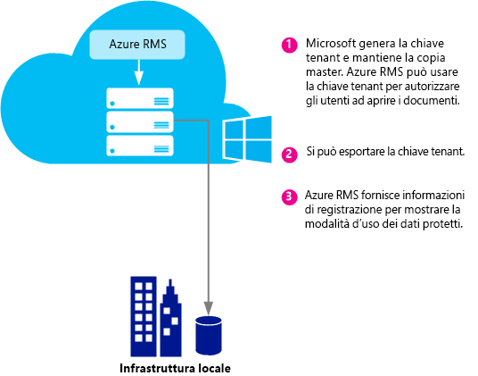
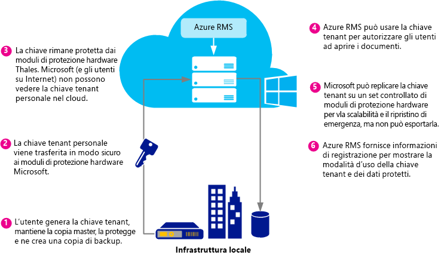
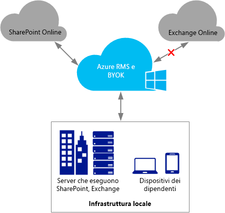

# Pianificazione e implementazione della chiave del tenant di Azure Rights Management
In questo argomento sono contenute informazioni per pianificare e gestire la chiave del tenant RMS (Rights Management Service) per Azure RMS. Anziché affidare a Microsoft la gestione della chiave del tenant (impostazione predefinita), per rispettare i criteri aziendali potrebbe essere necessario, ad esempio, gestire autonomamente la propria chiave del tenant  in base alla modalità BYOK (Bring Your Own Key).

> [!NOTE]
> La chiave del tenant RMS è nota anche come certificato concessore di licenze server (SLC, Server Licensor Certificate). Azure RMS gestisce una o più chiavi per ogni organizzazione che effettua una sottoscrizione a Azure RMS. Tutte le volte che in un'organizzazione si usa una chiave per RMS, ad esempio chiavi utente, chiavi computer o chiavi di crittografia documenti, la chiave si concatena a livello di crittografia alla chiave del tenant RMS dell'utente.

**Panoramica:** Usare la tabella seguente come guida rapida per la topologia consigliata delle chiavi del tenant. Per altre informazioni, vedere le sezioni aggiuntive:

Se si distribuisce Azure RMS con una chiave del tenant gestita da Microsoft, sarà possibile passare alla modalità BYOK in un secondo momento. Non è tuttavia attualmente possibile passare dalla modalità BYOK alla gestione da parte di Microsoft per la chiave del tenant di Azure RMS.

|Requisito aziendale|Topologia di chiave del tenant consigliata|
|-----------------------|----------------------------------------------|
|Distribuire Azure RMS rapidamente e senza che sia necessario hardware speciale|Gestita da Microsoft|
|Necessità di ottenere la funzionalità IRM completa in Exchange Online con Azure RMS|Gestita da Microsoft|
|Le chiavi vengono create dall'utente e protette in un modulo di protezione hardware|BYOK<br /><br />Questa configurazione darà attualmente come risultato una funzionalità IRM ridotta in Exchange Online. Per altre informazioni, vedere la sezione [Prezzi e restrizioni della modalità BYOK](../Topic/Planning_and_Implementing_Your_Azure_Rights_Management_Tenant_Key.md#BKMK_Pricing).|
Le informazioni contenute nelle sezioni seguenti consentono di scegliere la topologia di chiave del tenant da usare, il ciclo di vita della chiave del tenant, le modalità di implementazione della modalità BYOK e le operazioni successive da effettuare:

-   [Scegliere la topologia di chiave del tenant: gestione di Microsoft (impostazione predefinita) o BYOK](../Topic/Planning_and_Implementing_Your_Azure_Rights_Management_Tenant_Key.md#BKMK_ChooseTenantKey)

-   [Prezzi e restrizioni della modalità BYOK](../Topic/Planning_and_Implementing_Your_Azure_Rights_Management_Tenant_Key.md#BKMK_Pricing)

-   [Implementazione della modalità BYOK](../Topic/Planning_and_Implementing_Your_Azure_Rights_Management_Tenant_Key.md#BKMK_ImplementBYOK)

-   [Passaggi successivi](../Topic/Planning_and_Implementing_Your_Azure_Rights_Management_Tenant_Key.md#BKMK_NextSteps)

## <a name="BKMK_ChooseTenantKey"></a>Scegliere la topologia di chiave del tenant: gestione di Microsoft (impostazione predefinita) o BYOK
È innanzitutto necessario decidere la topologia di chiave del tenant più adatta per l'organizzazione. Per impostazione predefinita, Azure RMS genera la chiave del tenant e gestisce la maggior parte degli aspetti del relativo ciclo di vita. Questa opzione è quella più semplice e prevede il sovraccarico amministrativo minore. Nella maggior parte dei casi non è nemmeno necessario disporre di una chiave del tenant, ma è sufficiente iscriversi ad Azure RMS e la parte rimanente del processo di gestione delle chiavi viene eseguita da Microsoft.

In alternativa, se si desidera il controllo completo sulla chiave del tenant, è possibile creare la propria chiave e conservarne la copia master in locale. Questo scenario viene spesso definito con il termine modalità BYOK e prevede lo schema seguente.

1.  Generazione della chiave del tenant utente in locale, in base ai criteri IT dell'organizzazione.

2.  Trasferimento sicuro della chiave del tenant da un modulo di protezione hardware di proprietà dell'utente a moduli di protezioni hardware di proprietà e gestiti da Microsoft. Grazie a questo processo, la chiave del tenant non oltrepassa mai i confini dell'ambiente hardware protetto.

3.  Quando si trasferisce la chiave del tenant a Microsoft, la protezione viene assicurata da moduli di protezione hardware Thales. Microsoft ha collaborato con Thales per garantire che la chiave del tenant dell'utente non possa essere estratta da moduli di protezione hardware di Microsoft.

Anche se è facoltativo, i log di utilizzo di Azure RMS disponibili in tempo quasi reale sono utili per sapere esattamente come e quando viene usata la chiave del tenant.

> [!NOTE]
> Come misura di protezione aggiuntiva, Azure RMS usa ambienti di sicurezza separati per i propri data center in America del Nord, nei paesi EMEA (Europa, Medio Oriente e Africa) e in Asia. Quando si gestisce la propria chiave del tenant, quest'ultima è associata all'ambiente di sicurezza in cui è registrato il tenant RMS. Una chiave del tenant di un cliente europeo, ad esempio, non può essere usata in data center che si trovano in America del Nord o in Asia.

## <a name="BKMK_OverviewLifecycle"></a>Ciclo di vita della chiave del tenant
Se si decide di affidare a Microsoft la gestione della chiave del tenant, Microsoft gestisce la maggior parte delle operazioni del ciclo di vita della chiave. Se invece l'utente decide di gestire in modo autonomo la propria chiave del tenant, è responsabile di molte operazione del ciclo di vita della chiave e di alcune procedure aggiuntive.

Nei diagrammi seguenti vengono illustrate e confrontate le due opzioni. Nel primo diagramma viene illustrato il minor sovraccarico amministrativo che l'utente deve sostenere nella configurazione predefinita quando Microsoft gestisce la chiave del tenant.



Nel secondo diagramma vengono illustrati i passaggi aggiuntivi necessari quando l'utente gestisce la propria chiave del tenant.



Se si decide di affidare a Microsoft la gestione della chiave del tenant, non è necessaria alcuna azione aggiuntiva per generare la chiave ed è possibile ignorare le sezioni seguenti per passare direttamente alla sezione [Passaggi successivi](../Topic/Planning_and_Implementing_Your_Azure_Rights_Management_Tenant_Key.md#BKMK_NextSteps).

Se invece si decide di gestire in modo autonomo la propria chiave del tenant, leggere le sezioni seguenti per ottenere altre informazioni.

### Altre informazioni sui moduli di protezione hardware Thales e sulle funzionalità aggiunte da Microsoft
Azure RMS usa i moduli di protezione hardware Thales per proteggere le chiavi degli utenti.

Thales e-Security è un fornitore leader a livello mondiale di soluzioni di crittografia dei dati e di sicurezza informatica per i settori finanziario, tecnologico, manifatturiero e pubblico. Basate su un'esperienza di 40 anni nella protezione di informazioni aziendali e degli enti pubblici, le soluzioni Thales vengono usate da quattro delle cinque maggiori società dei settori energetico e aerospaziale e consentono di proteggere più dell'80 percento delle transazioni di pagamento in tutto il mondo.

Microsoft ha collaborato con Thales per migliorare il livello tecnologico dei moduli di protezione hardware per consentire all'utente di sfruttare i vantaggi tipici dei servizi ospitati senza perdere il controllo sulle proprie chiavi. In particolare, tali miglioramenti consentono a Microsoft di gestire i moduli di protezione hardware in modo che questa operazione non debba essere eseguita dall'utente. In modo analogo a un servizio cloud, Azure RMS è in grado di supportare la scalabilità verticale con breve preavviso per soddisfare i picchi d'utilizzo dell'organizzazione. Contemporaneamente, la chiave è protetta all'interno dei moduli di protezione hardware di Microsoft e l'utente mantiene il controllo sul ciclo di vita della chiave, perché genera la chiave e la trasferisce ai moduli di protezione hardware di Microsoft.

Per altre informazioni vedere la pagina relativa ai [moduli di protezione hardware Thales e Azure RMS](http://www.thales-esecurity.com/msrms/cloud) nel sito Web Thales.

## <a name="BKMK_Pricing"></a>Prezzi e restrizioni della modalità BYOK
Un'organizzazione che dispone di una sottoscrizione di Azure gestita in ambiente IT può usare la modalità BYOK e registrare l'utilizzo della chiave senza costi aggiuntivi, mentre le organizzazioni che usano RMS per utenti singoli non possono avvalersi di tale modalità né della registrazione perché non dispongono di un amministratore tenant che configuri queste funzionalità.

> [!NOTE]
> Per altre informazioni su RMS per utenti singoli, vedere [RMS per utenti singoli e Azure Rights Management](../Topic/RMS_for_Individuals_and_Azure_Rights_Management.md).



La modalità BYOK e la registrazione possono essere usate facilmente con ogni applicazione che si integra con Azure RMS, ad esempio servizi cloud come SharePoint Online, server locali che eseguono Exchange e SharePoint che si integrano con Azure RMS usando il connettore RMS e applicazioni client come Office 2013. È possibile ottenere log di utilizzo indipendentemente dall'applicazione che richiede Azure RMS.

È presente tuttavia un'eccezione, Attualmente, la **modalità BYOK di Azure RMS non è compatibile con Exchange Online**.  Se si vuole usare Exchange Online, è consigliabile distribuire Azure RMS con la modalità predefinita per la gestione delle chiavi, in base alla quale Microsoft genera e gestisce la chiave. È possibile passare a BYOK successivamente, ad esempio, quando Exchange Online supporterà la modalità BYOK per Azure RMS. Se non è possibile aspettare, tuttavia, si può distribuire subito Azure RMS con BYOK, con una funzionalità RMS ridotta per Exchange Online (i messaggi di posta elettronica e gli allegati non protetti rimangono completamente funzionanti):

-   I messaggi di posta elettronica protetti o gli allegati protetti in Outlook Web Access non possono essere visualizzati.

-   I messaggi di posta elettronica protetti nei dispositivi mobili che usano Exchange ActiveSync IRM non possono essere visualizzati.

-   La decrittografia del trasporto (ad esempio, per l'analisi antimalware) e la decrittografia del giornale di registrazione non sono possibili, quindi i messaggi di posta elettronica e gli allegati protetti verranno ignorati.

-   Le regole di protezione del trasporto e la prevenzione della perdita dei dati che applicano i criteri IRM non sono possibili e non è quindi possibile applicare la protezione RMS usando questi metodi.

-   La ricerca di messaggi di posta elettronica protetti è basata sul server, quindi i messaggi di posta elettronica protetti verranno ignorati.

Quando si usa la modalità BYOK di Azure RMS con una funzionalità RMS ridotta per Exchange Online, RMS funzionerà con i client di posta elettronica in Outlook su Windows e Mac e con altri client di posta elettronica che non usano Exchange ActiveSync IRM.

Se si esegue la migrazione ad Azure RMS da AD RMS, la chiave potrebbe essere stata importata come dominio di pubblicazione trusted in Exchange Online (ovvero in modalità BYOK nella terminologia di Exchange, che è diversa dalla modalità BYOK di Azure RMS). In questo scenario è necessario rimuovere il dominio di pubblicazione trusted da Exchange Online per evitare conflitti tra modelli e criteri. Per altre informazioni, vedere [Remove-RMSTrustedPublishingDomain](https://technet.microsoft.com/library/jj200720%28v=exchg.150%29.aspx) nella libreria di cmdlet di Exchange Online.

In alcuni casi l'eccezione relativa alla modalità BYOK di Azure RMS per Exchange Online non costituisce in effetti un problema. Ad esempio, le organizzazioni che devono usare la modalità BYOK e la registrazione eseguono le proprie applicazioni dati, ad esempio Exchange, SharePoint, Office, in locale e usano Azure RMS per funzionalità non facilmente disponibili con istanze locali di AD RMS, ad esempio collaborazione con altre società e accesso da client mobili. Sia la modalità BYOK che la registrazione sono compatibili con questo scenario e consentono all'organizzazione di disporre del controllo completo sulla sottoscrizione di Azure RMS.

## <a name="BKMK_ImplementBYOK"></a>Implementazione della modalità BYOK
Usare le informazioni e le procedure descritte in questa sezione se si è deciso di generare e gestire la propria chiave del tenant in base allo schema BYOK.

-   [Prerequisiti per la modalità BYOK](../Topic/Planning_and_Implementing_Your_Azure_Rights_Management_Tenant_Key.md#BKMK_Preqs)

-   [Generare e trasferire la propria chiave del tenant tramite Internet](../Topic/Planning_and_Implementing_Your_Azure_Rights_Management_Tenant_Key.md#BKMK_BYOK_Internet)

-   [Generare e trasferire la propria chiave del tenant di persona](../Topic/Planning_and_Implementing_Your_Azure_Rights_Management_Tenant_Key.md#BKMK_BYOK_InPerson)

> [!IMPORTANT]
> Se si è già iniziato a usare [!INCLUDE[aad_rightsmanagement_1](../Token/aad_rightsmanagement_1_md.md)] (servizio attivato) e se sono presenti utenti che eseguono Office 2010, prima di eseguire queste procedure contattare il Servizio Supporto Tecnico Clienti Microsoft. A seconda dello scenario e dei requisiti, è comunque possibile usare la modalità BYOK con alcune limitazioni o con passaggi aggiuntivi.
> 
> Contattare inoltre il Servizio Supporto Tecnico Clienti Microsoft se nell'organizzazione sono previsti criteri specifici per la gestione delle chiavi.

### <a name="BKMK_Preqs"></a>Prerequisiti per la modalità BYOK
Nella tabella seguente sono elencati i prerequisiti per la modalità BYOK.

|Requisito|Altre informazioni|
|-------------|----------------------|
|Sottoscrizione che supporta Azure RMS.|Per altre informazioni sulle sottoscrizioni disponibili, vedere la sezione [Sottoscrizioni cloud che supportano Azure RMS](../Topic/Requirements_for_Azure_Rights_Management.md#BKMK_SupportedSubscriptions) nell'argomento [Requisiti per Azure Rights Management](../Topic/Requirements_for_Azure_Rights_Management.md).|
|Non si usa RMS per singoli utenti o per Exchange Online. Se si usa Exchange Online, si conoscono e si accettano le limitazioni relative all'uso della modalità BYOK con questa configurazione.|Per altre informazioni sulle restrizioni per la modalità BYOK e sulle limitazioni attuali, vedere la sezione [Prezzi e restrizioni della modalità BYOK](../Topic/Planning_and_Implementing_Your_Azure_Rights_Management_Tenant_Key.md#BKMK_Pricing) in questo argomento. **Important:** Attualmente, la modalità BYOK e la registrazione non sono compatibili con Exchange Online.|
|Moduli di protezione hardware Thales, smart card e software di supporto<br /><br />Se si esegue la migrazione da AD RMS ad Azure RMS, passando da una chiave software a una chiave hardware, sarà necessaria almeno la versione 11.62 per i driver Thales.|È necessario disporre dell'accesso ai moduli di protezione hardware Thales e averne una conoscenza a livello operativo. Vedere la pagina relativa al [modulo di protezione hardware Thales](http://www.thales-esecurity.com/msrms/buy) per un elenco di modelli compatibili o per acquistare un modulo di protezione hardware, se è già disponibile.|
|Se si desidera trasferire la propria chiave del tenant tramite Internet anziché recarsi fisicamente a Redmond negli Stati Uniti, sono necessari i dispositivi seguenti:<br /><br />1.  Workstation x64 offline con sistema operativo Windows 7 o versioni successive e software nShield di Thales 11.62 o versioni successive.<br />    Se questa workstation esegue Windows 7, sarà necessario [installare Microsoft .NET Framework 4.5](http://go.microsoft.com/fwlink/?LinkId=225702).<br />2.  Workstation connessa a Internet con sistema operativo Windows 7 o versioni successive.<br />3.  Unità USB o altro dispositivo di archiviazione portatile con almeno 16 MB di spazio disponibile.|Tali prerequisiti non sono necessari se ci si reca a Redmond e si trasferisce la propria chiave di persona.<br /><br />Per motivi di sicurezza, si consiglia che la prima workstation non sia connessa a una rete. Questa condizione tuttavia non viene applicata a livello di codice. **Note:** Nelle istruzioni seguenti a questa workstation si fa riferimento come workstation disconnessa.<br />Se inoltre la propria chiave del tenant è destinata a essere usata in una rete di produzione, si consiglia di usare una seconda workstation separata per scaricare il set di strumenti e caricare la chiave del tenant. A scopo di test è comunque possibile usare la prima workstation. **Note:** Nelle istruzioni seguenti alla seconda workstation si fa riferimento come workstation connessa a Internet.|
|Facoltativa: Sottoscrizione di Azure|Se si desidera registrare l'utilizzo della propria chiave del tenant e di Rights Management, è necessario disporre di una sottoscrizione di Azure e di spazio di archiviazione sufficiente per memorizzare i log.|
Le procedure per generare e usare la propria chiave del tenant dipendono dalle modalità di esecuzione di tali operazioni, ovvero tramite Internet o di persona.

-   **Tramite Internet:** In questo caso sono necessari alcuni passaggi di configurazione aggiuntivi, ad esempio il download e l'uso di un set di strumenti e di cmdlet di Windows PowerShell. Non è necessario tuttavia essere presenti in un ufficio Microsoft per trasferire la chiave del tenant, perché la sicurezza è garantita grazie ai metodi indicati di seguito.

    -   La chiave del tenant viene generata in una workstation offline per ridurre la superficie di attacco.

    -   La crittografia della chiave del tenant viene eseguita tramite una chiave per lo scambio delle chiavi che rimane crittografata fino al momento del trasferimento ai moduli di protezione hardware di Azure RMS. Solo la versione crittografata della chiave del tenant viene inviata dalla workstation originale.

    -   Uno strumento imposta proprietà sulla chiave del tenant che consentono di associarla all'ambiente di sicurezza di Azure RMS. Di conseguenza, dopo che i moduli di protezione hardware di Azure RMS ricevono la chiave del tenant e ne eseguono la decrittografia, sono gli unici componenti a poterla usare. La chiave del tenant non può essere esportata. Questa associazione viene applicata dai moduli di protezione hardware Thales.

    -   La chiave per lo scambio delle chiavi usata per crittografare la chiave del tenant viene generata nei moduli di protezione hardware di Azure RMS e non è esportabile. I moduli di protezione hardware applicano la regola in base alla quale non può esistere una versione non crittografata della chiave per lo scambio delle chiavi all'esterno dei moduli stessi. Il set di strumenti include inoltre un'attestazione di Thales che dichiara che la chiave per lo scambio delle chiavi non è esportabile e che è stata generata in un modulo di protezione hardware originale prodotto da Thales.

    -   Il set di strumenti include un'attestazione di Thales che dichiara che anche l'ambiente di sicurezza di Azure RMS è stato generato in un modulo di protezione hardware originale prodotto da Thales. In questo modo l'utente ha la conferma che Microsoft usa hardware originale.

    -   Microsoft usa chiavi per lo scambio delle chiavi e ambienti di sicurezza separati in ogni area geografica per garantire che sia possibile usare la chiave del tenant solo nei data center presenti nell'area geografica in cui è stata generata. Una chiave del tenant di un cliente europeo, ad esempio, non può essere usata in data center che si trovano in America del Nord o in Asia.

    > [!NOTE]
    > La chiave del tenant può spostarsi in modo sicuro tra computer e reti non attendibili perché è crittografata e protetta con autorizzazioni a livello di controllo di accesso, condizione che la rende accessibile solo all'interno dei moduli di protezione hardware dell'utente e di quelli di Microsoft per Azure RMS. È possibile usare gli script disponibili nel set di strumenti per verificare le misure di sicurezza e leggere altre informazioni sul funzionamento in Thales della [gestione delle chiavi hardware nel cloud RMS](https://www.thales-esecurity.com/knowledge-base/white-papers/hardware-key-management-in-the-rms-cloud).

-   **Di persona:** In questo caso è necessario contattare il Servizio Supporto Clienti Microsoft per pianificare un appuntamento per il trasferimento della chiave per Azure RMS. È necessario recarsi di persona in un ufficio Microsoft a Redmond, Washington, Stati Uniti, per trasferire la propria chiave del tenant nell'ambiente di sicurezza di Azure RMS.

### <a name="BKMK_BYOK_Internet"></a>Generare e trasferire la propria chiave del tenant tramite Internet
Se si vuole trasferire la propria chiave del tenant tramite Internet anziché recarsi in un ufficio Microsoft per trasferirla di persona, seguire queste procedure.

-   [Preparare la workstation connessa a Internet](../Topic/Planning_and_Implementing_Your_Azure_Rights_Management_Tenant_Key.md#BKMK_InternetPrepareWorkstation)

-   [Preparare la workstation disconnessa](../Topic/Planning_and_Implementing_Your_Azure_Rights_Management_Tenant_Key.md#BKMK_DisconnectedPrepareWorkstation)

-   [Generare la chiave del tenant](../Topic/Planning_and_Implementing_Your_Azure_Rights_Management_Tenant_Key.md#BKMK_InternetGenerate)

-   [Preparare la chiave del tenant per il trasferimento](../Topic/Planning_and_Implementing_Your_Azure_Rights_Management_Tenant_Key.md#BKMK_InternetPrepareTransfer)

-   [Trasferire la chiave del tenant ad Azure RMS](../Topic/Planning_and_Implementing_Your_Azure_Rights_Management_Tenant_Key.md#BKMK_InternetTransfer)

#### <a name="BKMK_InternetPrepareWorkstation"></a>Preparare la workstation connessa a Internet
Per preparare la workstation connessa a Internet, seguire questi 3 passaggi:

-   [Passaggio 1: Installare Windows PowerShell per Azure Rights Management](../Topic/Planning_and_Implementing_Your_Azure_Rights_Management_Tenant_Key.md#BKMK_PrepareInternetConnectedWorkstation1)

-   [Passaggio 2: Ottenere l'ID del tenant di Azure Active Directory](../Topic/Planning_and_Implementing_Your_Azure_Rights_Management_Tenant_Key.md#BKMK_PrepareInternetConnectedWorkstation2)

-   [Passaggio 3: Scaricare il set di strumenti BYOK](../Topic/Planning_and_Implementing_Your_Azure_Rights_Management_Tenant_Key.md#BKMK_PrepareInternetConnectedWorkstation3)

##### <a name="BKMK_PrepareInternetConnectedWorkstation1"></a>Passaggio 1: Installare Windows PowerShell per Azure Rights Management
Nella workstation connessa a Internet scaricare e installare il modulo Windows PowerShell per Azure Rights Management.

> [!NOTE]
> Se il modulo Windows PowerShell è stato scaricato in precedenza, eseguire il comando seguente per verificare che la versione in uso sia almeno la versione 2.1.0.0: `(Get-Module aadrm -ListAvailable).Version`

Per le istruzioni di installazione, vedere [Installazione di Windows PowerShell per Microsoft Azure Rights Management](../Topic/Installing_Windows_PowerShell_for_Azure_Rights_Management.md).

##### <a name="BKMK_PrepareInternetConnectedWorkstation2"></a>Passaggio 2: Ottenere l'ID del tenant di Azure Active Directory
Avviare Windows PowerShell con l'opzione **Esegui come amministratore**, quindi eseguire i comandi indicati di seguito.

-   Usare il cmdlet [Connect-AadrmService](http://msdn.microsoft.com/library/windowsazure/dn629415.aspx) per connettersi al servizio Azure RMS:

    ```
    Connect-AadrmService
    ```
    Quando viene richiesto, immettere le credenziali dell'amministratore del tenant [!INCLUDE[aad_rightsmanagement_1](../Token/aad_rightsmanagement_1_md.md)]. In genere, viene usato un account amministratore globale per Azure Active Directory o Office 365.

-   Usare il cmdlet [Get-AadrmConfiguration](http://msdn.microsoft.com/library/windowsazure/dn629410.aspx) per visualizzare la configurazione del tenant:

    ```
    Get-AadrmConfiguration
    ```
    Nel file di output salvare il GUID presente nella prima riga (BPOSId), che rappresenta l'ID tenant di Azure Active Directory necessario in seguito nella preparazione della chiave del tenant per il caricamento.

-   Usare il cmdlet [Disconnect-AadrmService](http://msdn.microsoft.com/library/windowsazure/dn629416.aspx) per disconnettersi dal servizio Azure RMS, fino a quando non si è pronti a caricare la chiave:

    ```
    Disconnect-AadrmService
    ```

Non chiudere la finestra di Windows PowerShell.

##### <a name="BKMK_PrepareInternetConnectedWorkstation3"></a>Passaggio 3: Scaricare il set di strumenti BYOK
Passare all'Area download Microsoft e [scaricare il set di strumenti per la modalità BYOK](http://go.microsoft.com/fwlink/?LinkId=335781) per la propria area geografica:

|area|Nome pacchetto|
|--------|------------------|
|America del Nord|AzureRMS-BYOK-tools-UnitedStates.zip|
|Europa|AzureRMS-BYOK-tools-Europe.zip|
|Asia|AzureRMS-BYOK-tools-AsiaPacific.zip|
Il set di strumenti include gli elementi seguenti:

-   Pacchetto di chiavi per lo scambio di chiavi con un nome che inizia con **BYOK-KEK-pkg-**.

-   Pacchetto relativo all'ambiente di sicurezza con un nome che inizia con **BYOK-SecurityWorld-pkg-**.

-   Script python denominato **verifykeypackage.py**.

-   File eseguibile dalla riga di comando denominato **KeyTransferRemote.exe**, file di metadati denominato **KeyTransferRemote.exe.config** e DLL associate.

-   Componente Visual C++ Redistributable Package denominato **vcredist_x64.exe**.

Copiare il pacchetto in un'unità USB o in un altro dispositivo di archiviazione portatile.

#### <a name="BKMK_DisconnectedPrepareWorkstation"></a>Preparare la workstation disconnessa
Per preparare la workstation non connessa a una rete (Internet o la rete interna), seguire questi 2 passaggi.

-   [Passaggio 1: Preparare la workstation disconnessa con il modulo di protezione hardware Thales](../Topic/Planning_and_Implementing_Your_Azure_Rights_Management_Tenant_Key.md#BKMK_PrepareDisconnectedWorkstation1)

-   [Passaggio 2: Installare il set di strumenti BYOK nella workstation disconnessa](../Topic/Planning_and_Implementing_Your_Azure_Rights_Management_Tenant_Key.md#BKMK_PrepareDisconnectedWorkstation2)

##### <a name="BKMK_PrepareDisconnectedWorkstation1"></a>Passaggio 1: Preparare la workstation disconnessa con il modulo di protezione hardware Thales
Nella workstation disconnessa installare il software di supporto nCipher (Thales) in un computer Windows, quindi collegare un modulo di protezione hardware Thales a tale computer.

Verificare che gli strumenti Thales si trovino nei percorsi **(%nfast_home%\bin** e **%nfast_home%\python\bin**. Digitare ad esempio

```
set PATH=%PATH%;”%nfast_home%\bin”;”%nfast_home%\python\bin”
```
Per altre informazioni, vedere il manuale dell'utente incluso nel modulo di protezione hardware Thales oppure visitare il sito Web Thales per Azure RMS all'indirizzo [http://www.thales-esecurity.com/msrms/cloud](http://www.thales-esecurity.com/msrms/cloud).

##### <a name="BKMK_PrepareDisconnectedWorkstation2"></a>Passaggio 2: Installare il set di strumenti BYOK nella workstation disconnessa
Copiare il pacchetto del set di strumenti BYOK dall'unità USB o da un altro dispositivo di archiviazione portatile, quindi eseguire le operazioni seguenti:

1.  Estrarre i file dal pacchetto scaricato in una cartella qualsiasi.

2.  In tale cartella eseguire vcredist_x64.exe.

3.  Seguire le istruzioni per installare i componenti di runtime di Visual C++ per Visual Studio 2012.

#### <a name="BKMK_InternetGenerate"></a>Generare la chiave del tenant
Nella workstation disconnessa eseguire questi 3 passaggi per generare la propria chiave tdel tenant:

-   [Passaggio 1: Creare un ambiente di sicurezza](../Topic/Planning_and_Implementing_Your_Azure_Rights_Management_Tenant_Key.md#BKMK_InternetGenerate1)

-   [Passaggio 2: Convalidare il pacchetto scaricato](../Topic/Planning_and_Implementing_Your_Azure_Rights_Management_Tenant_Key.md#BKMK_InternetGenerate2)

-   [Passaggio 3: Creare una nuova chiave](../Topic/Planning_and_Implementing_Your_Azure_Rights_Management_Tenant_Key.md#BKMK_InternetGenerate3)

##### <a name="BKMK_InternetGenerate1"></a>Passaggio 1: Creare un ambiente di sicurezza
Avviare un prompt dei comandi ed eseguire il programma new-world di Thales.

```
new-world.exe --initialize --cipher-suite=DLf1024s160mRijndael --module=1 --acs-quorum=2/3
```
Tale programma crea un file di **ambiente di sicurezza** nel percorso %NFAST_KMDATA%\local\world, che corrisponde alla cartella C:\ProgramData\nCipher\Key Management Data\local. È possibile creare valori diversi per il quorum, ma nell'esempio viene chiesto di immettere tre schede vuote e un codice PIN per ciascuna scheda. Qualsiasi coppia di schede dovrà quindi disporre di accesso amministrativo all'ambiente di sicurezza (il quorum specificato).  Tali schede diventano il **set di schede amministrative** per il nuovo ambiente di sicurezza. È possibile specificare la password o il PIN per ogni scheda di ACS in questa fase oppure aggiungerli successivamente con un comando.

> [!TIP]
> È possibile verificare lo stato della configurazione attuale del modulo di protezione hardware usando il comando `nkminfo`.

Eseguire quindi le operazioni seguenti:

1.  Installare il provider CNG di Thales come descritto nella documentazione di Thales e configurarlo per usare il nuovo ambiente di sicurezza.

2.  Eseguire il backup del file relativo all'ambiente **%nfast_kmdata%\local**. Proteggere il file relativo all'ambiente, le schede amministrative e i codici PIN relativi e verificare che nessuna singola persona possa accedere a più di una scheda.

##### <a name="BKMK_InternetGenerate2"></a>Passaggio 2: Convalidare il pacchetto scaricato
Questo passaggio è facoltativo, ma è consigliato in modo che sia possibile convalidare gli elementi seguenti:

-   Chiave per lo scambio delle chiavi inclusa nel set di strumenti generato da un modulo di protezione hardware Thales originale.

-   Hash dell'ambiente di sicurezza di Azure RMS incluso nel set di strumenti generato da un modulo di protezione hardware Thales originale.

-   Impossibilità di esportare la chiave per lo scambio delle chiavi.

> [!NOTE]
> Per convalidare il pacchetto scaricato, il modulo di protezione hardware deve essere connesso e acceso e deve essere associato a un ambiente di sicurezza (ad esempio quello appena creato).

###### Per convalidare il pacchetto scaricato

1.  Eseguire lo script verifykeypackage.py associando uno dei comandi seguenti, a seconda dell'area geografica di appartenenza:

    -   America del Nord

        ```
        python verifykeypackage.py -k BYOK-KEK-pkg-NA-1 -w BYOK-SecurityWorld-pkg-NA-1
        ```

    -   Europa

        ```
        python verifykeypackage.py -k BYOK-KEK-pkg-EU-1 -w BYOK-SecurityWorld-pkg-EU-1
        ```

    -   Asia

        ```
        python verifykeypackage.py -k BYOK-KEK-pkg-AP-1 -w BYOK-SecurityWorld-pkg-AP-1
        ```

    > [!TIP]
    > Il software Thales include un interprete Python nel percorso %NFAST_HOME%\python\bin

2.  Assicurarsi di visualizzare il risultato positivo seguente, che indica il completamento della convalida: **Result:  SUCCESS**

Questo script consente di convalidare la catena di firmatari fino alla chiave radice di Thales. La funzione hash di questa chiave radice è incorporata nello script e il relativo valore deve essere **59178a47 de508c3f 291277ee 184f46c4 f1d9c639**. È anche possibile confermare questo valore separatamente visitando il [sito Web Thales](http://www.thalesesec.com/).

A questo punto si può creare una nuova chiave che costituirà la chiave del tenant RMS dell'utente.

##### <a name="BKMK_InternetGenerate3"></a>Passaggio 3: Creare una nuova chiave
Generare una chiave CNG tramite i programmi **generatekey** e **cngimport** di Thales.

Eseguire il comando seguente per generare la chiave:

```
generatekey --generate simple type=RSA size=2048 protect=module ident=contosokey plainname=contosokey nvram=no pubexp=
```
Quando si esegue il comando, usare le istruzioni seguenti:

-   Per le dimensioni della chiave, si consigliano 2048 bit, ma sono supportate anche chiavi RSA di 1024 bit per clienti AD RMS esistenti che dispongono di tali chiavi e che sono in procinto di eseguire la migrazione ad Azure RMS.

-   Sostituire il valore *contosokey* per **ident** e **plainname** con qualsiasi valore di stringa. Per ridurre i sovraccarichi amministrativi e i rischi di errore, si consiglia di usare lo stesso valore per entrambi gli elementi e di usare tutti caratteri minuscoli.

-   L'elemento pubexp viene lasciato vuoto in questo esempio (impostazione predefinita), ma è possibile indicare valori specifici. Per altre informazioni, vedere la documentazione di Thales.

Eseguire il comando seguente per importare la chiave in CNG:

```
cngimport --import -M --key=contosokey --appname=simple contosokey
```
Quando si esegue il comando, usare le istruzioni seguenti:

-   Sostituire *contosokey* con lo stesso valore specificato in [Passaggio 1: Creare un ambiente di sicurezza](../Topic/Planning_and_Implementing_Your_Azure_Rights_Management_Tenant_Key.md#BKMK_InternetGenerate1) nella sezione *Generare la chiave del tenant*.

-   Usare l'opzione **-M** in modo che la chiave sia adatta per lo scenario. Senza questa opzione, la chiave risultante sarà una chiave specifica per l'utente corrente.

Tale comando crea un file di chiave in formato token nella cartella %NFAST_KMDATA%\local dell'utente con un nome che inizia con **key_caping_** seguito da un SID. Ad esempio: **key_caping_machine--801c1a878c925fd9df4d62ba001b94701c039e2fb**. Questo file contiene una chiave crittografata.

> [!TIP]
> È possibile verificare lo stato attuale della configurazione delle chiavi usando il comando `nkminfo –k`.

Eseguire il backup del file di chiave in formato token in un percorso sicuro.

> [!IMPORTANT]
> Quando in seguito si trasferisce la chiave ad Azure RMS, Microsoft non può esportarla nuovamente nei dispositivi dell'utente, pertanto è estremamente importante eseguire il backup della chiave e dell'ambiente di sicurezza in modo sicuro. Per ottenere informazioni aggiuntive e procedure consigliate per eseguire il backup della chiave, contattare Thales.

A questo punto è possibile trasferire la propria chiave del tenant ad Azure RMS.

#### <a name="BKMK_InternetPrepareTransfer"></a>Preparare la chiave del tenant per il trasferimento
Nella workstation disconnessa eseguire questi 4 passaggi per preparare la propria chiave del tenant:

-   [Passaggio 1: Creare una copia della chiave con autorizzazioni ridotte](../Topic/Planning_and_Implementing_Your_Azure_Rights_Management_Tenant_Key.md#BKMK_InternetPrepareTransfer1)

-   [Passaggio 2: Verificare la nuova copia della chiave](../Topic/Planning_and_Implementing_Your_Azure_Rights_Management_Tenant_Key.md#BKMK_InternetPrepareTransfer2)

-   [Passaggio 3: Crittografare la chiave tramite la chiave per lo scambio di chiavi di Microsoft](../Topic/Planning_and_Implementing_Your_Azure_Rights_Management_Tenant_Key.md#BKMK_InternetPrepareTransfer3)

-   [Passaggio 4: Copiare il pacchetto di trasferimento della chiave nella workstation connessa a Internet](../Topic/Planning_and_Implementing_Your_Azure_Rights_Management_Tenant_Key.md#BKMK_InternetPrepareTransfer4)

##### <a name="BKMK_InternetPrepareTransfer1"></a>Passaggio 1: Creare una copia della chiave con autorizzazioni ridotte
Per ridurre le autorizzazioni sulla chiave del tenant, eseguire le operazioni seguenti:

-   A un prompt dei comandi eseguire uno dei comandi seguenti, a seconda dell'area geografica di appartenenza:

    -   America del Nord

        ```
        KeyTransferRemote.exe -ModifyAcls -KeyAppName simple -KeyIdentifier contosokey -ExchangeKeyPackage BYOK-KEK-pkg-NA-1 -NewSecurityWorldPackage BYOK-SecurityWorld-pkg-NA-1
        ```

    -   Europa

        ```
        KeyTransferRemote.exe -ModifyAcls -KeyAppName simple -KeyIdentifier contosokey -ExchangeKeyPackage BYOK-KEK-pkg-EU-1 -NewSecurityWorldPackage BYOK-SecurityWorld-pkg-EU-1
        ```

    -   Asia

        ```
        KeyTransferRemote.exe -ModifyAcls -KeyAppName simple -KeyIdentifier contosokey -ExchangeKeyPackage BYOK-KEK-pkg-AP-1 -NewSecurityWorldPackage BYOK-SecurityWorld-pkg-AP-1
        ```

Quando si esegue questo comando, sostituire *contosokey* con lo stesso valore specificato in [Passaggio 1: Creare un ambiente di sicurezza](../Topic/Planning_and_Implementing_Your_Azure_Rights_Management_Tenant_Key.md#BKMK_InternetGenerate1) nella sezione *Generare la chiave del tenant*.

Verrà richiesto di inserire le schede di ACS dell'ambiente di sicurezza e, se specificati, la password o il PIN.

Al completamento del comando, viene visualizzato il messaggio **Result: SUCCESS** e la copia della chiave tenant con autorizzazioni ridotte si troverà nel file denominato key_xferacId_*&lt;contosokey&gt;*.

##### <a name="BKMK_InternetPrepareTransfer2"></a>Passaggio 2: Verificare la nuova copia della chiave
Se si desidera, eseguire le utilità Thales per confermare le autorizzazioni minime sulla nuova chiave del tenant:

-   aclprint.py

    ```
    "%nfast_home%\bin\preload.exe" -m 1 -A xferacld -K contosokey "%nfast_home%\python\bin\python" "%nfast_home%\python\examples\aclprint.py"
    ```

-   kmfile-dump.exe

    ```
    "%nfast_home%\bin\kmfile-dump.exe" "%NFAST_KMDATA%\local\key_xferacld_contosokey"
    ```

Quando si eseguono questi comandi, sostituire *contosokey* con lo stesso valore specificato in [Passaggio 1: Creare un ambiente di sicurezza](../Topic/Planning_and_Implementing_Your_Azure_Rights_Management_Tenant_Key.md#BKMK_InternetGenerate1) nella sezione *Generare la chiave del tenant*.

##### <a name="BKMK_InternetPrepareTransfer3"></a>Passaggio 3: Crittografare la chiave tramite la chiave per lo scambio di chiavi di Microsoft
Eseguire uno dei comandi seguenti, a seconda dell'area geografica di appartenenza:

-   America del Nord

    ```
    KeyTransferRemote.exe -Package -KeyIdentifier contosokey -ExchangeKeyPackage BYOK-KEK-pkg-NA-1 -NewSecurityWorldPackage BYOK-SecurityWorld-pkg-NA-1 -TenantBposId GUID -KeyFriendlyName ContosoFirstkey
    ```

-   Europa

    ```
    KeyTransferRemote.exe -Package -KeyIdentifier contosokey -ExchangeKeyPackage BYOK-KEK-pkg-EU-1 -NewSecurityWorldPackage BYOK-SecurityWorld-pkg-EU-1 -TenantBposId GUID -KeyFriendlyName ContosoFirstkey
    ```

-   Asia

    ```
    KeyTransferRemote.exe -Package -KeyIdentifier contosokey -ExchangeKeyPackage BYOK-KEK-pkg-AP-1 -NewSecurityWorldPackage BYOK-SecurityWorld-pkg-AP-1 -TenantBposId GUID -KeyFriendlyName ContosoFirstkey
    ```

Quando si esegue il comando, usare le istruzioni seguenti:

-   Sostituire *contosokey* con l'identificatore usato per generare la chiave in [Passaggio 1: Creare un ambiente di sicurezza](../Topic/Planning_and_Implementing_Your_Azure_Rights_Management_Tenant_Key.md#BKMK_InternetGenerate1) nella sezione *Generare la chiave del tenant*.

-   Sostituire *GUID* con il proprio ID tenant di Azure Active Directory recuperato in [Passaggio 2: Ottenere l'ID del tenant di Azure Active Directory](../Topic/Planning_and_Implementing_Your_Azure_Rights_Management_Tenant_Key.md#BKMK_PrepareInternetConnectedWorkstation2) nella sezione *Preparare la workstation connessa a Internet*.

-   Sostituire *ContosoFirstKey* con un'etichetta usata per il nome del file di output.

Se l'operazione ha esito positivo, viene visualizzato il messaggio **Result: SUCCESS** e nella cartella corrente sarà presente un nuovo file con il nome: TransferPackage-*ContosoFirstkey*.byok

##### <a name="BKMK_InternetPrepareTransfer4"></a>Passaggio 4: Copiare il pacchetto di trasferimento della chiave nella workstation connessa a Internet
Usare un'unità USB o un altro dispositivo di archiviazione portatile per copiare il file di output creato nel passaggio precedente (KeyTransferPackage-*ContosoFirstkey*.byok) nella workstation connessa a Internet.

> [!NOTE]
> Usare le procedure di sicurezza per proteggere il file, poiché include la chiave privata.

#### <a name="BKMK_InternetTransfer"></a>Trasferire la chiave del tenant ad Azure RMS
Nella workstation connessa a Internet eseguire questi 3 passaggi per trasferire la nuova chiave del tenant ad Azure RMS:

-   [Passaggio 1: Connettersi ad Azure RMS](../Topic/Planning_and_Implementing_Your_Azure_Rights_Management_Tenant_Key.md#BKMK_InternetTransfer1)

-   [Passaggio 2: Caricare il pacchetto della chiave](../Topic/Planning_and_Implementing_Your_Azure_Rights_Management_Tenant_Key.md#BKMK_InternetTransfer2)

-   [Passaggio 3: Enumerare le chiavi tenant (in base alle esigenze)](../Topic/Planning_and_Implementing_Your_Azure_Rights_Management_Tenant_Key.md#BKMK_InternetTransfer3)

##### <a name="BKMK_InternetTransfer1"></a>Passaggio 1: Connettersi ad Azure RMS
Tornare alla finestra di Windows PowerShell e digitare i comandi indicati di seguito.

1.  Per connettersi al servizio [!INCLUDE[aad_rightsmanagement_1](../Token/aad_rightsmanagement_1_md.md)]:

    ```
    Connect-AadrmService
    ```

2.  Usare il cmdlet [Get-AadrmKeys](http://msdn.microsoft.com/library/windowsazure/dn629420.aspx) per visualizzare la configurazione attuale della chiave del tenant:

    ```
    Get-AadrmKeys
    ```

##### <a name="BKMK_InternetTransfer2"></a>Passaggio 2: Caricare il pacchetto della chiave
Usare il cmdlet [Add-AadrmKey](http://msdn.microsoft.com/library/windowsazure/dn629418.aspx) per caricare il pacchetto di trasferimento della chiave copiato dalla workstation disconnessa:

```
Add-AadrmKey –KeyFile <PathToPackageFile> -Verbose
```
> [!WARNING]
> Viene chiesto di confermare l'azione. È importante tenere presente che questa azione non può essere annullata. Quando si carica una chiave del tenant, quest'ultima diventa automaticamente la chiave del tenant primaria dell'organizzazione e gli utenti inizieranno a usarla quando proteggono documenti e file.

Se il caricamento riesce, viene visualizzato un messaggio che indica che la chiave è stata aggiunta: **The Rights management service successfully added the key.**

Prevedere un ritardo di replica prima che la modifica si propaghi a tutti i data center di [!INCLUDE[aad_rightsmanagement_1](../Token/aad_rightsmanagement_1_md.md)].

##### <a name="BKMK_InternetTransfer3"></a>Passaggio 3: Enumerare le chiavi tenant (in base alle esigenze)
Usare nuovamente il cmdlet Get-AadrmKeys per visualizzare le modifiche apportate alla chiave del tenant e tutte le volte che si desidera visualizzare un elenco delle proprie chiavi del tenant. Le chiavi tenant visualizzate includono la chiave iniziale generata da Microsoft e tutte le chiavi aggiunte dall'utente:

```
Get-AadrmKeys
```
La chiave del tenant contrassegnata come **Attiva** è quella usata attualmente dall'organizzazione per proteggere documenti e file.

Tutti i passaggi necessari per trasferire la propria chiave tramite Internet sono stati completati ed è possibile passare alla sezione [Passaggi successivi](../Topic/Planning_and_Implementing_Your_Azure_Rights_Management_Tenant_Key.md#BKMK_NextSteps).

### <a name="BKMK_BYOK_InPerson"></a>Generare e trasferire la propria chiave del tenant di persona
Se non si desidera trasferire la propria chiave del tenant tramite Internet, ma si desidera trasferirla di persona, seguire queste procedure.

-   [Generare la chiave del tenant](../Topic/Planning_and_Implementing_Your_Azure_Rights_Management_Tenant_Key.md#BKMK_GenerateKey)

-   [Trasferire la chiave del tenant ad Azure RMS](../Topic/Planning_and_Implementing_Your_Azure_Rights_Management_Tenant_Key.md#BKMK_Transfer)

#### <a name="BKMK_GenerateKey"></a>Generare la chiave del tenant
Per generare la propria chiave del tenant, eseguire questi 3 passaggi.

-   [Passaggio 1: Preparare una workstation con un modulo di protezione hardware Thales](../Topic/Planning_and_Implementing_Your_Azure_Rights_Management_Tenant_Key.md#BKMK_GenerateYourKey1)

-   [Passaggio 2: Creare un ambiente di sicurezza](../Topic/Planning_and_Implementing_Your_Azure_Rights_Management_Tenant_Key.md#BKMK_GenerateYourKey2)

-   [Passaggio 3: Creare una nuova chiave](../Topic/Planning_and_Implementing_Your_Azure_Rights_Management_Tenant_Key.md#BKMK_GenerateYourKey3)

##### <a name="BKMK_GenerateYourKey1"></a>Passaggio 1: Preparare una workstation con un modulo di protezione hardware Thales
Installare il software di supporto nCipher (Thales) in un computer Windows e collegare un modulo di protezione hardware Thales a tale computer. Verificare che gli strumenti Thales si trovino nel percorso locale. Per altre informazioni, vedere il manuale dell'utente incluso nel modulo di protezione hardware Thales oppure visitare il sito Web Thales per Azure RMS all'indirizzo [http://www.thales-esecurity.com/msrms/cloud](http://www.thales-esecurity.com/msrms/cloud).

##### <a name="BKMK_GenerateYourKey2"></a>Passaggio 2: Creare un ambiente di sicurezza
Avviare un prompt dei comandi ed eseguire il programma new-world di Thales.

```
new-world.exe --initialize --cipher-suite=DLf1024s160mRijndael --module=1 --acs-quorum=2/3
```
Tale programma crea un file di **ambiente di sicurezza** nel percorso %NFAST_KMDATA%\local\world, che corrisponde alla cartella C:\ProgramData\nCipher\Key Management Data\local. È possibile creare valori diversi per il quorum, ma nell'esempio viene chiesto di immettere tre schede vuote e un codice PIN per ciascuna scheda. Qualsiasi coppia di schede consentirà di accedere in modo completo all'ambiente di sicurezza.  Tali schede diventano il **set di schede amministrative** per il nuovo ambiente di sicurezza.

Eseguire quindi le operazioni seguenti:

1.  Installare il provider CNG di Thales come descritto nella documentazione di Thales e configurarlo per usare il nuovo ambiente di sicurezza.

2.  Eseguire il backup del file relativo all'ambiente. Proteggere il file relativo all'ambiente, le schede amministrative e i codici PIN relativi e verificare che nessuna singola persona possa accedere a più di una scheda.

A questo punto si può creare una nuova chiave che costituirà la chiave del tenant RMS dell'utente.

##### <a name="BKMK_GenerateYourKey3"></a>Passaggio 3: Creare una nuova chiave
Generare una chiave CNG tramite i programmi **generatekey** e **cngimport** di Thales.

Eseguire il comando seguente per generare la chiave:

```
generatekey --generate simple type=RSA size=2048 protect=module ident=contosokey plainname=contosokey nvram=no pubexp=
```
Quando si esegue il comando, usare le istruzioni seguenti:

-   Per le dimensioni della chiave si consigliano 2048 bit, ma sono supportate anche chiavi RSA di 1024 bit per clienti AD RMS esistenti che possiedono tali chiavi e che stanno eseguendo la migrazione ad Azure RMS.

-   Sostituire il valore *contosokey* per **ident** e **plainname** con qualsiasi valore di stringa. Per ridurre i sovraccarichi amministrativi e i rischi di errore, si consiglia di usare lo stesso valore per entrambi gli elementi e di usare tutti caratteri minuscoli.

-   L'elemento pubexp viene lasciato vuoto in questo esempio (impostazione predefinita), ma è possibile indicare valori specifici. Per altre informazioni, vedere la documentazione di Thales.

Eseguire il comando seguente per importare la chiave in CNG:

```
cngimport --import –M --key=contosokey --appname=simple contosokey
```
Quando si esegue il comando, usare le istruzioni seguenti:

-   Sostituire *contosokey* con lo stesso valore specificato nel passaggio 1.

-   Usare l'opzione **-M** in modo che la chiave sia adatta per lo scenario. Senza questa opzione, la chiave risultante sarà una chiave specifica per l'utente corrente.

Tale comando crea un file di chiave in formato token nella cartella %NFAST_KMDATA%\local dell'utente con un nome che inizia con **key_caping_** seguito da un SID. Ad esempio: **key_caping_machine--801c1a878c925fd9df4d62ba001b94701c039e2fb**. Questo file contiene una chiave crittografata.

Eseguire il backup del file di chiave in formato token in un percorso sicuro.

> [!IMPORTANT]
> Quando in seguito si trasferisce la chiave ad Azure RMS, Microsoft disporrà di una copia non recuperabile della chiave dell'utente. In questo modo nessuno potrà recuperare la chiave dai moduli di protezione hardware presso Microsoft e l'utente manterrà il controllo esclusivo della propria chiave del tenant. Di conseguenza, l'esecuzione del backup sicuro della chiave e dell'ambiente di sicurezza costituisce un aspetto estremamente importante. Per ottenere informazioni aggiuntive e procedure consigliate per eseguire il backup della chiave, contattare Thales.

A questo punto è possibile trasferire la propria chiave del tenant ad Azure RMS.

#### <a name="BKMK_Transfer"></a>Trasferire la chiave del tenant ad Azure RMS
Dopo aver generato la propria chiave, prima di usarla è necessario trasferirla ad Azure RMS. Per garantire il livello più elevato di sicurezza, questo trasferimento consiste in un processo manuale che richiede la presenza dell'utente negli uffici Microsoft a Redmond, Washington, Stati Uniti. Per completare questo processo, eseguire questi 3 passaggi.

-   [Passaggio 1: Trasferire la chiave a Microsoft](../Topic/Planning_and_Implementing_Your_Azure_Rights_Management_Tenant_Key.md#BKMK_TransferYourKey1)

-   [Passaggio 2: Trasferire la chiave all'ambiente di sicurezza di Azure RMS](../Topic/Planning_and_Implementing_Your_Azure_Rights_Management_Tenant_Key.md#BKMK_TransferYourKey2)

-   [Passaggio 3: Procedure di chiusura](../Topic/Planning_and_Implementing_Your_Azure_Rights_Management_Tenant_Key.md#BKMK_TransferYourKey3)

###### Passaggio 1: Trasferire la chiave a Microsoft

-   Contattare il Servizio Supporto Clienti Microsoft per pianificare un appuntamento per il trasferimento della chiave per Azure RMS. Portare negli uffici Microsoft a Redmond gli elementi seguenti:

    -   Un quorum delle proprie schede amministrative. Se sono state seguite le istruzioni precedenti nella sezione [Passaggio 2: Creare un ambiente di sicurezza](../Topic/Planning_and_Implementing_Your_Azure_Rights_Management_Tenant_Key.md#BKMK_GenerateYourKey2), si tratta di due qualsiasi delle tre schede in proprio possesso.

    -   Personale autorizzato ad avere le schede amministrative e i codici PIN, in genere due (uno per ogni scheda).

    -   File relativo all'ambiente di sicurezza (%NFAST_KMDATA%\local\world) in un'unità USB.

    -   File di chiave in formato token in un'unità USB.

###### Passaggio 2: Trasferire la chiave all'ambiente di sicurezza di Azure RMS

1.  All'arrivo negli uffici Microsoft per trasferire la chiave, si verifica quanto segue:

    -   Microsoft fornisce all'utente una workstation offline con il modulo di protezione hardware Thales collegato, il software Thales installato e un file relativo all'ambiente di sicurezza di Azure RMS pre-caricato nella cartella C:\Temp\Destination.

    -   In questa workstation l'utente carica il proprio file relativo all'ambiente di sicurezza e il file di chiave in formato token dall'unità USB nella cartella C:\Temp\Source.

    -   Gli operatori di Azure RMS trasferiscono in modo sicuro la chiave all'ambiente di sicurezza di Azure RMS tramite utilità Thales.

    Questo processo sembrerà analogo al seguente, in cui l'ultimo parametro di key-xfer-im in questo esempio viene sostituito dal nome file di chiave in formato token dell'utente:

    **C:\&gt; mk-reprogram.exe --owner c:\Temp\Destination add c:\Temp\Source**

    **C:\&gt; key-xfer-im.exe c:\Temp\Source c:\Temp\Destination --module c:\Temp\Source\key_caping_machine--801c1a878c925fd9df4d62ba001b94701c039e2fb**

2.  Mk-reprogram chiederà all'utente e agli operatori di Azure RMS di inserire le schede amministrative e di immettere i codici PIN corrispondenti. Tali comandi restituiscono un file di chiave in formato token nella cartella C:\Temp\Destination che contiene la chiave dell'utente protetta dall'ambiente di sicurezza di Azure RMS.

###### Passaggio 3: Procedure di chiusura

-   In presenza dell'utente, gli operatori di Azure RMS eseguono le operazioni seguenti:

    -   Esecuzione di uno strumento sviluppato da Microsoft in collaborazione con Thales che rimuove due autorizzazioni, ovvero l'autorizzazione per recuperare la chiave e quella per modificare le autorizzazioni. Al termine dell'operazione, questa copia della chiave è bloccata nell'ambiente di sicurezza di Azure RMS. I moduli di protezione hardware Thales non consentiranno agli operatori di Azure RMS di recuperare la copia in testo non crittografato della chiave dell'utente con le proprie schede amministrative.

    -   Copia del file di chiave risultante in un'unità USB da caricare in seguito nel servizio Azure RMS.

    -   Ripristino delle impostazioni predefinite del modulo di protezione hardware e cancellazione dei dati nella workstation.

Tutti i passaggi necessari per trasferire di persona la propria chiave sono stati completati ed è possibile tornare all'organizzazione per effettuare i passaggi successivi.

## <a name="BKMK_NextSteps"></a>Passaggi successivi

1.  Iniziare a usare la chiave del tenant.

    -   Se non è ancora stato fatto, è ora necessario attivare Rights Management in modo che l'organizzazione possa iniziare a usare RMS. In questo caso gli utenti iniziano immediatamente a usare la chiave del tenant (gestita da Microsoft o gestita in modo autonomo).

        Per altre informazioni sull'attivazione, vedere [Attivazione di Azure Rights Management](../Topic/Activating_Azure_Rights_Management.md).

    -   Se Rights Management è già stato attivato e si è deciso di gestire la propria chiave del tenant, gli utenti passano gradualmente dalla chiave del tenant precedente a quella nuova e questa transizione in fasi successive può richiedere alcune settimane per essere completata. I documenti e i file protetti con la chiave del tenant precedente rimangono accessibili agli utenti autorizzati.

2.  Valutare l'opportunità di abilitare la registrazione dell'utilizzo per tenere traccia di ogni transazione eseguita da RMS.

    Se si è deciso di gestire la propria chiave del tenant, la registrazione include informazioni sull'uso della chiave stessa. Vedere l'esempio seguente di un file di log visualizzato in Excel in cui i tipi di richiesta **Decrypt** e **SignDigest** mostrano che la chiave del tenant è attualmente usata.

    

    Per altre informazioni sulla registrazione dell'utilizzo, vedere [Registrazione e analisi dell'uso di Rights Management di Windows Azure](../Topic/Logging_and_Analyzing_Azure_Rights_Management_Usage.md).

3.  Gestire la propria chiave del tenant.

    Per altre informazioni, vedere [Operazioni relative alla chiave del tenant di Azure Rights Management](../Topic/Operations_for_Your_Azure_Rights_Management_Tenant_Key.md).

## Vedere anche
[Configurazione di Azure Rights Management](../Topic/Configuring_Azure_Rights_Management.md)

