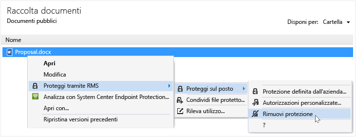

# Rimuovere la protezione da un file mediante l&#39;applicazione di condivisione Rights Management
Per rimuovere la protezione da un file che è stato precedentemente protetto mediante l'applicazione di condivisione RMS, utilizzare l’opzione **Rimuovere protezione** da Esplora File.

> [!IMPORTANT]
> È necessario essere un proprietario del file per rimuovere la protezione.

### Rimuovere la protezione da un file

1.  Da Esplora File, fare doppio clic su file (ad esempio, Sample.ptxt), selezionare **Protezione con RMS**, fare clic su **Protezione sul posto**, quindi fare clic su **Rimuovere protezione**:

    

    Le credenziali potrebbero essere richieste.

Il file protetto originale viene eliminato (ad esempio, Sample.ptxt) e sostituito con un file con lo stesso nome ma con l'estensione del nome file non protetta (ad esempio Sample. txt).

## Esempi e altre istruzioni
Per esempi di come è possibile utilizzare l'applicazione di condivisione Rights Management e procedure, vedere le sezioni seguenti della Guida dell’utente dell’applicazione di condivisione Rights Management:

-   [Esempi per l'utilizzo dell’applicazione di condivisione RMS](../Topic/Rights_Management_sharing_application_user_guide.md#BKMK_SharingExamples)

-   [Come procedere](../Topic/Rights_Management_sharing_application_user_guide.md#BKMK_SharingInstructions)

## Vedere anche
[Guida dell'utente dell'applicazione di condivisione Rights Management](../Topic/Rights_Management_sharing_application_user_guide.md)

