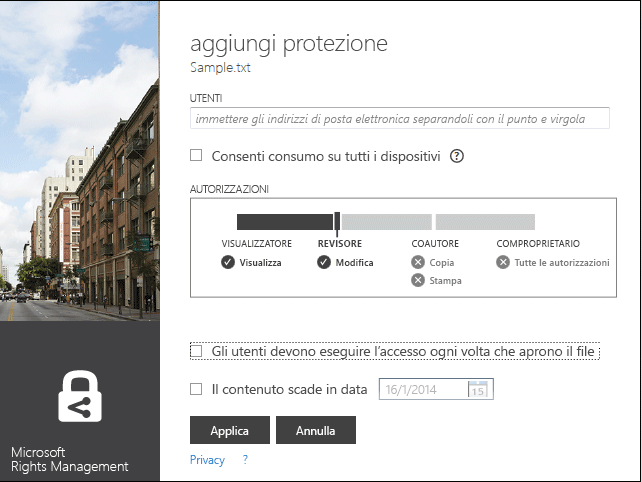
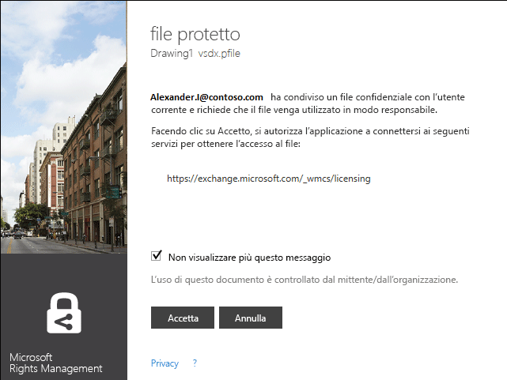

# Versione rivista 3: Guida dell&#39;applicazione di condivisione Microsoft Rights Management
Questa guida riguarda l'applicazione di condivisione Microsoft Rights Management (RMS) per Windows, che consente di proteggere documenti e immagini importanti dalle persone non autorizzate a visualizzarli, anche se vengono inviati tramite posta elettronica o salvati in un altro dispositivo. Analogamente, questa applicazione consente di aprire e usare i file protetti da altre persone con la stessa tecnologia Rights Management.

L'applicazione di condivisione fornisce questo tipo di protezione per i file nei modi seguenti:

-   Aggiunge funzionalità in Esplora file (noto anche come Esplora risorse in Windows 7 e versioni precedenti) in modo che, quando si gestiscono i file in una cartella, è possibile proteggere un singolo file, più file in blocco oppure tutti i file.

-   Fornisce protezione per tutti i tipi di file e include un visualizzatore predefinito per i tipi di file di testo e di immagine più comuni.

-   Aggiunge il pulsante **Condividi file protetto** alla barra degli strumenti di Microsoft Office toolbar per Word, PowerPoint ed Excel.

Per installare l'applicazione di condivisione RMS, è sufficiente avere un computer che esegue Windows 7 o Windows 8 e un account di amministratore locale. Quindi scaricare e installare questa applicazione gratuita di Microsoft.

In caso di domande a cui non viene data risposta in questa guida, vedere le [domande frequenti sull'applicazione di condivisione Microsoft Rights Management per Windows](http://go.microsoft.com/fwlink/?LinkId=303971).

## Esempi relativi all'uso dell'applicazione di condivisione RMS
Ecco alcuni esempi su come usare l'applicazione di condivisione RMS per proteggere i file.

|Scenario|Soluzione con l'applicazione di condivisione RMS|
|------------|----------------------------------------------------|
|**È necessario copiare in modo sicuro in un altro dispositivo un documento aziendale riservato**<br /><br />Si supponga di usare il PC per redigere un documento strategico riservato e di volerlo copiare in una chiavetta USB in modo da continuare a lavorare quando si lascia l'ufficio e non si ha più accesso alla rete aziendale.|Nel PC e nel portatile è installata l'applicazione di condivisione RMS. Usare Esplora file nel PC per proteggere il file con un modello, in modo che non sia accessibile a persone esterne alla società. Copiare quindi il file nella chiavetta, collegarla al portatile e continuare a lavorare al documento. Se si perde la chiavetta o il portatile viene rubato, nessuno all'esterno della società potrà accedere al documento.|
|**È necessario condividere in modo sicuro informazioni finanziarie con una persona di fiducia esterna all'organizzazione**<br /><br />Si supponga di collaborare con una società partner a cui si vuole inviare tramite posta elettronica un foglio di calcolo di Excel contenente dati sulle previsioni di vendita. Si vuole offrire la possibilità di visualizzare, ma non di modificare, le cifre.|Usare il pulsante **Condividi file protetto** sulla barra multifunzione di Excel, digitare gli indirizzi di posta elettronica delle due persone della società partner con cui si collabora, selezionare **Visualizzatore** sul dispositivo di scorrimento e fare clic su **Invia**.<br /><br />Quando il messaggio arriva alla società partner, solo i destinatari possono visualizzare il foglio di calcolo, ma non possono salvarlo, modificarlo, stamparlo né inoltrarlo.|
|**È necessario inviare in modo sicuro un diagramma tecnico tramite posta elettronica a una persona che usa un dispositivo iOS**<br /><br />La società usa un'applicazione di ingegneria personalizzata e si vuole inviare un diagramma strettamente riservato a un collega, che controlla regolarmente la posta elettronica sul proprio dispositivo iOS.|In Esplora file fare clic con il pulsante destro del mouse sul file e scegliere **Condividi file protetto**. L'applicazione di condivisione RMS riconosce che l'estensione del file non è di un'applicazione che supporta RMS in modo nativo, quindi quando il file viene allegato a un messaggio di posta elettronica, lo converte automaticamente in un file con protezione generica e seleziona automaticamente l'opzione **Consenti consumo su tutti i dispositivi**.<br /><br />Il destinatario riceve il messaggio sul proprio dispositivo iOS, fa clic sul collegamento nel messaggio che indica come scaricare l'applicazione di condivisione, installa la versione per dispositivi iOS e quindi visualizza il diagramma.|
|**La propria organizzazione non usa Rights Management, ma si riceve un messaggio di posta elettronica con un allegato protetto con RMS**<br /><br />Si supponga che il mittente del messaggio sia una persona di fiducia con cui si è già in rapporti di affari e si ritiene che possa inviare informazioni su una nuova possibile opportunità di business.|Fare clic sul collegamento nel messaggio che indica come scaricare l'applicazione di condivisione RMS per il computer, installarla e quindi iscriversi a RMS per singoli utenti. Microsoft conferma che l'organizzazione non ha un abbonamento a Office 365, invia un messaggio di posta elettronica per completare la procedura di iscrizione gratuita e a quel punto è possibile effettuare l'accesso con il nuovo account. È quindi possibile aprire l'allegato di posta elettronica e leggere le informazioni sulla nuova opportunità.|

## <a name="BKMK_Install"></a>Come scaricare e installare l'applicazione di condivisione RMS
> [!IMPORTANT]
> Per installare l'applicazione di condivisione RMS, è necessario avere un account di amministratore locale. Se non si effettua l'accesso come amministratore locale, è possibile usare l'opzione **Esegui come amministratore** quando si esegue Setup.exe nel passaggio 3.

Per installare l'applicazione di condivisione RMS, procedere come segue:

1.  Passare alla pagina [Microsoft Rights Management](http://go.microsoft.com/fwlink/?LinkId=303970) del sito Web Microsoft.

2.  Nella sezione **Computer** fare clic sull'icona dell'**app RMS per Windows** e salvare il pacchetto di installazione dell'applicazione di condivisione Microsoft Rights Management nel computer.

3.  Fare doppio clic sul file compresso scaricato e quindi su **setup.exe**. Se viene richiesto di continuare, fare clic su **Sì**.

4.  Nella pagina **Configurare Microsoft RMS** fare clic su **Avanti**, quindi attendere il completamento dell'installazione.

5.  Al termine dell'installazione, fare clic su **Riavvia** per riavviare il computer e completare la procedura. Oppure fare clic su **Chiudi** e riavviare il computer in seguito per completare l'installazione.

A questo punto è possibile iniziare a proteggere i file o a leggere quelli protetti da altri utenti.

## <a name="BKMK_UsingMSRMSApp"></a>Operazioni correlate
Seguire le istruzioni seguenti per gestire i file protetti.

### <a name="BKMK_CreatePTXT"></a>Creare un file di testo protetto
È possibile convertire un normale file di testo (con estensione txt) in un file protetto, che quindi avrà estensione ptxt.

##### Per creare un file di testo protetto (ptxt)

1.  In Esplora file fare clic con il pulsante destro del mouse in una cartella, scegliere **Nuovo** e quindi fare clic su **Documento di testo**.

2.  Rinominare il file, ad esempio Sample.txt.

3.  Fare doppio clic sul file per aprirlo nel Blocco note.

4.  Nel Blocco note aggiungere alcune righe di testo al file, quindi salvarlo. È possibile usare il testo di esempio seguente.

    ```
    This is a sample text file.
    This is a sample text file.
    This is a sample text file.
    This is a sample text file. 
    This is a sample text file.
    This is a sample text file.
    ```

5.  Fare clic con il pulsante destro del mouse sul file, scegliere **Proteggi sul posto** e selezionare un modello nell'elenco. La prima volta che si usa l'applicazione di condivisione RMS, è necessario selezionare **Protezione definita dall'azienda**, per avviare il download dei modelli per l'organizzazione.

6.  Nella schermata **Applicazione di condivisione Microsoft Rights Management** verificare i criteri da applicare, fare clic su **Applica** e quindi, una volta protetto il file, fare clic su **Chiudi**.

### <a name="BKMK_ViewPTXT"></a>Visualizzare un file di testo protetto (ptxt) o un file di immagine protetto
Per visualizzare un file di testo protetto (ptxt), in Esplora file fare doppio clic sul file (ad esempio Sample.ptxt). Potrebbe essere richiesto di immettere le credenziali. Quando il file si apre, nella parte superiore verranno visualizzati i criteri di protezione.

Le immagini protette vengono visualizzate e aperte nello stesso modo.

### <a name="BKMK_CreatePFILE"></a>Creare un file con protezione generica
Usare il formato di file con protezione generica (con estensione pfile) per offrire un livello generico di protezione nel caso di file non supportati direttamente dall'applicazione di condivisione RMS o da altre applicazioni che forniscono un tipo di protezione RMS incorporata. È possibile consultare la pagina [Microsoft Rights Management](http://go.microsoft.com/fwlink/?LinkId=303970) del sito Web Microsoft per verificare rapidamente quali applicazioni supportano la protezione incorporata di RMS.

Ad esempio, poiché Microsoft Visio attualmente non supporta la protezione incorporata per RMS, è possibile usare la protezione generica per i file con estensione vsd creati con questa applicazione.

> [!TIP]
> Qual è la differenza tra protezione incorporata (nativa) e protezione generica?
> 
> -   Se si applica la protezione generica a un file, le persone non autorizzate non possono aprirlo. Ma dopo aver aperto il file, le persone autorizzate potrebbero inoltrarlo non protetto ad altri utenti oppure salvarlo in un percorso accessibile ad altri. Visualizzano tuttavia un messaggio nella parte superiore del file che indica quali autorizzazioni hanno per il file e gli viene chiesto di rispettarle, ma questa protezione non può essere imposta. Inoltre, quando di applica la protezione generica a un file, non è possibile restringere ulteriormente le autorizzazioni. Se ad esempio si usano autorizzazioni personalizzate, il dispositivo di scorrimento dell'applicazione di condivisione RMS seleziona automaticamente **COMPROPRIETARIO** e non è possibile sostituire questa autorizzazione con una più restrittiva, ad esempio **VISUALIZZATORE** o **COAUTORE**.
> -   Al contrario, se si usa la protezione incorporata di RMS con applicazioni che la supportano, ad esempio i file di Office, la protezione viene applicata al file anche se questo viene inviato a qualcun altro o salvato in un altro percorso. Inoltre, quando si proteggono questi file, è possibile usare autorizzazioni restrittive, ad esempio di sola lettura, oppure l'autorizzazione per modificare ma non per stampare o copiare. Se ad esempio si usano autorizzazioni personalizzate, il dispositivo di scorrimento dell'applicazione di condivisione RMS seleziona automaticamente **REVISORE** come autorizzazione, che è poi possibile sostituire con un'altra più o meno restrittiva.

##### Esempio: Per creare un file con protezione generica (pfile) da un file di disegno di Visio (vsd)

1.  In Esplora file fare clic con il pulsante destro del mouse in una cartella, scegliere **Nuovo** e quindi fare clic su **Documento di Visio**.

2.  Rinominare il file, ad esempio Sample.vsd.

3.  Fare doppio clic sul file per aprirlo in Visio.

4.  In Visio aggiungere elementi al disegno, quindi salvare e chiudere il file.

5.  Fare clic con il pulsante destro del mouse sul file, scegliere **Proteggi sul posto** e selezionare un modello di criteri nell'elenco. La prima volta che si usa l'applicazione di condivisione RMS, è necessario selezionare **Protezione definita dall'azienda**, per avviare il download dei modelli per l'organizzazione.

6.  Nella schermata **Applicazione di condivisione Microsoft Rights Management** selezionare i criteri da applicare e quindi fare clic su **Applica**.

7.  Viene visualizzato un messaggio che indica che il file protetto è stato salvato come file pfile, ad esempio Sample.vsd.pfile. Il file originale viene eliminato.

### <a name="BKMK_ViewPFILE"></a>Visualizzare un file con protezione generica (pfile)
Per visualizzare un file con protezione generica (pfile), in Esplora file fare doppio clic sul file pfile, ad esempio Sample.vsd.pfile, quindi fare clic su **Apri**.

### <a name="BKMK_Unprotect"></a>Rimuovere la protezione da un file
Per rimuovere la protezione da un file protetto in precedenza, usare l'opzione **Rimuovi protezione**:

1.  Fare clic con il pulsante destro del mouse sul file, ad esempio Sample.ptxt, scegliere **Proteggi sul posto** e quindi fare clic su **Rimuovi protezione**. Potrebbe essere richiesto di immettere le credenziali.

2.  Il file protetto originale viene eliminato, ad esempio Sample.ptx, e sostituito da un file con lo stesso nome ma con l'estensione del file non protetto, ad esempio Sample.txt.

### <a name="BKMK_ProtectCustom"></a>Proteggere un file con autorizzazioni personalizzate
Il modo più semplice per proteggere un file consiste nell'usare i modelli, ma è anche possibile specificare autorizzazioni personalizzate. Si tratta in sostanza di applicare una protezione creata dall'utente, particolarmente utile nelle situazioni seguenti:

-   Si vuole limitare l'accesso ai file solo a un elenco specifico di singoli utenti identificati dai relativi indirizzi di posta elettronica.

-   Si vuole limitare l'uso del file solo a diritti specifici, ad esempio di sola lettura per un documento.

Per proteggere un file con autorizzazioni create dall'utente, fare clic con il pulsante destro del mouse sul file, scegliere **Proteggi sul posto** e quindi fare clic su **Autorizzazioni personalizzate**. Verrà visualizzata la schermata seguente:



Digitare gli indirizzi di posta elettronica degli utenti, usare il dispositivo di scorrimento per selezionare le autorizzazioni per il file e fare clic su **Applica**.

### <a name="BKMK_UserDefined"></a>Usare file con protezione personalizzata
La maggior parte dei file che si aprono saranno stati protetti applicando modelli. Tuttavia, gli utenti possono anche proteggere i file usando autorizzazioni personalizzate, ossia con la protezione creata dall'utente.

Per i formati di file di testo e di immagine, questo livello di protezione richiede che tutte le applicazioni usate per modificare, salvare o limitare tali file siano state progettate per supportare la protezione RMS e che implementino le API di protezione disponibili in AD RMS SDK.

Quando si visualizza un file di testo protetto al quale è applicata la protezione creata dall'utente, si noterà una leggera differenza nelle autorizzazioni che vengono visualizzate per il file, come illustrato nell'esempio seguente.

Per i file protetti usando il formato di file con protezione generica (pfile), i diritti o le autorizzazioni specifiche definite dall'utente vengono visualizzate nella schermata di conferma al posto del nome del modello usato per proteggere il file, come illustrato nella figura seguente.



### <a name="BKMK_ShareProtected"></a>Proteggere contenuto da condividere per posta elettronica
Per proteggere contenuto da condividere tramite un messaggio di posta elettronica, fare clic con il pulsante destro del mouse sul file e scegliere **Condividi file protetto**. Verrà visualizzata la schermata seguente:


Digitare gli indirizzi di posta elettronica dell'elenco di utenti, usare il dispositivo di scorrimento per selezionare le autorizzazioni per il file e fare clic su **Invia**. Outlook crea quindi un messaggio di posta elettronica per i destinatari, con una breve nota che è possibile modificare, e allega il file protetto. Il file originale non viene protetto.

Per consentire agli utenti di visualizzare i file protetti in dispositivi non Windows, fare clic su **Consenti consumo su tutti i dispositivi**. Gli utenti potrebbero dover scaricare l'applicazione di condivisione RMS per il dispositivo e nel messaggio di posta elettronica è disponibile un apposito collegamento.

### <a name="BKMK_Multiple"></a>Applicare la protezione a più file e cartelle
Non è necessario applicare la protezione ai singoli file quando si usa Esplora file. È invece possibile selezionare più file oppure tutti i file in una cartella, se non sono già protetti.

##### Per proteggere più file o tutti i file in una cartella selezionata

1.  In Esplora file selezionare più file oppure una cartella contenente i file da proteggere.

2.  Fare clic con il pulsante destro del mouse sulla cartella o sui file, scegliere **Proteggi sul posto** e selezionare un modello nell'elenco. La prima volta che si usa l'applicazione di condivisione RMS, è necessario selezionare **Protezione definita dall'azienda**, per avviare il download dei modelli per l'organizzazione.

3.  Nella schermata **Applicazione di condivisione Microsoft Rights Management** verificare se i file sono stati protetti.

> [!TIP]
> Se vengono visualizzati messaggi di errore, vedere le [domande frequenti sull'applicazione di condivisione Microsoft Rights Management per Windows](http://go.microsoft.com/fwlink/?LinkId=303971).

### <a name="BKMK_OfficeToolbar"></a>Usare il componente aggiuntivo della barra degli strumenti di Office
È possibile proteggere e condividere file di Word, PowerPoint ed Excel direttamente da Microsoft Office usando il componente aggiuntivo della barra multifunzione di Office per l'applicazione di condivisione Microsoft Rights Management.

Nel gruppo **Protezione** fare clic su **Condividi file protetto** per avviare l'applicazione di condivisione Microsoft Rights Management.


### <a name="BKMK_AccessKeys"></a>Usare i tasti di scelta rapida
Premere **ALT** per vedere i tasti di scelta disponibili e quindi premere **ALT** + il tasto di accesso per selezionare un'opzione.

Ad esempio, nella finestra di dialogo **condividi file protetto** premere **ALT** per vedere i tasti di scelta e quindi premere **ALT+U** per selezionare la casella di controllo **Gli utenti devono eseguire l'accesso ogni volta che aprono il file**.


## Vedere anche
[Download dell'applicazione di condivisione Microsoft Rights Management](http://go.microsoft.com/fwlink/?LinkId=303970)
 [Domande frequenti sull'applicazione di condivisione Microsoft Rights Management per Windows](http://go.microsoft.com/fwlink/?LinkId=303971)

