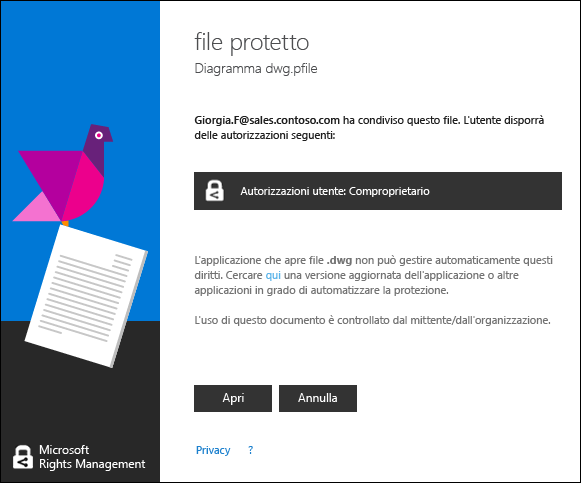

# Manuale dell&#39;utente dell&#39;applicazione di condivisione Rights Management - revisione per singolo argomento
L'applicazione di condivisione Microsoft Rights Management (RMS) per Windows consente di proteggere documenti e immagini importanti dalle persone non autorizzate a visualizzarli, anche se vengono inviati tramite posta elettronica o salvati in un altro dispositivo. È anche possibile usare questa applicazione per aprire e usare i file protetti da altre persone con la stessa tecnologia Rights Management.

Per installare l'applicazione di condivisione RMS, è sufficiente avere un computer che esegua almeno Windows 7 e un account di amministratore locale. Quindi [scaricare e installare](http://go.microsoft.com/fwlink/?LinkId=303970) questa applicazione gratuita di Microsoft.

In caso di domande a cui non viene data risposta in questa guida, vedere le [domande frequenti sull'applicazione di condivisione Microsoft Rights Management per Windows](http://go.microsoft.com/fwlink/?LinkId=303971).

Ecco alcuni esempi su come usare l'applicazione di condivisione per proteggere i file.

|Per …|Eseguire questa operazione|
|---------|------------------------------|
|**… condividere in modo sicuro informazioni finanziarie con una persona di fiducia esterna all'organizzazione**  Si supponga di collaborare con una società partner a cui si vuole inviare tramite posta elettronica un foglio di calcolo di Excel contenente dati sulle previsioni di vendita. Si vuole offrire la possibilità di visualizzare, ma non di modificare, le cifre.|Usare il pulsante Condividi file protetto sulla barra multifunzione di Excel, digitare gli indirizzi di posta elettronica delle due persone della società partner con cui si collabora, selezionare Visualizzatore sul dispositivo di scorrimento e fare clic su Invia.  Quando il messaggio arriva alla società partner, solo i destinatari possono visualizzare il foglio di calcolo, ma non possono salvarlo, modificarlo, stamparlo né inoltrarlo.  Dettagli: Vedere **Proteggere un file condiviso tramite posta elettronica** nella sezione [Operazioni correlate](../Topic/Rights_Management_sharing_application_user_guide_-_revision_for_single_topic.md#BKMK_UsingMSRMSApp) di questa guida.|
|**… inviare in modo sicuro un documento tramite posta elettronica a un utente di un dispositivo iOS**  Si supponga di voler inviare tramite posta elettronica un documento di Word strettamente riservato a un collega che controlla regolarmente la posta sul proprio dispositivo iOS.|In Esplora file fare clic con il pulsante destro del mouse sul file e scegliere Condividi file protetto. Nell'applicazione di condivisione RMS selezionare l'opzione Consenti consumo su tutti i dispositivi e inviare il file come allegato al collega.  Il destinatario riceve il messaggio sul proprio dispositivo iOS, fa clic sul collegamento nel messaggio che indica come scaricare l'applicazione di condivisione, installa la versione per dispositivi iOS e quindi visualizza il documento.  Dettagli: Vedere **Proteggere un file condiviso tramite posta elettronica** nella sezione [Operazioni correlate](../Topic/Rights_Management_sharing_application_user_guide_-_revision_for_single_topic.md#BKMK_UsingMSRMSApp) di questa guida.|
|**… leggere un allegato ricevuto in un messaggio di posta elettronica e condiviso in modo sicuro, ma che non è possibile aprire perché la propria organizzazione non usa Rights Management**  Si supponga che il mittente del messaggio sia una persona di fiducia con cui si è già in rapporti di affari e si ritiene che possa inviare informazioni su una nuova possibile opportunità di business.|Seguire le istruzioni riportate nel messaggio e fare clic sul collegamento per iscriversi a Microsoft Rights Management. Microsoft conferma che l'organizzazione non ha un abbonamento a Office 365, invia un messaggio di posta elettronica per completare la procedura di iscrizione gratuita e a quel punto è possibile effettuare l'accesso con il nuovo account. Fare clic sul secondo collegamento nel messaggio per installare l'app di condivisione Rights Management. A questo punto è possibile aprire l'allegato e leggere il contenuto del file.  Dettagli: Vedere **Visualizzare e usare file protetti con Rights Management** nella sezione [Operazioni correlate](../Topic/Rights_Management_sharing_application_user_guide_-_revision_for_single_topic.md#BKMK_UsingMSRMSApp) di questa guida.|
|**… proteggere file aziendali riservati sul portatile in modo che non siano accessibili all'esterno della società**  Si supponga di viaggiare molto e di usare il portatile per accedere ai file e aggiornarli in una cartella che deve essere protetta da accessi non autorizzati.|Nel portatile è installata l'applicazione di condivisione RMS. Usare Esplora file per proteggere rapidamente i file con un modello. Se il portatile viene rubato, si può stare tranquilli perché nessuno all'esterno della società potrà accedere a questi documenti.  Dettagli: Vedere **Proteggere un file in un dispositivo (protezione sul posto)** nella sezione [Operazioni correlate](../Topic/Rights_Management_sharing_application_user_guide_-_revision_for_single_topic.md#BKMK_UsingMSRMSApp) di questa guida.|

## Operazioni correlate
Seguire le istruzioni seguenti per gestire i file protetti.

### Scaricare e installare l'applicazione di condivisione Rights Management

1.  Passare alla pagina [Microsoft Rights Management](http://go.microsoft.com/fwlink/?LinkId=303970) del sito Web Microsoft.

2.  Nella sezione **Computer** fare clic sull'icona dell'**app RMS per Windows** e salvare il pacchetto di installazione dell'applicazione di condivisione Microsoft Rights Management nel computer.

3.  Fare doppio clic sul file compresso scaricato e quindi su **setup.exe**. Se viene richiesto di continuare, fare clic su **Sì**.

    > [!TIP]
    > Potrebbe essere necessario scorrere alla fine dell'elenco nella cartella corrente per vedere **setup.exe**.

4.  Nella pagina **Configurare Microsoft RMS** fare clic su **Avanti**, quindi attendere il completamento dell'installazione.

5.  Al termine dell'installazione, fare clic su **Riavvia** per riavviare il computer e completare la procedura. Oppure fare clic su **Chiudi** e riavviare il computer in seguito per completare l'installazione.

A questo punto è possibile iniziare a proteggere i file o a leggere quelli protetti da altri utenti.

#### Ulteriori informazioni
Per installare l'applicazione di condivisione, è necessario avere un account di amministratore locale. Se non si effettua l'accesso come amministratore locale, è possibile usare l'opzione **Esegui come amministratore** quando si esegue Setup.exe nel passaggio 3.

### Proteggere un file in un dispositivo (protezione sul posto)

1.  In Esplora file selezionare un file, una cartella oppure più file da proteggere. Fare clic con il pulsante destro del mouse e quindi scegliere **Proteggi sul posto**. Ad esempio:

    

    > [!NOTE]
    > Se l'opzione **Proteggi sul posto** non è visualizzata, è probabile che l'applicazione di condivisione non sia installata nel computer o che sia necessario riavviare il computer per completare l'installazione. Per altre informazioni su come installare l'applicazione di condivisione, vedere **Scaricare e installare l'applicazione di condivisione Rights Management** nella sezione [Operazioni correlate](../Topic/Rights_Management_sharing_application_user_guide_-_revision_for_single_topic.md#BKMK_UsingMSRMSApp) di questa guida.

2.  Effettuare una delle operazioni riportate di seguito:

    -   Selezionare un modello di criteri: si tratta di autorizzazioni predefinite che limitano l'accesso e l'utilizzo agli utenti dell'organizzazione. La prima volta che si protegge un file nel computer, è necessario selezionare **Protezione definita dall'azienda** per scaricare i modelli. Il nome dei modelli inizia con il nome della società, seguito da un nome descrittivo dell'autorizzazione. Ad esempio: **Contoso - Solo visualizzazione riservata**

    -   Selezionare **Autorizzazioni personalizzate**: scegliere questa opzione se i modelli non forniscono il livello di protezione necessario, ad esempio se si desidera concedere l'accesso a persone esterne all'organizzazione oppure impostare in modo esplicito le opzioni di protezione personalizzate. Specificare le opzioni desiderate per il file nella finestra di dialogo **aggiungi protezione** e quindi fare clic su **Applica**.

        > [!NOTE]
        > Per altre informazioni sulle opzioni di questa finestra di dialogo, vedere le istruzioni **Specificare le opzioni nella finestra di dialogo Rights Management**  nella sezione [Operazioni correlate](../Topic/Rights_Management_sharing_application_user_guide_-_revision_for_single_topic.md#BKMK_UsingMSRMSApp) di questa guida.

3.  È possibile che venga visualizzata rapidamente una finestra di dialogo che informa che il file viene protetto. Lo stato attivo tornerà a Esplora file. A questo punto i file selezionati sono protetti. In alcuni casi (quando l'aggiunta della protezione modifica l'estensione del file), il file originale in Esplora file viene sostituito con un nuovo file con l'icona del blocco di protezione di Rights Management. Ad esempio:

    

Se in seguito è necessario rimuovere la protezione da un file, vedere le istruzioni **Rimuvoere la protezione da un file** nella sezione [Operazioni correlate](../Topic/Rights_Management_sharing_application_user_guide_-_revision_for_single_topic.md#BKMK_UsingMSRMSApp) di questa guida.

#### Ulteriori informazioni
Quando si protegge un file sul posto, questo sostituisce il file originale non protetto. È quindi possibile lasciare il file nel percorso in cui si trova, copiarlo in un'altra cartella o in un altro dispositivo o condividere la cartella in cui è archiviato. Il file rimarrà comunque protetto. È anche possibile allegare il file protetto a un messaggio di posta elettronica, anche se per condividere un file protetto tramite posta elettronica è consigliabile procedere direttamente da Esplora file o da un'applicazione di Office. Vedere **Proteggere un file condiviso tramite posta elettronica** nella sezione [Operazioni correlate](../Topic/Rights_Management_sharing_application_user_guide_-_revision_for_single_topic.md#BKMK_UsingMSRMSApp) di questa guida.

È possibile usare la stessa tecnica per proteggere più file contemporaneamente oppure una cartella. Quando si protegge una cartella, tutti i file al suo interno vengono automaticamente selezionati per la protezione, mentre i nuovi file creati non verranno protetti automaticamente.

Se vengono visualizzati errori quando si tenta di proteggere i file, fare riferimento alle [domande frequenti sull'applicazione di condivisione Microsoft Rights Management per Windows](http://go.microsoft.com/fwlink/?LinkId=303971).

### Proteggere un file condiviso tramite posta elettronica

1.  Usare una delle opzioni seguenti:

    -   Per Esplora file: Fare clic con il pulsante destro del mouse sul file e scegliere **Condividi file protetto**:

        

    -   Per l'applicazione di Office: verificare di aver prima salvato il file. Quindi, nel gruppo **Protezione** fare clic su **Condividi file protetto**.

        

    > [!NOTE]
    > Se queste opzioni per condividere la protezione non sono presenti, è probabile che l'applicazione di condivisione non sia installata nel computer o che sia necessario riavviare il computer per completare l'installazione. Per altre informazioni su come installare l'applicazione di condivisione, vedere **Scaricare e installare l'applicazione di condivisione Rights Management** nella sezione [Operazioni correlate](../Topic/Rights_Management_sharing_application_user_guide_-_revision_for_single_topic.md#BKMK_UsingMSRMSApp) di questa guida.

2.  Specificare le opzioni desiderate per il file nella finestra di dialogo **condividi file protetto** e quindi fare clic su **Invia**.

    

    > [!NOTE]
    > Per altre informazioni sulle opzioni di questa finestra di dialogo, vedere le istruzioni **Specificare le opzioni nella finestra di dialogo Rights Management**  nella sezione [Operazioni correlate](../Topic/Rights_Management_sharing_application_user_guide_-_revision_for_single_topic.md#BKMK_UsingMSRMSApp) di questa guida.

3.  È possibile che venga visualizzata rapidamente una finestra di dialogo che indica che il file verrà protetto e quindi viene automaticamente creato un messaggio di posta elettronica con l'oggetto **Ho condiviso in modo sicuro i file**. In questo messaggio di posta elettronica il file selezionato è allegato senza protezione e il testo del messaggio contiene i collegamenti per quanto segue:

    -   RMS per utenti singoli

    -   L'applicazione di condivisione RMS

    -   Questo manuale dell'utente

    Esempio:

    

4.  Facoltativo: è possibile modificare qualsiasi elemento di questo messaggio di posta elettronica. Ad esempio, è possibile aggiungere o modificare l'oggetto o il testo del messaggio.

    > [!WARNING]
    > Anche se è possibile aggiungere o rimuovere persone dal messaggio di posta elettronica, le autorizzazioni per l'allegato specificate nella finestra di dialogo **condividi file protetto** non vengono modificate. Per modificare queste autorizzazioni, ad esempio per concedere a un'altra persona l'autorizzazione per aprire il file, chiudere il messaggio senza salvarlo o inviarlo e quindi tornare al passaggio 1.

5.  Inviare il messaggio di posta elettronica.

#### Ulteriori informazioni
Quando si protegge un file che viene condiviso tramite posta elettronica, viene creata una nuova versione del file originale. Il file originale rimane non protetto e la nuova versione viene protetta e allegata automaticamente a un messaggio di posta elettronica che si invia.

Il messaggio ha un oggetto e un testo predefiniti che è possibile cambiare prima di inviarlo.

È possibile proteggere un file da condividere per posta elettronica in due modi:

-   Da Esplora file: questo metodo funziona per tutti i file.

-   Da un'applicazione di Office: questo metodo funziona per le applicazioni supportate dall'applicazione di condivisione Rights Management usando il componente aggiuntivo di Office che consente di visualizzare il gruppo **Protezione** della barra multifunzione.

> [!NOTE]
> In questa versione dell'applicazione di condivisione Rights Management non è presente nessun componente aggiuntivo di Outlook che consenta di proteggere i file e inviare messaggi di posta elettronica direttamente dall'applicazione. Usare invece la procedura di questa sezione.

### Visualizzare e usare file protetti con Rights Management

#### Per visualizzare un file protetto
In Esplora file o nel messaggio di posta elettronica che contiene l'allegato, fare doppio clic sul file protetto e, quando richiesto, immettere le credenziali. Il modo in cui il file viene aperto dipende da come è stato protetto.

-   Se al file è applicata la protezione generica (ha estensione pfile):

    Viene visualizzata la finestra di dialogo **file protetto** dell'applicazione di condivisione, che indica chi ha protetto il file e chiede di rispettare le autorizzazioni del comproprietario. Si viene informati che l'azione di apertura del file viene controllata.

    

    Fare clic su **Apri** per leggere il file.

-   Se al file è applicata la protezione nativa (non ha estensione pfile):

    Viene aperto usando l'applicazione associata all'estensione del file originale e nella parte superiore viene visualizzato un messaggio con le restrizioni. Il messaggio può indicare le autorizzazioni applicate al file o fornire un collegamento per visualizzarle. È ad esempio possibile che sia necessario fare clic su **L'autorizzazione è attualmente soggetta a restrizioni** per visualizzare le autorizzazioni effettive applicate al file e le persone che possono accedervi:

    

    Il file viene anche controllato e rimane tale finché è protetto.

##### Ulteriori informazioni
Per consentire a un utente di visualizzare il file protetto, RMS deve prima verificare che sia autorizzato e a questo scopo controlla il nome utente e la password. In alcuni casi, è possibile che le credenziali siano memorizzate nella cache e non verrà visualizzato un messaggio che chiede di immetterle. In altri casi questo messaggio verrà invece visualizzato.

Se l'organizzazione non usa Microsoft Azure Rights Management (Microsoft Azure RMS) o AD RMS, è possibile richiedere un account gratuito che accetterà le credenziali, in modo da poter aprire i file protetti con RMS: Per richiedere questo account, fare clic sul collegamento per ottenere [RMS per utenti singoli](http://go.microsoft.com/fwlink/?LinkId=309469).

#### Per usare i file protetti, ad esempio modificarli e stamparli
Se il file protetto ha estensione pfile:

-   Salvare il file aperto e assegnargli l'estensione associata all'applicazione che si vuole usare.

    Se ad esempio il file è stato protetto con il nome document.vsdx.pfile, visualizzarlo in Esplora file e salvarlo con il nome document.vsdx.

    Il file non è più protetto. Se si vuole proteggerlo, è necessario farlo manualmente. Per le istruzioni, vedere **Come proteggere un file in un dispositivo (protezione sul posto) usando l'applicazione di condivisione Rights Management** nella sezione [Operazioni correlate](../Topic/Rights_Management_sharing_application_user_guide_-_revision_for_single_topic.md#BKMK_UsingMSRMSApp) di questa guida.

Se il file protetto originariamente non ha estensione pfile:

-   Non è possibile fare altro che visualizzare il file, a meno che non si abbia un'applicazione che riconosce Rights Management, ossia una cosiddetta applicazione abilitata per RMS. Le applicazioni di Office 2013 e Office 2010, come Word, Excel, PowerPoint e Outlook, sono esempi di applicazioni abilitate per Rights Management. Ma anche applicazioni non di Microsoft, ad esempio quelle di altre società software oppure applicazioni line-of-business sviluppate internamente, potrebbero essere abilitate per Rights Management.

    Le applicazioni abilitate riconoscono come aprire i file protetti da altre applicazioni abilitate. Mantengono inoltre la protezione applicata ai file, anche se vengono modificati oppure salvati con un altro nome o in un altro percorso. Queste applicazioni consentono di usare il file in base alle autorizzazioni attualmente applicate, quindi è possibile usarlo se si hanno tali autorizzazioni. Se ad esempio il file è stato protetto come di sola lettura, non sarà possibile apportarvi modifiche né stamparlo.

### Rimuovere la protezione da un file
In Esplora file fare clic con il pulsante destro del mouse sul file, ad esempio Sample.ptxt, scegliere **Proteggi sul posto** e quindi fare clic su **Rimuovi protezione**:

Potrebbe essere richiesto di immettere le credenziali.

#### Ulteriori informazioni
Il file protetto originale viene eliminato, ad esempio Sample.ptx, e sostituito da un file con lo stesso nome ma con l'estensione del file non protetto, ad esempio Sample.txt.

Per rimuovere la protezione da un file protetto in precedenza con l'applicazione di condivisione RMS, usare l'opzione **Rimuovi protezione** di Esplora file.

> [!IMPORTANT]
> Per rimuovere la protezione, è necessario essere un proprietario del file.

### Usare i tasti di scelta rapida nell'applicazione di condivisione Rights Management
Premere **ALT** per vedere i tasti di scelta disponibili e quindi premere **ALT** + il tasto di accesso per selezionare un'opzione.

#### Ulteriori informazioni
Ad esempio, nella finestra di dialogo **condividi file protetto** premere **ALT** per vedere i tasti di scelta e quindi premere **ALT+U** per selezionare la casella di controllo **Gli utenti devono eseguire l'accesso ogni volta che aprono il file**.

### Specificare le opzioni nella finestra di dialogo Rights Management

|Opzione|Descrizione|
|-----------|---------------|
|**UTENTI**|Digitare gli indirizzi di posta elettronica delle persone che si vuole autorizzare ad aprire il file. Usare un punto e virgola per separare più indirizzi. Possono essere indirizzi interni o esterni all'organizzazione,  Ad esempio: giorgiaf@contoso.com; dmilano@fabrikam.com|
|**Consenti consumo su tutti i dispositivi**|Se si sceglie questa opzione che consente agli utenti di aprire il file in dispositivi mobili come un iPad, le autorizzazioni vengono automaticamente impostate su **CO-OWNER** (tutte le autorizzazioni) in modo che al file venga applicata la protezione generica.|
|**AUTORIZZAZIONI**|Spostare il dispositivo di scorrimento sull'autorizzazione che si vuole impostare per il file.  In alcuni casi, le autorizzazioni vengono impostate automaticamente su COMPROPRIETARIO e non è possibile cambiarle. Ciò si verifica se si seleziona **Consenti consumo su tutti i dispositivi** e inoltre se si protegge un file a cui non è possibile applicare la protezione nativa di RMS, quindi è necessario scegliere la protezione generica. L'applicazione di condivisione determina quale protezione applicare in base all'estensione del file. **Tip:** È possibile consultare la pagina [Microsoft Rights Management](http://go.microsoft.com/fwlink/?LinkId=303970) del sito Web Microsoft per verificare rapidamente quali applicazioni supportano la protezione incorporata.|
|**Gli utenti devono eseguire l'accesso ogni volta che aprono il file**|Selezionare questa opzione se è necessaria una protezione maggiore per un file perché richiede che gli utenti specificati vengano sempre autenticati, ogni volta che accedono a un file. A questo scopo, se le credenziali non sono memorizzate nella cache, verrà richiesto di specificare nome utente e password. Tuttavia, questa impostazione richiede che gli utenti abbiano sempre accesso a Internet per aprire un file e può risultare frustrante visualizzare un messaggio che chiede di sbloccare un file o aspettare che il processo di autenticazione venga completato.|
|**Il contenuto scade in data**|Selezionare questa opzione solo per i file con scadenza che gli utenti selezionati non dovranno essere in grado di aprire dopo una data specificata. Sarà comunque possibile aprire il file originale.|

#### Ulteriori informazioni
Usare la tabella per informazioni su come specificare le opzioni della finestra di dialogo **aggiungi protezione** o **condividi file protetto**. Questa finestra di dialogo viene visualizzata se si protegge un file sul posto e si scelgono autorizzazioni personalizzate oppure se si protegge un file da condividere.

Per altre informazioni sulla protezione di un file sul posto o da condividere, vedere la sezione [Operazioni correlate](../Topic/Rights_Management_sharing_application_user_guide_-_revision_for_single_topic.md#BKMK_UsingMSRMSApp) di questa guida.

## Vedere anche
[Guida dell'amministratore dell'applicazione di condivisione Rights Management](../Topic/Rights_Management_sharing_application_administrator_guide.md)
 [Download dell'applicazione di condivisione Microsoft Rights Management](http://go.microsoft.com/fwlink/?LinkId=303970)
 [Domande frequenti sull'applicazione di condivisione Microsoft Rights Management per Windows](http://go.microsoft.com/fwlink/?LinkId=303971)

