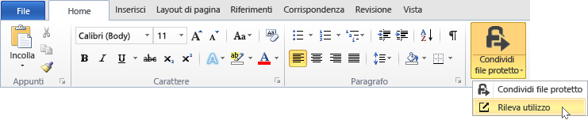
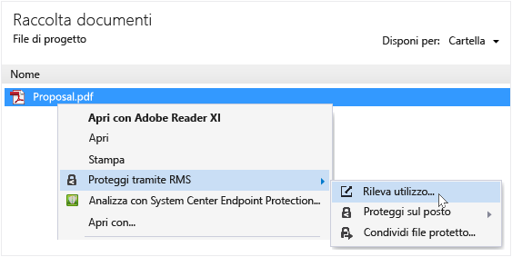

# Rilevare e revocare i documenti quando si utilizza l&#39;applicazione di condivisione RMS
Dopo avere protetto i documenti tramite l'applicazione RMS sharing, se l'organizzazione usa Azure Rights Management invece di Active Directory Rights Management Services, è possibile tenere traccia del modo in cui le persone usano i documenti protetti. Se necessario, è anche possibile revocare l'accesso a questi documenti quando si desidera interromperne la condivisione. A tale scopo, usare il **sito di rilevamento del documento**, a cui è possibile accedere dai computer Windows, i computer Mac e anche da tablet e telefoni.

> [!TIP]
> Video di due minuti con la [Revoca e rilevamento dei documenti di Azure RMS](http://channel9.msdn.com/Series/Information-Protection/Azure-RMS-Document-Tracking-and-Revocation)

Quando si accede a questo sito, eseguire l'accesso per effettuare il rilevamento dei documenti. A condizione che l'organizzazione disponga di una [sottoscrizione che supporta il rilevamento e la revoca dei documenti](https://technet.microsoft.com/dn858608.aspx) e di avere ricevuto una licenza per tale sottoscrizione, è quindi possibile sapere chi ha tentato di aprire i file protetti e se il tentativo ha avuto esito positivo (è stata eseguita correttamente l'autenticazione) o meno. Ogni volta che ha tentato di accedere al documento e la sua posizione in quel momento. Inoltre:

-   Se è necessario interrompere la condivisione di un documento: Fare clic su **Revocare l'accesso**, si noti il periodo di tempo in cui il documento continuerà a essere disponibile, e decidere se si vuol far sapere agli utenti che si sta revocando l'accesso al documento condiviso in precedenza e inviare un messaggio personalizzato.

-   Se si desidera esportare in Excel: Fare clic su **Apri in Excel**, in modo da poter poi modificare i dati e creare le visualizzazioni e i grafici.

-   Se si desidera configurare notifiche tramite posta elettronica: Fare clic su **Impostazioni** e selezionare come e se ricevere un messaggio di posta elettronica quando si accede al documento.

-   Se si hanno domande o si vogliono lasciare commenti e suggerimenti sul sito di rilevamento del documento: Fare clic sull'icona della Guida per l'accesso alle [Domande frequenti relative al rilevamento dei documenti](http://go.microsoft.com/fwlink/?LinkId=523977).

## Utilizzare Office per accedere al sito di rilevamento del documento

-   Per le applicazioni di Office, Word, Excel e PowerPoint: Nella scheda **Home**, nel gruppo **RMS**, fare clic su **Condivisione protetta**, e poi fare clic su **Rileva utilizzo**.

    

-   Per Outlook: In Outlook, nella scheda **Home**, nel gruppo **RMS**, fare clic su **Rileva utilizzo**.

    

Se non vengono visualizzate queste opzioni per RMS, è probabile che l'applicazione di applicazione RMS non sia installata nel computer o che il computer debba essere riavviato per completare l'installazione. Per ulteriori informazioni su come installare l'applicazione di sharing, vedere [Scaricare e installare l’applicazione di condivisione Rights Management](../Topic/Download_and_install_the_Rights_Management_sharing_application.md).

### Altri modi per tenere traccia e revocare i documenti
Oltre a tenere traccia dei documenti nei computer Windows utilizzando applicazioni Office, è anche possibile utilizzare queste alternative:

-   **Tramite un browser web**: Questo metodo funziona per tutti i dispositivi supportati.

-   **Tramite Esplora File**: Questo metodo funziona per i computer Windows.

-   **Tramite un messaggio di posta elettronica di Outlook**: Questo metodo funziona per i computer Windows.

##### Tramite l’utilizzo di un browser per accedere al sito di rilevamento dei documenti

-   Tramite l’utilizzo di un browser supportato, passare al [sito di rilevamento del documento](http://go.microsoft.com/fwlink/?LinkId=529562).

    Browser supportati: È consigliabile utilizzare almeno la versione  10 di Internet Explorer, ma è possibile utilizzare uno qualsiasi dei browser seguenti per utilizzare il sito di rilevamento del documento:

    -   Internet Explorer: Almeno la versione  10

    -   Internet Explorer 9 con almeno MS12-037: Aggiornamento cumulativo della sicurezza per Internet Explorer: 12 Giugno 2012

    -   Mozilla Firefox: Almeno la versione  12

    -   Apple Safari 5: Almeno la versione  5

    -   Google Chrome: Almeno la versione  18

##### Utilizzando Esplora File per accedere al sito di rilevamento del documento

-   Fare clic con il destro sul file, selezionare **Protezione con RMS**, poi selezionare **Traccia utilizzo**:

    

##### Utilizzo di un messaggio di posta elettronica di Outlook per accedere al sito di rilevamento del documento

-   In un messaggio di posta elettronica, nella scheda **Messaggio**, nel gruppo  **RMS**, fare clic su **Condivisione protetta**, e poi fare clic su **Traccia utilizzo**:

    

## Esempi e altre istruzioni
Per esempi di come è possibile utilizzare l'applicazione di condivisione Rights Management e procedure, vedere le sezioni seguenti della Guida dell’utente dell’applicazione di condivisione Rights Management:

-   [Esempi per l'utilizzo dell’applicazione di condivisione RMS](../Topic/Rights_Management_sharing_application_user_guide.md#BKMK_SharingExamples)

-   [Come procedere](../Topic/Rights_Management_sharing_application_user_guide.md#BKMK_SharingInstructions)

## Vedere anche
[Guida dell'utente dell'applicazione di condivisione Rights Management](../Topic/Rights_Management_sharing_application_user_guide.md)

