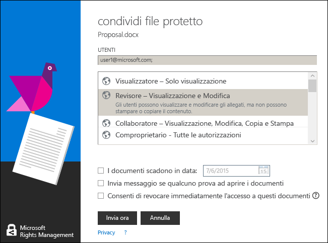

# Utilizzare i tasti di scelta rapida nell&#39;applicazione di condivisione Rights Managementi
Quando si utilizza l'applicazione di condivisione RMS, premere la chiave **Alt** per visualizzare le chiavi di accesso disponibili, poi premere **Alt** + chiave di accesso per selezionare un'opzione.

Ad esempio, nella finestra di dialogo **condivisione protetta**, premere **Alt** per visualizzare le chiavi di accesso, poi premere **Alt + m** per selezionare la casella di controllo **Inviare messaggio di posta elettronica quando qualcuno tenta di aprire questi documenti**.

## Esempi e altre istruzioni
Per esempi di come è possibile utilizzare l'applicazione di condivisione Rights Management e procedure, vedere le sezioni seguenti della Guida dell’utente dell’applicazione di condivisione Rights Management:

-   [Esempi per l'utilizzo dell’applicazione di condivisione RMS](../Topic/Rights_Management_sharing_application_user_guide.md#BKMK_SharingExamples)

-   [Come procedere](../Topic/Rights_Management_sharing_application_user_guide.md#BKMK_SharingInstructions)

## Vedere anche
[Guida dell'utente dell'applicazione di condivisione Rights Management](../Topic/Rights_Management_sharing_application_user_guide.md)

