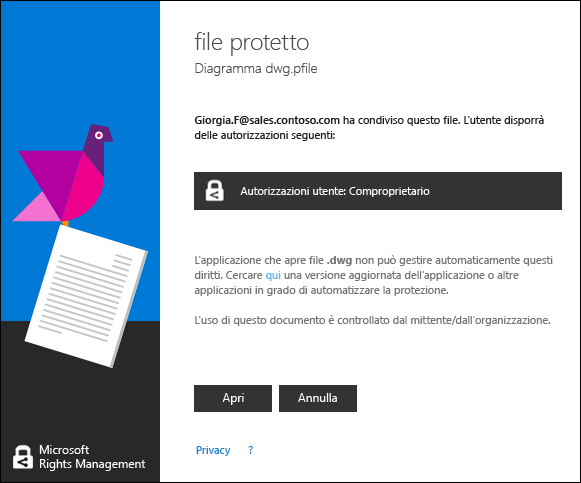

# Visualizzare e usare i file che sono stati protetti da Rights Management
Quando [l'applicazione Rights Management (RMS) sharing è installata nel computer](https://technet.microsoft.com/library/dn574734%28v=ws.10%29.aspx), è possibile visualizzare un file protetto semplicemente facendo doppio clic su di esso. Il file potrebbe essere un allegato in un messaggio di posta elettronica oppure è possibile vederlo quando si utilizza Esplora file.

> [!NOTE]
> Prima di poter visualizzare il file protetto, RMS deve prima confermare che si è autorizzati a visualizzare il file, operazione eseguita controllando nome utente e password. In alcuni casi, questo potrebbe essere memorizzato nella cache e non verrà visualizzato un messaggio che richiede l'immissione delle credenziali. In altri casi, verrà richiesto di fornire le credenziali.
> 
> Se l'organizzazione non utilizza Azure Rights Management (Azure RMS) o AD RMS, è possibile richiedere un account gratuito che accetterà le credenziali in modo che sia possibile aprire i file protetti tramite RMS:
> 
> -   Per richiedere questo account, fare clic sul collegamento per richiedere [RMS per utenti singoli](http://go.microsoft.com/fwlink/?LinkId=309469).
> 
>     Quando si effettua l'iscrizione, utilizzare l'indirizzo di posta elettronica della società anziché un indirizzo di posta elettronica personale. Se si esegue l'iscrizione perché è stato inviato un allegato protetto tramite posta elettronica, utilizzare lo stesso indirizzo di posta elettronica utilizzato per inviare il messaggio di posta elettronica.
> -   Per ulteriori informazioni, vedere [RMS per utenti singoli e Rights Management di Windows Azure](http://technet.microsoft.com/library/dn592127.aspx).

## Per visualizzare un file protetto
Utilizzando Esplora file o il messaggio di posta elettronica contenente l'allegato, fare doppio clic sul file protetto e immettere le credenziali se viene richiesto.

Se si visualizzano due versioni del file, ma con estensioni del nome di file diverse, aprire il file con estensione .ppdf solo se gli altri file non si aprono. Se non è possibile aprire nemmeno la versione .ppdf, installare innanzitutto l’[applicazione di RMS sharing](http://technet.microsoft.com/library/dn574734.aspx), che sa come aprire i file con estensione .ppdf.

> [!NOTE]
> Per altre informazioni, vedere “[Che cos'è il file .ppdf che viene creato automaticamente?](../Topic/Dialog_box_options_for_the_Rights_Management_sharing_application.md#BKMK_PPDF)”.

Come il file verrà aperto dipende da come è stato protetto; è possibile saperlo esaminando l'estensione del file. In ogni caso, l’apertura del file potrebbe essere controllata e rimane controllata finché è protetto. Inoltre, se il file è stato inviato come allegato di posta elettronica, il mittente potrebbe ricevere una notifica tramite posta elettronica ogni volta che si apre il file.

|Estensione del nome di file e protezione|Altre informazioni|
|--------------------------------------------|----------------------|
|Il file ha un’estensione del nome di file **.pfile**.  Il file è stato protetto in modo generico.|Quando si apre il file, viene visualizzata una finestra di dialogo del **file protetto** dall'applicazione di condivisione che indica chi ha protetto il file e che è necessario rispettare le autorizzazioni di comproprietario. Fare clic su **Apri** per leggere il file.  |
|Il file ha un’estensione del nome di file **.ppdf** o è un file di testo o di immagine protetto (ad esempio **.ptxt** o **.pjpg**).  Il file è stato protetto in modo nativo come copia di sola lettura.|Il file si apre tramite il visualizzatore che viene installato con l'applicazione di RMS sharing. Questo file è di sola lettura, anche se lo si salva in un altro percorso o lo si rinomina.|
|Altre estensioni del nome di file.  Il file è protetto in modo nativo.|Il file si apre tramite l'applicazione associata all'estensione del nome di file originale e viene visualizzato un banner di limitazione nella parte superiore del file. Nel banner possono essere visualizzate le autorizzazioni applicate al file o può essere presente un collegamento per visualizzarle. Ad esempio, si potrebbe visualizzare quanto segue dove è necessario fare clic su **L'autorizzazione è attualmente soggetta a restrizioni** per visualizzare le autorizzazioni effettive applicate al file e le persone che possono accedervi:  |
Per un elenco completo delle estensioni dei nomi di file che supportano Rights Management, vedere le sezioni [Tipi di file supportati e le estensioni di nome di file](../Topic/Rights_Management_sharing_application_administrator_guide.md#BKMK_SupportFileTypes) in [Guida dell'amministratore dell'applicazione di condivisione Rights Management](../Topic/Rights_Management_sharing_application_administrator_guide.md). Se un'estensione di nome di file non è elencata, eseguire una ricerca sul Web per determinare se si tratta di un'estensione di nome di file supportata da un'altra applicazione.

> [!NOTE]
> Se, dopo avere verificato che il file è protetto da Rights Management, non è possibile aprire il file, scaricare e usare lo [strumento RMS Analyzer](https://www.microsoft.com/en-us/download/details.aspx?id=46437). Seguire le istruzioni visualizzate nello strumento per determinare se nel computer si sono verificati problemi che possono impedire l'apertura di un documento protetto.

## Per utilizzare i file protetti (ad esempio, modificare e stampare il file)
Se dopo avere aperto il file protetto si desidera eseguire altre operazioni oltre alla lettura (ad esempio, modifica, copia e stampa):

|Estensione del nome di file|Istruzioni|
|-------------------------------|--------------|
|Il file ha un’estensione del nome di file **.pfile**.|Salvare il file aperto e assegnargli una nuova estensione del nome di file associata all'applicazione che si desidera utilizzare.  Ad esempio, se un file è stato protetto utilizzando il nome di file document.vsdx.pfile, visualizzarlo e in Esplora file salvarlo come document.vsdx.  Il nuovo file non è più protetto. Se si desidera proteggerlo, è necessario eseguire questa operazione manualmente. Per istruzioni, vedere [Proteggere un file in un dispositivo &#40;protezione locale&#41; mediante l'applicazione di condivisione Rights Management](../Topic/Protect_a_file_on_a_device__protect_in-place__by_using_the_Rights_Management_sharing_application.md).|
|Il file ha un’estensione del nome di file **.ppdf** o è un file di testo o di immagine protetto (ad esempio **.ptxt** o **.pjpg**).|È possibile solo visualizzare il file e se lo si rinomina o lo si sposta, la protezione rimane con il file.|
|Altre estensioni del nome di file.|Il dispositivo deve disporre di un'applicazione che riconosca Rights Management per utilizzare questi file. Queste applicazioni vengono chiamate applicazioni abilitate per RMS. Le applicazioni di Office 2016, Office 2013 e Office 2010 (ad esempio Word, Excel, PowerPoint e Outlook) sono esempi di applicazioni abilitate per Rights Management. Tuttavia, anche applicazioni che non provengono da Microsoft, come altre aziende software e applicazioni line-of-business, potrebbero essere abilitate per Rights Management.  Le applicazioni abilitate per Rights Management sono in grado di aprire i file che sono stati protetti con altre applicazioni abilitate per Rights Management. Anche queste mantengono la protezione applicata ad essi, anche se si modifica il file o lo si salva con un altro nome di file o in un altro percorso. Queste applicazioni consentono di utilizzare il file in base alle autorizzazioni applicate ad esso, in modo che se si dispone delle autorizzazioni per utilizzare il file, è possibile farlo. Ad esempio, si potrebbe essere in grado di modificare il file, ma non di stamparlo.|

## Esempi e altre istruzioni
Per esempi di come è possibile utilizzare l'applicazione di condivisione Rights Management e procedure, vedere le sezioni seguenti della Guida dell’utente dell’applicazione di condivisione Rights Management:

-   [Esempi per l'utilizzo dell’applicazione di condivisione RMS](../Topic/Rights_Management_sharing_application_user_guide.md#BKMK_SharingExamples)

-   [Come procedere](../Topic/Rights_Management_sharing_application_user_guide.md#BKMK_SharingInstructions)

## Vedere anche
[Guida dell'utente dell'applicazione di condivisione Rights Management](../Topic/Rights_Management_sharing_application_user_guide.md)

