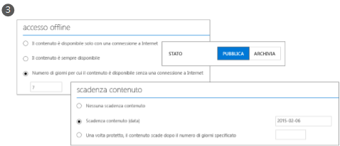

# Informazioni su Microsoft Azure Rights Management
Azure Rights Management (RMS Azure) è una soluzione per la protezione delle informazioni destinata alle organizzazioni che vogliono proteggere i dati nell'impegnativo ambiente di lavoro attuale.

Queste sfide includono la necessità di essere connessi a Internet, con gli utenti che portano al lavoro i propri dispositivi personali, accedono ai dati aziendali anche in viaggio o da casa e condividono informazioni riservate con partner commerciali importanti. Come parte delle attività di ogni giorno, gli utenti condividono le informazioni tramite posta elettronica, siti di condivisione di file e servizi cloud. In questi scenari, se si desidera proteggere i dati aziendali consentendo al tempo stesso ai dipendenti di lavorare in modo efficiente, i tradizionali controlli di sicurezza (ad esempio, gli elenchi di controllo di accesso e le autorizzazioni NTFS) e i firewall hanno efficacia limitata.

Azure Rights Management (Azure RMS) può invece proteggere le informazioni riservate dell'azienda in tutti questi scenari. Usa la crittografia, l'identità e criteri di autorizzazione per proteggere i file e i messaggi di posta elettronica e funziona su più dispositivi telefoni, Tablet e PC. È possibile proteggere le informazioni all'interno e all'esterno dell'organizzazione perché la protezione resta associata ai dati, anche quando supera i limiti dell'organizzazione. Si supponga, ad esempio, che un utente invii un documento a una società partner tramite posta elettronica o che salvi il documento sull'unità cloud della società. La protezione permanente fornita da Azure RMS non solo garantisce la sicurezza dei dati aziendali, ma può anche avere valore legale per quanto riguarda la conformità normativa e la conservazione delle informazioni per fini giuridici oppure, più semplicemente, può rappresentare un esempio di procedure consigliate per la gestione delle informazioni.

Aspetto molto importante, le persone e i servizi autorizzati, ad esempio quelli di ricerca e indicizzazione, possono continuare a leggere e analizzare i dati protetti da Azure RMS, risultato non raggiunto facilmente da altre soluzioni di protezione delle informazioni che usano la crittografia peer-to-peer. Questa possibilità viene definita anche "ragionamento sui dati" e riveste un ruolo di importanza critica nel mantenimento del controllo sui dati dell'organizzazione.

La seguente figura mostra il modo in cui Azure RMS funziona come soluzione Rights Management per Office 365, oltre che per server e servizi locali. Indica anche che supporta dispositivi degli utenti di uso comune che eseguono Windows, Mac OS, iOS, Android e Windows Phone.

> [!TIP]
> A questo punto, possono risultare utili le risorse aggiuntive seguenti:
> 
> -   Video di due minuti con la [descrizione di Microsoft Azure Rights Management](http://technet.microsoft.com/dn833005.aspx)
> -   Esercitazione di cinque passaggi: [Esercitazione di avvio rapido per Azure Rights Management](../Topic/Quick_Start_Tutorial_for_Azure_Rights_Management.md)
> -   Requisiti di Azure RMS, incluse le opzioni di sottoscrizione per l'acquisto o la valutazione: [Requisiti per Azure Rights Management](../Topic/Requirements_for_Azure_Rights_Management.md)

Le sezioni seguenti forniscono altre informazioni su Azure RMS:

-   [Problemi risolti da Azure RMS](../Topic/What_is_Azure_Rights_Management_.md#BKMK_RMSrequirements)

    -   [Requisiti di sicurezza, conformità e normativi](../Topic/What_is_Azure_Rights_Management_.md#BKMK_RMScompliance)

-   [Azure RMS in azione: Cosa vedono gli amministratori e gli utenti](../Topic/What_is_Azure_Rights_Management_.md#BKMK_RMSpictures)

    -   [Attivazione e configurazione di Rights Management](../Topic/What_is_Azure_Rights_Management_.md#BKMK_Example_ManagementPortal)

    -   [Protezione automatica dei file su file server che eseguono Windows Server e Infrastruttura di classificazione file.](../Topic/What_is_Azure_Rights_Management_.md#BKMK_Example_FCI)

    -   [Protezione automatica della posta elettronica con Exchange Online e criteri di prevenzione della perdita di dati](../Topic/What_is_Azure_Rights_Management_.md#BKMK_Example_DLP)

    -   [Protezione automatica dei file con SharePoint Online e librerie protette](../Topic/What_is_Azure_Rights_Management_.md#BKMK_Example_SharePoint)

    -   [Condivisione sicura di allegati con utenti mobili](../Topic/What_is_Azure_Rights_Management_.md#BKMK_Example_SharingApp)

-   [Funzionamento di Azure RMS Dietro le quinte](../Topic/What_is_Azure_Rights_Management_.md#BKMK_HowRMSworks)

    -   [Controlli crittografici usati in Azure RMS: Algoritmi e lunghezze delle chiavi](../Topic/What_is_Azure_Rights_Management_.md#BKMK_RMScrytographics)

    -   [Procedura dettagliata del funzionamento di Azure RMS: primo utilizzo, protezione del contenuto, uso del contenuto](../Topic/What_is_Azure_Rights_Management_.md#BKMK_Walthrough)

-   [Passaggi successivi](../Topic/What_is_Azure_Rights_Management_.md#BKMK_NextSteps)

## Problemi risolti da Azure RMS
Usare la seguente tabella per identificare i requisiti aziendali e i possibili problemi dell'organizzazione e per scoprire la soluzione fornita da Azure RMS.

|Requisito o problema|Soluzione fornita da Azure RMS|
|------------------------|----------------------------------|
|Protezione di tutti i tipi di file|√ Nella precedente implementazione di Rights Management era possibile proteggere, usando la protezione nativa, soltanto i file di Office. Per [protezione generica](https://technet.microsoft.com/library/dn574738%28v=ws.10%29.aspx) si intende che sono supportati tutti i tipi di file.|
|Protezione dei file in qualsiasi situazione|√ Quando un file viene salvato in un percorso ([protezione sul posto](https://technet.microsoft.com/library/dn574733%28v=ws.10%29.aspx)), i criteri di sicurezza rimangono integrati nel file stesso anche se questo viene copiato in un'area di archiviazione non controllata dal reparto IT, ad esempio un servizio di archiviazione cloud.|
|Condivisione sicura dei file tramite posta elettronica|√ Quando viene condiviso tramite posta elettronica ([condividi file protetto](https://technet.microsoft.com/library/dn574735%28v=ws.10%29.aspx)), un file viene protetto come un allegato a un messaggio di posta elettronica, con istruzioni per l'apertura. Il testo del messaggio di posta non viene crittografato, in modo che il destinatario possa sempre leggere le istruzioni. Il documento allegato, tuttavia, è protetto e può essere aperto solo dagli utenti autorizzati, anche se il messaggio di posta elettronica o il documento viene inoltrato ad altre persone.|
|Controllo e monitoraggio|√ È possibile [controllare e monitorare l'utilizzo](https://technet.microsoft.com/library/dn529121.aspx) dei file protetti, anche se tali file escono all'esterno dell'organizzazione.  Si supponga, ad esempio, di essere un dipendente della società Contoso, Ltd e di lavorare a un progetto comune con tre persone della società Fabrikam, Inc. Si supponga quindi di inviare a queste tre persone un documento protetto e di sola lettura. La funzionalità di controllo di Azure RMS può fornire le seguenti informazioni:  -   Se e quando le persone di Fabrikam specificate hanno aperto il documento. -   Se altre persone che non sono state specificate hanno tentato (senza riuscirvi) di aprire il documento, forse perché questo era stato inoltrato o salvato in una posizione condivisa a cui altri utenti hanno accesso. -   Se una delle persone specificate ha tentato (senza riuscirvi) di stampare o modificare il documento.|
|Supporto per tutti i dispositivi di uso comune, non solo dei computer Windows|√ I [dispositivi supportati](https://technet.microsoft.com/library/dn655136.aspx) comprendono:  -   Computer e telefoni Windows -   Computer Mac -   Tablet e telefoni iOS -   Tablet e telefoni Android|
|Supporto della collaborazione business-to-business|√ Poiché Azure RMS è un servizio cloud, per poter condividere contenuti protetti con altre organizzazioni non è necessario configurare esplicitamente dei trust con queste ultime. Se queste organizzazioni dispongono già di una directory di Office 365 o di Azure AD, la collaborazione tra organizzazioni è supportata automaticamente. In caso contrario, gli utenti possono eseguire gratuitamente la sottoscrizione a [RMS per utenti singoli](https://technet.microsoft.com/library/dn592127.aspx).|
|Supporto per servizi locali e per Office 365|√ Oltre a interagire [senza problemi con Office 365](https://technet.microsoft.com/library/jj585004.aspx), quando si distribuisce il [connettore RMS](https://technet.microsoft.com/library/dn375964.aspx) è anche possibile usare Azure RMS con i seguenti servizi locali:  -   Exchange Server -   SharePoint Server -   Windows Server con la funzionalità Infrastruttura di classificazione file|
|Facilità di attivazione|√ [L'attivazione del servizio Rights Management](https://technet.microsoft.com/library/jj658941.aspx) per gli utenti richiede solo pochi clic nel portale di Azure classico.|
|Scalabilità a livello di intera organizzazione, in base alle esigenze|√ Poiché Azure RMS viene eseguito come servizio cloud e offre l'elasticità tipica di Azure in termini di scalabilità verticale e orizzontale, non è necessario effettuare il provisioning di server locali aggiuntivi o distribuirli.|
|Possibilità di creare criteri semplici e flessibili|√ I [modelli di criteri per i diritti personalizzati](https://technet.microsoft.com/library/dn642472.aspx) forniscono agli amministratori una soluzione rapida e semplice per applicare i criteri e permettono agli utenti di usare il livello di protezione corretto per ciascun documento, nonché di limitarne l'accesso al personale dell'organizzazione.  Per condividere a livello aziendale un documento sulle strategie, ad esempio, è possibile applicare a tutti i dipendenti interni un criterio di sola lettura. Nel caso di un documento più riservato, ad esempio un report finanziario, è possibile consentire l'accesso ai soli dirigenti dell'azienda.|
|Supporto esteso per applicazioni|√ Azure RMS è caratterizzato da una stretta integrazione con applicazioni e servizi di Microsoft Office ed estende il supporto ad altre applicazioni usando l'applicazione RMS sharing.√ Azure RMS è caratterizzato da una stretta integrazione con applicazioni e servizi di Microsoft Office ed estende il supporto ad altre applicazioni usando l'applicazione RMS sharing.  √ [Microsoft Rights Management SDK](https://msdn.microsoft.com/library/hh552972%28v=vs.85%29.aspx) fornisce agli sviluppatori interni e ai fornitori di software le API necessarie per la creazione di applicazioni personalizzate con supporto per Azure RMS.  Per altre informazioni, vedere [Supporto di Microsoft Azure Rights Management da parte delle applicazioni](../Topic/How_Applications_Support_Azure_Rights_Management.md).|
|Mantenimento del controllo dei dati da parte del reparto IT|√ Le organizzazioni possono scegliere di gestire la propria chiave del tenant oppure di usare la soluzione BYOK "[Bring Your Own Key](https://technet.microsoft.com/library/dn440580.aspx)" e di archiviare la chiave del tenant in moduli di protezione hardware (HSM).  √ Supporto per il controllo e la [registrazione dell'utilizzo](https://technet.microsoft.com/library/dn529121.aspx), per consentire agli utenti di ottenere informazioni aziendali accurate, monitorare i possibili abusi e, in caso di perdita o furto di informazioni, eseguire analisi per scopi legali.  √ L'accesso delegato mediante la [funzionalità per utenti con privilegi avanzati](https://technet.microsoft.com/library/mt147272.aspx) assicura agli addetti del reparto IT la possibilità di accedere sempre ai contenuti protetti, anche nel caso di documenti protetti da un utente che non fa più parte dell'organizzazione. Paragonate all'accesso delegato, le soluzioni di crittografia peer-to-peer rischiano la perdita dell'accesso ai dati aziendali.  √ Sincronizzazione [solo degli attributi della directory richiesti da Azure RMS](https://azure.microsoft.com/documentation/articles/active-directory-aadconnectsync-attributes-synchronized/) per supportare un'identità comune per gli account Active Directory locali usando uno [strumento di sincronizzazione della directory](https://azure.microsoft.com/documentation/articles/active-directory-aadconnect-get-started-tools-comparison/), come Azure AD Connect.  √ Abilitazione dell'accesso Single-Sign On senza replicare le password nel cloud usando ADFS.  √ Le organizzazioni possono sempre decidere di sospendere l'uso di Azure RMS, senza perdere l'accesso al contenuto protetto in precedenza da Azure RMS. Per informazioni sulle opzioni di rimozione, vedere [Rimozione delle autorizzazioni e disattivazione di Azure Rights Management](../Topic/Decommissioning_and_Deactivating_Azure_Rights_Management.md). Le organizzazioni che hanno distribuito Active Directory Rights Management Services (AD RMS), possono inoltre [eseguire la migrazione ad Azure RMS](https://technet.microsoft.com/library/dn858447.aspx) senza perdere l'accesso ai dati protetti in precedenza da AD RMS.|
> [!TIP]
> Gli utenti che hanno già acquisito familiarità con la versione locale di Rights Management, Active Directory Rights Management Services (AD RMS), possono essere interessati alla tabella comparativa disponibile in [Confronto tra Rights Management di Microsoft Azure e AD RMS](../Topic/Comparing_Azure_Rights_Management_and_AD_RMS.md).

### Requisiti di sicurezza, conformità e normativi
Azure RMS supporta i requisiti di sicurezza, conformità e normativi seguenti:

√ Uso di crittografia standard del settore e supporto per FIPS 140-2. Per altre informazioni, vedere la sezione [Controlli crittografici usati in Azure RMS: Algoritmi e lunghezze delle chiavi](../Topic/What_is_Azure_Rights_Management_.md#BKMK_RMScrytographics) di questo argomento.

√ Supporto per moduli di protezione hardware (HSM) Thales per archiviare la chiave del tenant in data center di Microsoft Azure. Azure RMS usa ambienti di sicurezza separati per i propri data center in America del Nord, nei paesi EMEA (Europa, Medio Oriente e Africa) e in Asia, così da limitare l'uso della chiave del tenant al Paese in cui ha sede il data center.

√ Certificazione per:

-   ISO/IEC 27001:2013 (include [ISO/IEC 27018](http://azure.microsoft.com/blog/2015/02/16/azure-first-cloud-computing-platform-to-conform-to-isoiec-27018-only-international-set-of-privacy-controls-in-the-cloud/))

-   Attestazioni SOC 2 SSAE 16/ISAE 3402

-   HIPAA BAA

-   EU Model Clause

-   FedRAMP come parte di Azure Active Directory nella certificazione di Office 365, FedRAMP Agency ATO (Authority to Operate) rilasciato da HHS

-   PCI DSS Livello 1

Per altre informazioni su queste certificazioni esterne, vedere il [Centro protezione Azure](http://azure.microsoft.com/support/trust-center/compliance/).

## Azure RMS in azione: Cosa vedono gli amministratori e gli utenti
Le immagini in questa sezione mostrano alcuni esempi tipici di come gli amministratori e gli utenti vedono e possono usare Azure RMS per proteggere informazioni sensibili o riservate.

> [!NOTE]
> In questi esempi in cui i dati sono protetti da Azure RMS, il proprietario del contenuto continua ad avere accesso completo ai dati (file o posta elettronica), anche se la protezione applicata concede le autorizzazioni a un gruppo di cui il proprietario non fa parte o anche se la protezione applicata include una data di scadenza.
> 
> Analogamente, il reparto IT può accedere sempre ai dati protetti senza restrizioni, usando la funzionalità Utente con privilegi avanzati di Rights Management che concede l'accesso delegato a specifici utenti autorizzati o servizi. Inoltre, il personale IT può tenere traccia e monitorare l'utilizzo per i dati che sono stati protetti, ad esempio chi accede ai dati e quando.

Per altre schermate e video che mostrano RMS in azione, vedere il [portale dei servizi di Microsoft Rights Management](http://www.microsoft.com/rms), il [blog del team Microsoft Rights Management (RMS)](http://blogs.technet.com/b/rms) e i [contenuti dedicati ad Azure RMS nel sito Curah!](http://curah.microsoft.com/Search?query="Azure%20RMS").

### Attivazione e configurazione di Rights Management
Sebbene sia possibile usare Windows PowerShell per attivare e configurare Azure RMS, è più semplice procedere dal portale di gestione. Quando il servizio viene attivato, sono disponibili due modelli predefiniti che gli amministratori e gli utenti possono selezionare per applicare la protezione delle informazioni ai file in modo rapido e semplice. È anche possibile creare modelli personalizzati per includere opzioni e impostazioni aggiuntive.

|||
|-|-|
|  [Immagine più grande](http://technet.microsoft.com/98d53a12-3b19-4622-bb1e-75ef56df5438) (per impostazione predefinita, viene visualizzata nella stessa finestra del browser)|Per attivare RMS, è possibile usare l'interfaccia di amministrazione di Office 365 (prima immagine) o il portale di Azure classico (seconda immagine).  È sufficiente un clic per attivare e un altro clic per confermare e la protezione delle informazioni viene abilitata per gli amministratori e gli utenti nell'organizzazione.|
|  [Immagine più grande](http://technet.microsoft.com/596e4fec-124c-41b1-8efd-63d5179193fb) (per impostazione predefinita, viene visualizzata nella stessa finestra del browser)|Dopo l'attivazione sono automaticamente disponibili due modelli di criteri di diritti per l'organizzazione. Un modello (il cui nome include **Solo visualizzazione riservata**) è di sola lettura, mentre l'altro (**Riservata**) consente l'accesso in lettura e modifica.  Quando questi modelli vengono applicati a file o messaggi di posta elettronica, limitano l'accesso agli utenti nell'organizzazione. Si tratta di un modo molto rapido e semplice per impedire che i dati aziendali archiviati vengano divulgati a utenti esterni all'organizzazione. **Tip:** Questi modelli predefiniti sono facilmente riconoscibili perché sono preceduti automaticamente dal nome dell'organizzazione, in questo esempio **VanArsdel, Ltd**. Se si preferisce non mostrare questi modelli agli utenti oppure creare modelli personalizzati, è possibile usare il portale di Azure classico. Come mostrato nella figura, una procedura guidata illustra il processo di creazione del modello personalizzato.|
|  [Immagine più grande](http://technet.microsoft.com/f5df80e5-efc9-4c0f-91be-060225977356) (per impostazione predefinita, viene visualizzata nella stessa finestra del browser)|Se si decide di creare modelli personalizzati, sono disponibili diverse impostazioni di configurazione, tra cui accesso offline, impostazioni di scadenza e pubblicazione immediata del modello (per renderlo visibile nelle applicazioni che supportano Rights Management).|
|  [Immagine più grande](http://technet.microsoft.com/597a3402-fd5a-4bcf-b5e6-5c983dbde697) (per impostazione predefinita, viene visualizzata nella stessa finestra del browser)|In seguito alla pubblicazione, questi modelli possono essere selezionati, ad esempio in applicazioni quali Esplora file e Microsoft Word:  -   Un utente può scegliere il modello predefinito, **VanArsdel, Ltd – Riservata**. In seguito, solo i dipendenti dell'organizzazione VanArsdel possono aprire e usare questo documento, anche se successivamente viene inviato tramite posta elettronica all'esterno dell'organizzazione o salvato in una posizione pubblica. -   Un utente può scegliere il modello personalizzato creato dall'amministratore, **Vendite e Marketing - Solo lettura e stampa**. In questo modo, il file non solo è protetto da utenti esterni all'organizzazione, ma è limitato ai dipendenti del reparto Vendite e marketing. Inoltre, questi dipendenti non dispongono dei diritti completi per il documento, ma solo dei diritti di lettura e stampa. Ad esempio, non possono modificarlo né copiarne il contenuto.|
Per altre informazioni, vedere [Attivazione di Azure Rights Management](../Topic/Activating_Azure_Rights_Management.md) e [Configurazione di modelli personalizzati per Azure Rights Management](../Topic/Configuring_Custom_Templates_for_Azure_Rights_Management.md).

Per aiutare gli utenti a proteggere i file aziendali importanti, vedere [Consentire agli utenti di proteggere i file mediante Azure Rights Management](../Topic/Helping_Users_to_Protect_Files_by_Using_Azure_Rights_Management.md).

Di seguito sono disponibili alcuni esempi di come gli amministratori possono applicare i modelli per configurare automaticamente la protezione delle informazioni per i file e i messaggi di posta elettronica.

### Protezione automatica dei file su file server che eseguono Windows Server e Infrastruttura di classificazione file.
Questo esempio mostra come usare Azure RMS per proteggere automaticamente i file nei file server che eseguono Windows Server 2012 o versioni successive e sono configurati per l'uso di Infrastruttura di classificazione file.

Esistono diversi modi per applicare valori di classificazione ai file. Ad esempio, è possibile esaminare il contenuto dei file e applicare di conseguenza le classificazioni predefinite come Riservatezza e Informazioni personali. In questo esempio, però, un amministratore crea una classificazione personalizzata **Marketing** che viene applicata automaticamente a tutti i documenti utente vengono salvati nella cartella **Promozioni marketing**. Sebbene questa cartella sia protetta con autorizzazioni NTFS che limitano l'accesso ai membri del gruppo Marketing, l'amministratore è consapevole del fatto che queste autorizzazioni possono andare perdute se un membro del gruppo sposta i file o li invia tramite posta elettronica. In quel caso, è possibile che utenti non autorizzati accedano alle informazioni contenute nei file.

|||
|-|-|
|  [Immagine più grande](http://technet.microsoft.com/cf18c56b-c301-4640-8d9e-9e677e494091) (per impostazione predefinita, viene visualizzata nella stessa finestra del browser)|Gli amministratori installano e configurano il connettore Rights Management (RMS), che agisce da punto di inoltro tra i server locali e Azure RMS.|
|  [Immagine più grande](http://technet.microsoft.com/ba3e247d-ea5e-4009-8eac-74f70270ece0) (per impostazione predefinita, viene visualizzata nella stessa finestra del browser)|Sul file server l'amministratore configura le attività e le regole di classificazione in modo che tutti i file utente nella cartella **Promozioni marketing** vengano classificati automaticamente come **Marketing** e protetti con la crittografia di RMS.  Seleziona il modello RMS personalizzato creato nel primo esempio, che limita l'accesso ai membri dei reparti Vendite e Marketing: **Vendite e marketing - Solo stampa e lettura**  Di conseguenza, tutti i documenti in quella cartella vengono automaticamente configurati con la classificazione Marketing e protetti mediante il modello Vendite e Marketing di RMS.|
|  [Immagine più grande](http://technet.microsoft.com/ad666594-68df-4289-835a-235b2af9bf4b) (per impostazione predefinita, viene visualizzata nella stessa finestra del browser)|Ecco come RMS contribuisce a evitare la divulgazione dei dati a persone non autorizzate ad accedere alle informazioni sensibili o riservate:  -   Janet, del reparto Marketing, invia un report riservati dalla cartella Promozioni marketing. Questo report contiene le nuove funzionalità e i piani di pubblicità del prodotto ed è richiesto da un collega che attualmente si trova in viaggio per lavoro. Tuttavia, Janet lo invia tramite posta elettronica al destinatario sbagliato, selezionando per errore un destinatario con un nome simile, ma di un'altra società.     Il destinatario non può leggere il report riservato perché non fa parte del gruppo Vendite e marketing.|
Per altre informazioni, vedere [Distribuzione del connettore di Azure Rights Management](../Topic/Deploying_the_Azure_Rights_Management_Connector.md).

### Protezione automatica della posta elettronica con Exchange Online e criteri di prevenzione della perdita di dati
L'esempio precedente ha mostrato come proteggere automaticamente i file che contengono informazioni sensibili o riservate, ma cosa accade se le informazioni non si trovano in un file, ma in un messaggio di posta elettronica? Qui emerge evidente l'utilità dei criteri di prevenzione della perdita dei dati di Exchange Online, che richiedono all'utente di applicare la protezione delle informazioni (usando i suggerimenti relativi ai criteri) oppure applicandola automaticamente (mediante le regole di trasporto).

In questo esempio l'amministratore configura un criterio per assicurare la conformità dell'azienda alle norme statunitensi per la protezione delle informazioni personali, ma è anche possibile configurare regole per il rispetto di altre normative oppure regole personalizzate.

|||
|-|-|
|  [Immagine più grande](http://technet.microsoft.com/58461319-3981-4b7f-a195-956a1778e907) (per impostazione predefinita, viene visualizzata nella stessa finestra del browser)|Il modello di Exchange denominato **Stati Uniti - Informazioni personali** può essere usato dall'amministratore per creare e configurare nuovi criteri DLP. Questo modello cerca informazioni quali numeri di previdenza sociale e patenti di guida nei messaggi di posta elettronica.  Le regole sono configurate in modo che ai messaggi di posta elettronica che contengono queste informazioni e che vengono inviati automaticamente all'esterno dell'organizzazione venga applicata la protezione dei diritti usando un modello di RMS che limita l'accesso ai soli dipendenti della società.  In questo caso, la regola è configurata per l'uso di uno dei modelli predefiniti, **VanArsdel, Ltd - Riservata**, illustrato nel primo esempio. Nella scelta dei modelli, tuttavia, sono inclusi anche i modelli personalizzati creati, oltre a un'opzione **Non inoltrare** specifica di Exchange.|
|  [Immagine più grande](http://technet.microsoft.com/bfb0762d-06fb-42e4-beff-eb391f4bedf0) (per impostazione predefinita, viene visualizzata nella stessa finestra del browser)|Il responsabile delle assunzioni scrive un messaggio di posta elettronica che contiene il numero di previdenza sociale di un nuovo dipendente. Invia il messaggio di posta elettronica a Sherrie del reparto Risorse umane.|
|  [Immagine più grande](http://technet.microsoft.com/59e3b68e-4bed-4962-bb1e-e82d82f8000a) (per impostazione predefinita, viene visualizzata nella stessa finestra del browser)|Se questo messaggio di posta elettronica viene inviato o inoltrato a qualcuno all'esterno dell'organizzazione, la regola DLP applica automaticamente la protezione dei diritti.  Il messaggio di posta elettronica viene crittografato quando lascia l'infrastruttura dell'organizzazione, in modo che il numero di previdenza sociale incluso nel non possa essere letto quando il messaggio è in transito o si trova nella posta in arrivo del destinatario. Il destinatario non potrà leggere il messaggio a meno che non sia un dipendente VanArsdel.|
Per altre informazioni, vedere le sezioni seguenti:

-   [Exchange Online ed Exchange Server](../Topic/How_Applications_Support_Azure_Rights_Management.md#BKMK_ExchangeIntro) nell'argomento [Supporto di Microsoft Azure Rights Management da parte delle applicazioni](../Topic/How_Applications_Support_Azure_Rights_Management.md).

-   [Exchange Online: configurazione di IRM](../Topic/Configuring_Applications_for_Azure_Rights_Management.md#BKMK_ExchangeOnline) nell'argomento [Configurazione di applicazioni per Rights Management di Windows Azure](../Topic/Configuring_Applications_for_Azure_Rights_Management.md).

### Protezione automatica dei file con SharePoint Online e librerie protette
Questa sezione mostra come proteggere facilmente i documenti mediante SharePoint Online e librerie protette.

In questo esempio l'amministratore di SharePoint per Contoso ha creato una libreria per ogni reparto che viene usata per archiviare centralmente ed estrarre i documenti per il controllo delle versioni e la modifica. Ad esempio, è presente una libreria per il reparto Vendite, una per Marketing, una per Risorse umane e così via. Quando viene caricato o creato un nuovo documento in una di queste librerie protette, il documento eredita la protezione della libreria (non occorre selezionare un modello di criteri di diritti), viene protetto automaticamente e rimane protetto anche in caso di spostamento all'esterno della libreria di SharePoint.

|||
|-|-|
|  [Immagine più grande](http://technet.microsoft.com/2fc90989-9289-4431-9e6a-07740b7f6e5a) (per impostazione predefinita, viene visualizzata nella stessa finestra del browser)|L'amministratore abilita Information Rights Management per il sito di SharePoint.|
|  [Immagine più grande](http://technet.microsoft.com/a18f2e99-5ac4-4103-a88c-527846374091) (per impostazione predefinita, viene visualizzata nella stessa finestra del browser)|Abilita quindi Rights Management per una libreria. Anche se sono disponibili opzioni aggiuntive, questa semplice impostazione spesso è sufficiente.  Quando i documenti vengono scaricati da questa raccolta, sono automaticamente protetti da Rights Management, ereditando la protezione configurata per la raccolta.|
|  [Immagine più grande](http://technet.microsoft.com/0ebd6806-0190-441e-84db-72ac4b97e4a2) (per impostazione predefinita, viene visualizzata nella stessa finestra del browser)|Quando un utente del reparto vendite estrae il report delle vendite dalla libreria, l'intestazione nella parte superiore indica chiaramente che si tratta di un documento protetto con accesso limitato.  Il documento rimane protetto anche se viene rinominato, salvato in un altro percorso o condiviso tramite posta elettronica. Può essere letto solo dai membri del reparto vendite, indipendentemente dal nome che viene assegnato al file, dal percorso in cui viene archiviato o dalla sua condivisione tramite posta elettronica.|
Per altre informazioni, vedere le sezioni seguenti:

-   [SharePoint Online e SharePoint Server](../Topic/How_Applications_Support_Azure_Rights_Management.md#BKMK_SharePointIntro) nell'argomento [Supporto di Microsoft Azure Rights Management da parte delle applicazioni](../Topic/How_Applications_Support_Azure_Rights_Management.md).

-   [SharePoint Online e OneDrive for Business: configurazione di IRM](../Topic/Configuring_Applications_for_Azure_Rights_Management.md#BKMK_SharePointOnline) nell'argomento [Configurazione di applicazioni per Rights Management di Windows Azure](../Topic/Configuring_Applications_for_Azure_Rights_Management.md).

### Condivisione sicura di allegati con utenti mobili
Negli esempi precedenti è stato illustrato come gli amministratori possono applicare automaticamente la protezione delle informazioni ai dati sensibili e riservati. In alcuni casi, però, gli utenti possono avere l'esigenza di applicare autonomamente questa protezione, ad esempio se collaborano con partner di un'altra organizzazione, hanno bisogno di autorizzazioni personalizzate o impostazioni non definite nei modelli, in situazioni specifiche che non rientrano negli esempi precedenti. In questi casi, gli utenti possono applicare autonomamente i modelli di RMS oppure configurare autorizzazioni personalizzate.

Questo esempio illustra come gli utenti possono condividere facilmente un documento con un collaboratore in un'altra società, proteggendo comunque il documento e con la certezza che il destinatario possa leggerlo, anche da un dispositivo mobile. Questo scenario usa l'applicazione di condivisione Rights Management, che è possibile distribuire automaticamente nei computer Windows dell'organizzazione. In alternativa, può essere installata manualmente dagli utenti.

In questo esempio, Alice di Contoso invia un documento di Word riservato tramite posta elettronica a Roberto di Fabrikam. Legge il documento sul suo iPad, ma potrebbe leggerlo altrettanto facilmente anche su un iPhone, su un tablet o telefono Android, su un computer Mac o su un telefono o computer Windows.

|||
|-|-|
|  [Immagine più grande](http://technet.microsoft.com/feeef78d-3c2e-432b-817d-d06f784be226) (per impostazione predefinita, viene visualizzata nella stessa finestra del browser)|Alice crea un messaggio di posta elettronica standard dal suo PC Windows e allega un documento.  Fa clic su **Condividi file protetto** sulla barra multifunzione. Viene visualizzata la finestra di dialogo **condividi file protetto** dall'applicazione RMS sharing.  Alice vuole che Roberto possa solo visualizzare e modificare il documento, ma non copiarlo o stamparlo, quindi seleziona **REVISORE - Visualizzazione e Modifica**. Vuole anche essere informata tramite posta elettronica quando qualcuno prova ad aprire il documento e vuole poter revocare il documento successivamente, se necessario, con la certezza che la revoca avrà effetto immediato.|
|  [Immagine più grande](http://technet.microsoft.com/e748fd78-8bba-4168-96cf-f96def078283) (per impostazione predefinita, viene visualizzata nella stessa finestra del browser)|Roberto vede il messaggio di posta elettronica sul suo iPad.  Oltre al messaggio e all'allegato di Alice, ci sono istruzioni che segue per iscriversi e installare l'app RMS sharing sul suo iPad.|
|  [Immagine più grande](http://technet.microsoft.com/7dba5ff9-a61d-4a83-8adc-d6ffb0e85df6) (per impostazione predefinita, viene visualizzata nella stessa finestra del browser)|Roberto ora può aprire l'allegato. Prima di tutto gli viene chiesto di accedere per confermare di essere il destinatario previsto.  Quando Roberto visualizza il documento, vede anche le informazioni relative all'accesso limitato, che indicano che può visualizzare e modificare il documento, ma non copiarlo o stamparlo.|
|  [Immagine più grande](http://technet.microsoft.com/9f642a2e-58ad-44ab-9f81-f890d15380f9) (per impostazione predefinita, viene visualizzata nella stessa finestra del browser)|Alice riceve un messaggio di posta elettronica che indica che Roberto ha aperto il documento che lei gli ha inviato, con data e ora di accesso al documento.  Se Roberto inoltra il messaggio di posta elettronica con l'allegato o lo salva in un percorso cui altri utenti possono accedere o se questo viene intercettato sulla rete, il documento non potrà essere letto da altre persone.|
Per altre informazioni, vedere [Proteggere un file che si condivide tramite posta elettronica](https://technet.microsoft.com/library/dn574735.aspx) e [Visualizzare e usare i file che sono stati protetti](https://technet.microsoft.com/library/dn574741.aspx) nella [Guida dell'utente dell'applicazione di condivisione Rights Management](https://technet.microsoft.com/library/dn339006.aspx).

In [Esercitazione di avvio rapido per Azure Rights Management](../Topic/Quick_Start_Tutorial_for_Azure_Rights_Management.md) sono inoltre disponibili istruzioni dettagliate per questo scenario.

Dopo avere visto alcuni esempi di ciò che Azure RMS è in grado di fare, è interessante capire come opera. Per informazioni tecniche sul funzionamento di Azure RMS, vedere la sezione successiva.

## Funzionamento di Azure RMS Dietro le quinte
Una cosa importante da comprendere sul funzionamento di Azure RMS è che tramite il servizio Rights Management (e Microsoft) non vengono visualizzati o archiviati dati come parte del processo di protezione delle informazioni. Le informazioni protette non vengono mai inviate o archiviate in Azure, a meno di archiviarle in modo esplicito in Azure o di usare un altro servizio cloud che le archivia in Azure. Azure RMS rende i dati di un documento semplicemente illeggibili a chiunque, eccetto gli utenti e i servizi autorizzati:

-   I dati vengono crittografati a livello di applicazione e includono un criterio che definisce l'uso autorizzato del documento.

-   Quando un documento protetto viene usato da un utente legittimo o viene elaborato da un servizio autorizzato, i dati contenuti nel documento vengono decrittografati e vengono applicati i diritti definiti nei criteri.

A livello generale, è possibile vedere il funzionamento del processo nell'immagine seguente. Un documento contenente la formula segreta viene protetto e quindi aperto da un utente o un servizio autorizzato. Il documento è protetto da una chiave simmetrica (la chiave verde nell'immagine), che è univoca per ogni documento e viene inserita nell'intestazione del file, dove è protetta dalla chiave radice del tenant RMS (la chiave rossa nell'immagine). La chiave del tenant può essere generata e gestita da Microsoft oppure direttamente dall'utente.

Durante il processo di protezione, mentre Azure RMS crittografa e decrittografa, autorizza e applica restrizioni, la formula segreta non viene mai inviata ad Azure.

Per una descrizione dettagliata delle operazioni eseguite, vedere la sezione [Procedura dettagliata del funzionamento di Azure RMS: primo utilizzo, protezione del contenuto, uso del contenuto](../Topic/What_is_Azure_Rights_Management_.md#BKMK_Walthrough) in questo argomento.

Per informazioni tecniche sugli algoritmi e sulle lunghezze delle chiavi usate in Azure RMS, vedere la sezione successiva.

### Controlli crittografici usati in Azure RMS: Algoritmi e lunghezze delle chiavi
Anche se non è necessario conoscere personalmente il funzionamento di RMS, è possibile che vengano richieste informazioni sui controlli crittografici usati, per garantire che la protezione sia conforme agli standard del settore.

|||
|-|-|
|Metodo di protezione della documentazione:|Algoritmo: AES  Lunghezza della chiave: 128 e 256 bit 1|
|Metodo di protezione della chiave:|Algoritmo: RSA  Lunghezza della chiave: 2048 bit|
|Firma del certificato:|Algoritmo: SHA-256|
1 La lunghezza di 256 bit viene usata dall'applicazione di condivisione Rights Management per la protezione generica e la protezione nativa quando l'estensione di file è ppdf o si tratta di un file di testo o di immagine protetto, ad esempio con estensione ptxt o pjpg.

### Procedura dettagliata del funzionamento di Azure RMS: primo utilizzo, protezione del contenuto, uso del contenuto
Per comprendere in modo più dettagliato il funzionamento di Azure RMS, viene illustrato un flusso tipico dopo l'[attivazione del servizio Azure RMS](https://technet.microsoft.com/library/jj658941.aspx) e quando un utente usa per la prima volta RMS nel proprio computer Windows (un processo definito a volte **inizializzazione dell'ambiente utente** o bootstrap), **protegge il contenuto** (un documento o un messaggio di posta elettronica) e quindi **utilizza** (apre e modifica) il contenuto protetto da altri.

Dopo aver inizializzato l'ambiente utente, l'utente può quindi proteggere i documenti o utilizzare documenti protetti su quel computer.

> [!NOTE]
> Se l'utente passa a un altro computer Windows o un altro utente usa lo stesso computer Windows, il processo di inizializzazione viene ripetuto.

#### Inizializzazione dell'ambiente utente
Prima che un utente sia in grado di proteggere contenuto o utilizzare contenuto protetto in un computer Windows, è necessario preparare l'ambiente utente sul dispositivo. Questo è un processo unico e si verifica automaticamente senza l'intervento dell'utente quando un utente tenta di proteggere o utilizzare contenuto protetto:

|||
|-|-|
||Il client RMS nel computer si connette prima di tutto ad Azure RMS e autentica l'utente usando il proprio account Azure Active Directory.  Quando l'account dell'utente è federato con Azure Active Directory, l'autenticazione avviene automaticamente e all'utente non vengono richieste le credenziali.|

|||
|-|-|
||Dopo l'autenticazione dell'utente, la connessione viene reindirizzata automaticamente al tenant RMS dell'organizzazione, che emette i certificati per consentire all'utente di autenticarsi ad Azure RMS in modo da utilizzare il contenuto protetto e proteggere il contenuto offline.  Una copia del certificato dell'utente viene archiviata in Azure RMS, in modo che se l'utente passa a un altro dispositivo, i certificati vengono creati usando le stesse chiavi.|

#### Protezione del contenuto
Quando un utente protegge un documento, il client RMS esegue le azioni seguenti su un documento non protetto:

|||
|-|-|
||Il client RMS crea una chiave casuale (la chiave simmetrica) e crittografa il documento usando questa chiave con l'algoritmo di crittografia simmetrica AES.|

|||
|-|-|
||Il client RMS crea quindi un certificato che include un criterio per il documento, in base a un modello o indicando i diritti specifici per il documento. Questo criterio include i diritti per utenti o gruppi diversi e altre limitazioni, ad esempio una data di scadenza.  Il client RMS usa quindi la chiave dell'organizzazione, ottenuta al momento dell'inizializzazione dell'ambiente utente, per crittografare i criteri e la chiave simmetrica. Il client RMS firma anche i criteri con il certificato dell'utente ottenuto al momento dell'inizializzazione dell'ambiente.|

|||
|-|-|
||Infine, il client RMs incorpora i criteri in un file con il corpo del documento crittografato in precedenza, che insieme costituiscono un documento protetto.  Questo documento può essere archiviato ovunque o condiviso usando qualsiasi metodo. I criteri rimangono sempre incorporati nel documento.|

#### Utilizzo del contenuto
Quando un utente vuole utilizzare un documento protetto, il client RMS avvia la richiesta dell'accesso al servizio Azure RMS:

|||
|-|-|
||L'utente autenticato invia i criteri del documento e i certificati dell'utente ad Azure RMS. Il servizio decrittografa e valuta i criteri e compila un elenco di diritti (se presenti) di cui l'utente dispone per il documento.|

|||
|-|-|
||Il servizio estrae quindi la chiave simmetrica AES dai criteri decrittografati. Questa chiave viene quindi crittografata con la chiave pubblica RSA dell'utente ottenuta con la richiesta.  La chiave simmetrica nuovamente crittografata viene quindi incorporata in un contratto di licenza con l'utente finale crittografato con l'elenco dei diritti utente, che viene quindi restituito al client RMS.|

|||
|-|-|
||Infine, il client RMS accetta il contratto di licenza con l'utente finale crittografato e lo decrittografa con la propria chiave privata utente. In questo modo il client RMS decrittografa il corpo del documento quando è necessario e ne esegue il rendering sullo schermo.  Il client decrittografa anche l'elenco di diritti e li passa all'applicazione, che li applica nell'interfaccia utente dell'applicazione.|

#### Varianti
Le procedure dettagliate precedenti riguardano scenari standard, ma esistono alcune varianti:

-   **Dispositivi mobili**: quando i dispositivi mobili proteggono o utilizzano file con Azure RMS, i flussi del processo sono molto più semplici. I dispositivi mobili non vengono prima sottoposti al processo di inizializzazione utente, perché ogni transazione (di protezione o utilizzo del contenuto) è invece indipendente. Come con i computer Windows, i dispositivi mobili si connettono al servizio Azure RMS e si autenticano. Per proteggere il contenuto, i dispositivi mobili inviano i criteri e Azure RMS invia una licenza di pubblicazione e la chiave simmetrica per proteggere il documento. Per utilizzare il contenuto, quando i dispositivi mobili si connettono al servizio Azure RMS e si autenticano, inviano i criteri del documento ad Azure RMS e richiedono un contratto di licenza con l'utente finale per utilizzare il documento. In risposta, Azure RMS invia le chiavi e le restrizioni necessarie ai dispositivi mobili. Entrambi i processi usano TLS per proteggere lo scambio di chiavi e altre comunicazioni.

-   **Connettore RMS**: quando Azure RMS viene usato con il connettore RMS, i flussi del processo rimangono invariati. L'unica differenza è che il connettore opera come un relè tra i servizi locali (ad esempio Exchange Server e SharePoint Server) e Azure RMS. Il connettore stesso non esegue alcuna operazione, ad esempio l'inizializzazione dell'ambiente utente, né crittografia o decrittografia. Inoltra semplicemente la comunicazione indirizzata solitamente a un server AD RMS, gestendo la conversione tra i protocolli usati su ogni lato. Questo scenario consente di usare Azure RMS con servizi locali.

-   **Protezione generica (pfile)**: quando Azure RMS protegge un file in modo generico, il flusso è fondamentalmente lo stesso per la protezione del contenuto, con la differenza che il client RMS crea i criteri che concedono tutti i diritti. Quando si usa il file, questo viene decrittografato prima di essere passato all'applicazione di destinazione. Questo scenario consente di proteggere tutti i file, anche se non supportano RMS in modo nativo.

-   **PDF protetto (ppdf)**: quando Azure RMS protegge in modo nativo di un file di Office, crea anche una copia del file e lo protegge nello stesso modo. L'unica differenza è che la copia del file è nel formato di file PPDF, che l'applicazione RMS sharing è in grado di aprire solo per la visualizzazione. Questo scenario consente di inviare allegati protetti tramite posta elettronica, sapendo che il destinatario di un dispositivo mobile sarà sempre in grado di leggerli, anche se il dispositivo mobile non dispone di un'app che supporta i file di Office protetti in modo nativo.

## Passaggi successivi
Per altre informazioni su Azure RMS, fare riferimento agli altri argomenti della sezione [Introduzione a Azure Rights Management](../Topic/Getting_Started_with_Azure_Rights_Management.md), ad esempio [Supporto di Microsoft Azure Rights Management da parte delle applicazioni](../Topic/How_Applications_Support_Azure_Rights_Management.md), in cui viene spiegato come è possibile integrare le applicazioni esistenti in Azure RMS per implementare una soluzione di protezione delle informazioni. Rivedere l'argomento [Terminologia di Azure Rights Management](../Topic/Terminology_for_Azure_Rights_Management.md) per acquisire familiarità con i termini relativi alla configurazione e all'uso di Azure RMS. Prima di iniziare la distribuzione, controllare anche le informazioni riportate in [Requisiti per Azure Rights Management](../Topic/Requirements_for_Azure_Rights_Management.md). Se si vuole approfondire e affrontare un'esercitazione pratica, vedere [Esercitazione di avvio rapido per Azure Rights Management](../Topic/Quick_Start_Tutorial_for_Azure_Rights_Management.md).

Quando si è pronti a iniziare la distribuzione di Azure RMS per l'organizzazione, vedere l'argomento [Guida di orientamento per la distribuzione di Microsoft Azure Rights Management](../Topic/Azure_Rights_Management_Deployment_Roadmap.md) in cui sono illustrati i passaggi da eseguire e sono disponibili collegamenti a istruzioni procedurali.

> [!TIP]
> Per altre informazioni e ulteriore supporto, usare le risorse e i collegamenti riportati in [Informazioni e supporto per Rights Management di Windows Azure](../Topic/Information_and_Support_for_Azure_Rights_Management.md).

## Vedere anche
[Introduzione a Azure Rights Management](../Topic/Getting_Started_with_Azure_Rights_Management.md)

